[ΠΕΡΙΕΧΟΜΕΝΑ]{.smallcaps}

[[1]{.smallcaps} [Η ΚΕΡΚΥΡΑ ΚΑΙ ΤΟ ΙΟΝΙΟ ΠΑΝΕΠΙΣΤΗΜΙΟ]{.smallcaps}
5](#η-κερκυρα-και-το-ιονιο-πανεπιστημιο)

[*1.1* *Το Ιόνιο Πανεπιστήμιο* 6](#το-ιόνιο-πανεπιστήμιο)

[1.1.1 Ίδρυση 6](#ίδρυση)

[1.1.2 Σχολές και Τμήματα 6](#σχολές-και-τμήματα)

[1.1.3 Διοίκηση 7](#διοίκηση)

[*1.2* *Η Σχολή Επιστήμης της Πληροφορίας και Πληροφορικής*
9](#η-σχολή-επιστήμης-της-πληροφορίας-και-πληροφορικής)

[1.2.1 Ίδρυση 9](#ίδρυση-1)

[1.2.2 Διοίκηση 9](#διοίκηση-1)

[[2]{.smallcaps} [ΤΟ ΤΜΗΜΑ ΠΛΗΡΟΦΟΡΙΚΗΣ]{.smallcaps}
10](#το-τμημα-πληροφορικησ)

[*2.1* *Σκοπός* 10](#σκοπός)

[*2.2* *Υλικοτεχνική Υποδομή* 12](#υλικοτεχνική-υποδομή)

[2.2.1 Εργαστήρια Η/Υ 12](#εργαστήρια-ηυ)

[2.2.2 Υπηρεσίες Τηλεκπαίδευσης 13](#υπηρεσίες-τηλεκπαίδευσης)

[2.2.3 Βιβλιοθήκη 14](#βιβλιοθήκη)

[*2.3* *Προσωπικό* 15](#προσωπικό)

[2.3.1 Διοίκηση και Διοικητικό Προσωπικό
15](#διοίκηση-και-διοικητικό-προσωπικό)

[2.3.2 Διδακτικό Προσωπικό -- Μέλη ΔΕΠ
16](#διδακτικό-προσωπικό-μέλη-δεπ)

[2.3.3 Διδακτικό Προσωπικό -- Μέλη ΕΔΙΠ
21](#διδακτικό-προσωπικό-μέλη-εδιπ)

[[3]{.smallcaps} [ΠΡΟΠΤΥΧΙΑΚΕΣ ΣΠΟΥΔΕΣ]{.smallcaps}
22](#προπτυχιακεσ-σπουδεσ)

[*3.1* *Πρόγραμμα Προπτυχιακών Σπουδών Ακαδ. Έτους 2016-17*
22](#πρόγραμμα-προπτυχιακών-σπουδών-ακαδ.-έτους-2016-17)

[*3.2* *Κανονισμός Προπτυχιακών Σπουδών* 27](#section)

[*3.3* *Περιεχόμενο Μαθημάτων* 30](#περιεχόμενο-μαθημάτων)

[*3.4* *Κατευθύνσεις* 58](#κατευθύνσεις)

[*3.5* *Πτυχιακή Eργασία (ΠΕ)* 61](#πτυχιακή-eργασία-πε)

[*3.6* *Πρακτική Ασκηση* 64](#πρακτική-ασκηση)

[*3.7* *Erasmus* 68](#erasmus)

[[4]{.smallcaps} [ΜΕΤΑΠΤΥΧΙΑΚΕΣ ΣΠΟΥΔΕΣ]{.smallcaps}
69](#μεταπτυχιακεσ-σπουδεσ)

[*4.1* *Π.Μ.Σ.-Μ.Δ.Ε. «Πληροφορική»* 69](#π.μ.σ.-μ.δ.ε.-πληροφορική)

[4.1.1 Κατευθύνσεις ΠΜΣ «Πληροφορική» 70](#κατευθύνσεις-πμσ-πληροφορική)

[4.1.2 Πρόγραμμα Σπουδών ΠΜΣ «Πληροφορική»
71](#πρόγραμμα-σπουδών-πμσ-πληροφορική)

[*4.2* *Π.Μ.Σ. -- Μ.Δ.Ε. «Βιοπληροφορική και Νευροπληροφορική»*
74](#π.μ.σ.-μ.δ.ε.-βιοπληροφορική-και-νευροπληροφορική)

[4.2.1 Πρόγραμμα Σπουδών ΠΜΣ «Βιοπληροφορική και Νευροπληροφορική»
75](#πρόγραμμα-σπουδών-πμσ-βιοπληροφορική-και-νευροπληροφορική)

[*4.3* *Απόκτηση Διδακτορικού Διπλώματος (Π.Μ.Σ. -- Δ.Δ.)*
78](#απόκτηση-διδακτορικού-διπλώματος-π.μ.σ.-δ.δ.)

[*4.4* *Μεταδιδακτορικές Σπουδές στην Πληροφορική*
80](#μεταδιδακτορικές-σπουδές-στην-πληροφορική)

[[5]{.smallcaps} [ΕΡΕΥΝΑ ΣΤΟ ΤΜΗΜΑ ΠΛΗΡΟΦΟΡΙΚΗΣ]{.smallcaps}
82](#ερευνα-στο-τμημα-πληροφορικησ)

[*5.1* *Ερευνητικά Εργαστήρια* 82](#ερευνητικά-εργαστήρια)

[5.1.1 Θεσμοθετημένα Εργαστήρια 82](#θεσμοθετημένα-εργαστήρια)

[5.1.2 Άλλα Εργαστήρια 89](#άλλα-εργαστήρια)

[*5.2* *Ερευνητικά και Αναπτυξιακά Προγράμματα*
91](#ερευνητικά-και-αναπτυξιακά-προγράμματα)

[5.2.1 Προγράμματα σε Εξέλιξη 92](#προγράμματα-σε-εξέλιξη)

[5.2.2 Ολοκληρωμένα Προγράμματα 93](#_Toc460496663)

[[6]{.smallcaps} [ΦΟΙΤΗΤΙΚΑ ΘΕΜΑΤΑ]{.smallcaps} 96](#φοιτητικα-θεματα)

[*6.1* *Κέντρο Διαχείρισης Δικτύων* 96](#κέντρο-διαχείρισης-δικτύων)

[*6.2* *Φοιτητική Μέριμνα* 96](#φοιτητική-μέριμνα)

[*6.3* *Συνήγορος του Φοιτητή* 97](#_Toc460496669)

[*6.4* *Ηλεκτρονική Καρτέλα Φοιτητή* 97](#ηλεκτρονική-καρτέλα-φοιτητή)

[[7]{.smallcaps} [ΑΚΑΔΗΜΑΙΚΟ ΗΜΕΡΟΛΟΓΙΟ]{.smallcaps}
98](#ακαδημαικο-ημερολογιο)

[]{#_Toc455567412 .anchor}

[Η ΚΕΡΚΥΡΑ ΚΑΙ ΤΟ ΙΟΝΙΟ ΠΑΝΕΠΙΣΤΗΜΙΟ]{.smallcaps}
=================================================

{width="5.825112642169729in"
height="1.8071325459317584in"}{width="3.7402777777777776in"
height="2.428472222222222in"}Έχοντας διατελέσει υπό την κυριαρχία των
Βενετών, των Γάλλων, των Άγγλων, τα Επτάνησα διαφοροποιούνται ιστορικά
από τις υπόλοιπες ελληνικές επαρχίες, οι οποίες με την κατάλυση του
Βυζαντινού Κράτους κατά το 15ο αιώνα εντάχθηκαν στην Οθωμανική
αυτοκρατορία μέχρι το 19ο και τις αρχές του 20ού, οπότε άρχισε η
σταδιακή απελευθέρωσή τους και η ένταξή τους στο νεοελληνικό εθνικό
κράτος. Κατ' αυτό τον τρόπο, τα Ιόνια νησιά ήλθαν πλησιέστερα στους
δυτικούς ευρωπαϊκούς τρόπους ζωής και σκέψης, που με τη σειρά τους
άφησαν το στίγμα τους στο αστικό και αγροτικό τοπίο των νησιών, στις
νοοτροπίες και στις συνήθειες των ανθρώπων. Είναι ενδεικτικό ότι το
πρώτο ελληνικό Πανεπιστήμιο, η Ιόνιος Ακαδημία, ιδρύθηκε στην Κέρκυρα το
1824, κατά την περίοδο της Αγγλοκρατίας. Από τις πρώτες δεκαετίες
του19ου αιώνα και μέχρι την ένταξη των Επτανήσων στο νεοελληνικό κράτος
το 1864 αναπτύχθηκε εκεί αξιόλογο λογοτεχνικό ρεύμα με ιδιαίτερα
χαρακτηριστικά, που προσέφερε πολλά στις πνευματικές ζυμώσεις του
σύγχρονου ελληνισμού. Κατά την τελευταία εικοσαετία, το ελληνικό κράτος
ίδρυσε νέα Πανεπιστήμια στην περιφέρεια, με στόχο την πολιτιστική και
οικονομική αναβάθμισή της, αλλά και την προώθηση επιστημών που δεν
περιλαμβάνονταν στα παλαιότερα ΑΕΙ. Στην πολιτική αυτή εντάσσεται και η
ίδρυση του Ιονίου Πανεπιστημίου, το οποίο φιλοδοξεί, και σε μεγάλο βαθμό
έχει επιτύχει, να ανασυνδεθεί με την εντόπια πνευματική παράδοση, κύημα
των πολιτιστικών επιδράσεων που είχε δεχθεί το νησί κατά τη μακρά
περίοδο των ευρωπαϊκών κυριαρχιών που γνώρισε.

*Το Ιόνιο Πανεπιστήμιο*
-----------------------

### {width="2.03125in" height="1.6034722222222222in"}Ίδρυση

Το Ιόνιο Πανεπιστήμιο ιδρύθηκε το 1984, με έδρα την Κέρκυρα, μαζί με τα
Πανεπιστήμια της Θεσσαλίας και του Αιγαίου. Τρία από τα έξι Τμήματά του,
το Τμήμα Ξένων Γλωσσών Μετάφρασης και Διερμηνείας, το Τμήμα
Αρχειονομίας, Βιβλιοθηκονομίας και Mουσειολογίας, και το Τμήμα Τεχνών
Ήχου και Εικόνας, είναι μοναδικά στην Ελλάδα. H διασπορά των κτηριακών
εγκαταστάσεων του Πανεπιστημίου σε διαφορετικά σημεία της πόλης της
Κέρκυρας είχε ως αποτέλεσμα την ένταξή του στις χωροταξικές και
κοινωνικές δομές της πόλης.

### Σχολές και Τμήματα

Το Ιόνιο Πανεπιστήμιο απαρτίζεται από τις ακόλουθες τρείς Σχολές:

Σχολή Ιστορίας και Μετάφρασης-Διερμηνείας, η οποία περιλαμβάνει τα εξής
τμήματα (σε παρένθεση δηλώνεται το έτος έναρξης λειτουργίας):

-   Tμήμα Iστορίας (1985)

-   Tμήμα Ξένων Γλωσσών, Mετάφρασης και Διερμηνείας (1986)

Σχολή Μουσικής και Οπτικοακουστικών Σπουδών, η οποία περιλαμβάνει τα
εξής τμήματα:

-   Tμήμα Mουσικών Σπουδών (1992)

-   Τμήμα Τεχνών Ήχου και Εικόνας (2004)

Σχολή Επιστήμης της Πληροφορίας και Πληροφορικής, η οποία περιλαμβάνει
τα εξής τμήματα:

-   Tμήμα Aρχειονομίας, Bιβλιοθηκονομίας και Μουσειολογίας (1993)

-   Τμήμα Πληροφορικής (2004)

{width="1.229861111111111in"
height="1.0576388888888888in"}{width="1.461111111111111in"
height="1.0666666666666667in"}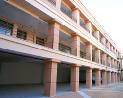{width="1.4708333333333334in"
height="1.06875in"}{width="1.1340277777777779in"
height="1.0666666666666667in"}{width="1.3840277777777779in"
height="1.0590277777777777in"}

### Διοίκηση

**Α. Πρυτανικές Αρχές **

Οι πρυτανικές αρχές του Ιονίου Πανεπιστημίου ορίζονται ως εξής:

> {width="2.057638888888889in"
> height="1.961111111111111in"}**Πρύτανης**
>
> Βασίλειος Χρυσικόπουλος,
>
> Καθηγητής Τμήματος Πληροφορικής
>
> **Αναπληρωτές Πρύτανη**
>
> Θεόδωρος Παππάς,
>
> Kαθηγητής Τμήματος Αρχειονομίας,
>
> Βιβλιοθηκονομίας και Μουσειολογίας
>
> 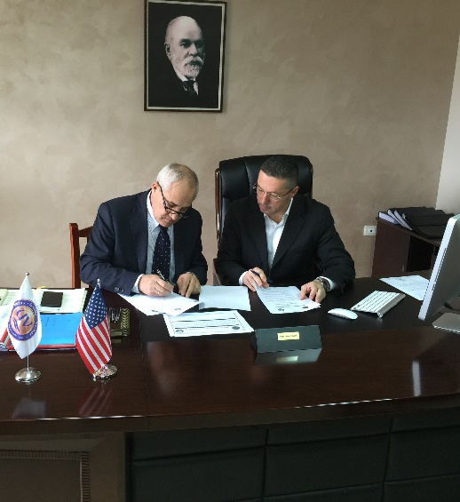{width="2.3555555555555556in"
> height="2.567361111111111in"}*Οικονομικού Προγραμματισμού, *
>
> *Στρατηγικού Σχεδιασμού και Ανάπτυξης*
>
> Κωνσταντίνος Αγγελάκος,
>
> Αναπλ. Καθηγητής Τμήματος Ιστορίας
>
> *Ακαδημαϊκών Υποθέσεων και Προσωπικού *
>
> {width="1.8722222222222222in"
> height="2.808333333333333in"}
>
> Ιωσήφ Παπαδάτος,
>
> Καθηγητής Τμήματος Μουσικών Σπουδών
>
> *Διεθνών και Δημοσίων Σχέσεων και *
>
> *Διασφάλισης Ποιότητας του Ιδρύματος*
>
> **Γραμματεία Πρυτανείας**
>
> Γραμματέας Πρύτανη:
>
> Νέλλη Αντωνάτου-Μπούρα (antonatou@ionio.gr)
>
> Τηλέφωνο επικοινωνίας: 26610 87110
>
> {width="2.145138888888889in"
> height="1.7333333333333334in"}Γραμματέας Αναπληρωτών Πρύτανη:
>
> Νικόλ Ρούσσου (roussou@ionio.gr)
>
> Τηλέφωνο επικοινωνίας: 26610 87106

**Β. Συμβούλιο Ιδρύματος **

Η σύνθεση του Συμβουλίου του Ιονίου Πανεπιστημίου έχει ως εξής:

-   Κωνσταντίνος Αγγελόπουλος, Καθηγητής Νεοελληνικών Σπουδών,
    > Πανεπιστήμιο Paul Valery Montpellier III, Πρόεδρος

-   Νικόλαος-Γρηγόριος Κανελλόπουλος, Καθηγητής Τμήματος Τεχνών Ήχου και
    > Εικόνας, Ιόνιο Πανεπιστήμιο, Αναπληρωτής Πρόεδρος

-   Νικόλαος Αλεξανδρής, Ομότιμος Καθηγητής Τμήματος Πληροφορικής,
    > Πανεπιστήμιο Πειραιά

-   Ιωάννης Γραμματικός, Πρόεδρος της Φιλαρμονικής Εταιρίας Κέρκυρας

-   Βύρων Φιδετζής, Αρχιμουσικός της Κρατικής Ορχήστρας Αθηνών

-   Χρυσούλα-Μιράντα Καλδή, Αν. Καθηγήτρια Τμήματος Μουσικών Σπουδών,
    > Ιόνιο Πανεπιστήμιο

-   Νικόλαος Καραπιδάκης, Καθηγητής Τμήματος Ιστορίας, Ιόνιο
    > Πανεπιστήμιο

-   Μιχάλης Πολίτης, Αν. Καθηγητής Τμήματος Ξένων Γλωσσών, Μετάφρασης
    > και Διερμηνείας, Ιόνιο Πανεπιστήμιο

*Η Σχολή Επιστήμης της Πληροφορίας και Πληροφορικής*
----------------------------------------------------

### Ίδρυση

Η Σχολή Επιστήμης της Πληροφορίας και Πληροφορικής ιδρύθηκε τον Μάιο
2013 (ΦΕΚ ΙΔΡΥΣΗΣ 119 ΤΕΥΧΟΣ Α' 28-5-2013). Σκοπός της σχολής είναι η
μελέτη της διεύρυνσης της πρόσβασης στην πληροφορία, της επεξεργασίας,
διαχείρισης, ανάκτησης, και επικοινωνίας της πληροφορίας, καθώς και της
βελτίωσης της αξιοπιστίας και της ευχρηστίας της.

### Διοίκηση

Όργανο διοίκησης της σχολής αποτελεί η Κοσμητεία, η οποία ορίζεται ως
εξής:

> **Κοσμήτορας**
>
> Σαράντος Καπιδάκης
>
> *Καθηγητής Τμήματος Αρχειονομίας, Βιβλιοθηκονομίας και Μουσειολογίας*
>
> **Μέλη Κοσμητείας**
>
> Εμμανουήλ Γεργατσούλης
>
> *Καθηγητής Τμήματος Αρχειονομίας, Βιβλιοθηκονομίας και Μουσειολογίας*
>
> Παναγιώτης Βλάμος
>
> *Καθηγητής Τμήματος Πληροφορικής*
>
> **Γραμματεία Κοσμητείας**
>
> Γραμματέας: Βασίλης Αρβανάκος (vassilis@ionio.gr)
>
> Τηλέφωνο επικοινωνίας: 26610 87423

[ ]{.smallcaps}[ΤΟ ΤΜΗΜΑ ΠΛΗΡΟΦΟΡΙΚΗΣ]{.smallcaps}
==================================================

*Σκοπός*
--------

Το Τμήμα Πληροφορικής του Ιονίου Πανεπιστημίου δημιουργήθηκε στο πλαίσιο
του ΕΠΕΑΕΚ με το νόμο υπ' αριθ. 3255 και λειτουργεί από το ακαδημαϊκό
έτος 2004-05. Το τμήμα δέχεται κάθε χρόνο φοιτητές/τριες από το 2ο και
4ο επιστημονικό πεδίο και έχει ως αντικείμενο τόσο τη θεωρητική όσο και
την εφαρμοσμένη Πληροφορική.

Σκοπός του Τμήματος είναι:

-   Να καλλιεργεί και να προάγει την Πληροφορική Επιστήμη, με ιδιαίτερη
    έμφαση στη θεωρία και τις εφαρμογές της Πληροφορικής στους τομείς
    των Ανθρωπιστικών και Κοινωνικών Επιστημών, καθώς επίσης και στο
    σχεδιασμό, την ανάπτυξη, τη λειτουργία και τη διαχείριση των
    πληροφοριακών συστημάτων.

-   Να παρέχει στους φοιτητές εξειδικευμένες γνώσεις που θα τους
    επιτρέπουν να απασχοληθούν, πέραν των βασικών τομέων της
    Πληροφορικής, με τη μελέτη, την έρευνα, την κατανόηση και την
    εφαρμογή της Επιστήμης της Πληροφορικής, καθώς και με την χρήση της
    στην υποστήριξη των ποικίλων κοινωνικών, διοικητικών και οικονομικών
    δραστηριοτήτων.

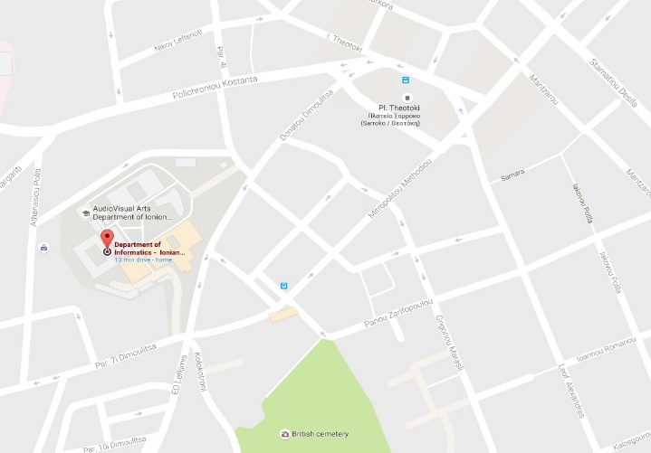{width="3.2708333333333335in"
height="2.2743055555555554in"}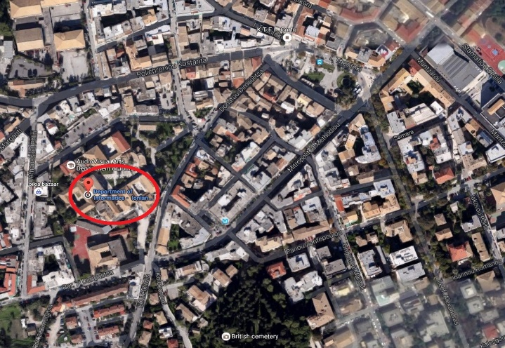{width="3.2708333333333335in"
height="2.252083333333333in"}Tο Τμήμα στεγάζεται στο πλήρως
ανακαινισμένο κτήριο "Αρεταίος" στο κέντρο της πόλης (Πλατεία Τσιριγώτη
7, Κέρκυρα). Σε παρακείμενα κτήρια στεγάζονται τα Τμήματα Τεχνών Ήχου
και Εικόνας, Ξένων Γλωσσών, Μετάφρασης και Διερμηνείας, και το φοιτητικό
εστιατόριο. Οι μετακινήσεις εντός της πόλης πραγματοποιούνται εύκολα με
τα πόδια ή με ποδήλατο, ενώ το λιμάνι και το αεροδρόμιο βρίσκονται σε
κοντινή απόσταση. Ο ιστότοπος του τμήματος Πληροφορικής βρίσκεται στην
διεύθυνση <http://di.ionio.gr/>.

{width="6.46875in" height="2.5368055555555555in"}

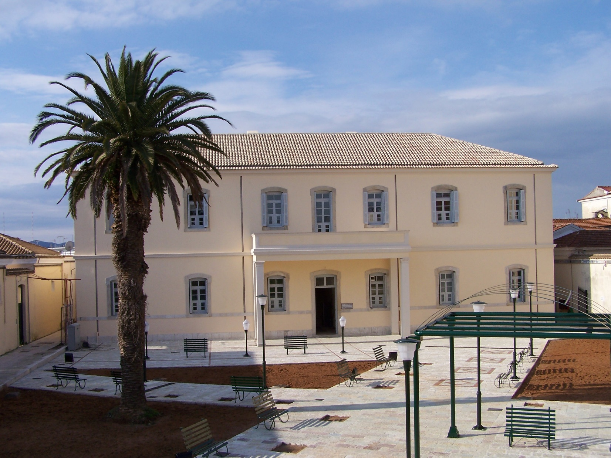{width="7.639583333333333in" height="6.1875in"}

*Υλικοτεχνική Υποδομή*
----------------------

### Εργαστήρια Η/Υ

Για την κάλυψη των αυξημένων αναγκών για διδασκαλία, ερευνητική καθώς
και πρακτική εξάσκηση το Τμήμα διαθέτει Εργαστήρια Υπολογιστών
εξοπλισμένα με σύγχρονους Η/Υ και υποστηρικτικό ηλεκτρονικό εξοπλισμό
(laser εκτυπωτές, σαρωτές, video προβολείς, κάμερες, διαδραστικό πίνακα
και λογισμικό για τηλεκπαίδευση). Όλοι οι υπολογιστές είναι συνδεδεμένοι
ασύρματα ή ενσύρματα σε τοπικό δίκτυο και έχουν πρόσβαση στο Διαδίκτυο
μέσω του κόμβου του Ιονίου Πανεπιστημίου, ο οποίος συνδέεται με το
δίκτυο κορμού του ΕΔΕΤ (Εθνικό Δίκτυο Έρευνας & Τεχνολογίας).

Η πρόσβαση των φοιτητών στα εργαστήρια είναι ελεύθερη εκτός από τις ώρες
που σε αυτά γίνονται μαθήματα. Οι χρήστες μπορούν ελεύθερα να
περιηγούνται στο Διαδίκτυο, να προετοιμάζουν τις εργασίες τους και να
επικοινωνούν ηλεκτρονικά με τους διδάσκοντες και τη γραμματεία του
Τμήματος (υπηρεσίες webmail, gram-web και e-class). Στην υποδομή των
εργαστηρίων συμπεριλαμβάνεται η υπηρεσία καταλόγου (LDAP) του Τμήματος
Πληροφορικής, η οποία επιτρέπει την πιστοποίηση των χρηστών για την
πρόσβαση στους υπολογιστές και εκτυπωτές των εργαστηρίων.

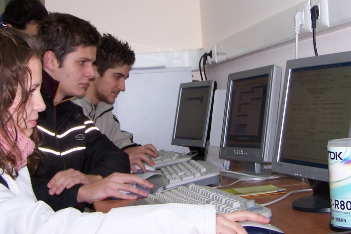{width="3.207638888888889in" height="2.14375in"}

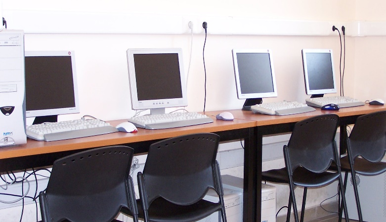{width="3.5493055555555557in"
height="2.045138888888889in"}

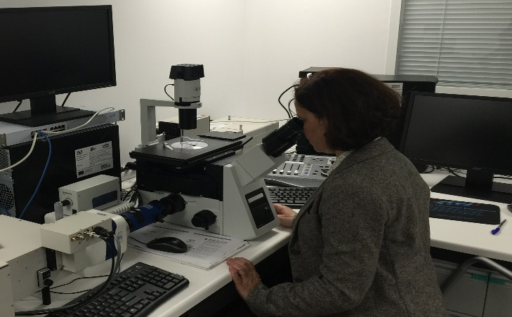{width="3.310416666666667in"
height="2.053472222222222in"}

### Υπηρεσίες Τηλεκπαίδευσης

Στο πλαίσιο των προσπαθειών για την ανάπτυξη και εισαγωγή δράσεων
ηλεκτρονικής μάθησης στην εκπαιδευτική διαδικασία και τη συμμετοχή του
στα αντίστοιχα προγράμματα της Κοινωνίας της Πληροφορίας, το Τμήμα
λειτουργεί,σε συνεργασία με το Κέντρο Διαχείρισης Δικτύων του Ιονίου
Πανεπιστημίου, αίθουσα πλήρως εξοπλισμένη με υλικό και λογισμικό
σύγχρονης και ασύγχρονης τηλεκπαίδευσης.

-   {width="1.7472222222222222in"
    > height="2.098611111111111in"}Οι πλατφόρμες GUnet, e-Class, Open
    > e-Class και Big Blue Button (BBB) είναι ολοκληρωμένα συστήματα
    > δημιουργίας και διαχείρισης online μαθημάτων. Επιτρέπουν στον
    > εκπαιδευτή να δημιουργεί και να διαχειρίζεται το δικτυακό τόπο των
    > μαθημάτων του μέσω εφαρμογής περιήγησης (web browser) με απλό,
    > γρήγορο και εύχρηστο τρόπο. Παρέχουν επίσης εξελιγμένες υπηρεσίες
    > επικοινωνίας μεταξύ διδάσκοντα και εκπαιδευόμενων, virtual
    > classroom, καθώς και σύστημα διαχείρισης εργασιών.

-   {width="1.332638888888889in"
    > height="1.8777777777777778in"}Για τις ανάγκες της σύγχρονης
    > τηλεκπαίδευσης-τηλεδιάσκεψης διατίθεται πλήρως εξοπλισμένη
    > αίθουσα, η οποία έχει τη δυνατότητα να φιλοξενήσει 25 φοιτητές,
    > παρέχοντας τη δυνατότητα διαδραστικής παρακολούθησης και
    > διδασκαλίας μαθημάτων. Κατά τη διεξαγωγή μιας τηλεδιάσκεψης ο
    > εισηγητής έχει τη δυνατότητα, κάνοντας χρήση του διαθέσιμου
    > εξοπλισμού και λογισμικού, να παρουσιάζει ταυτόχρονα στο τοπικό
    > και το απομακρυσμένο ακροατήριο το εκπαιδευτικό υλικό του.

-   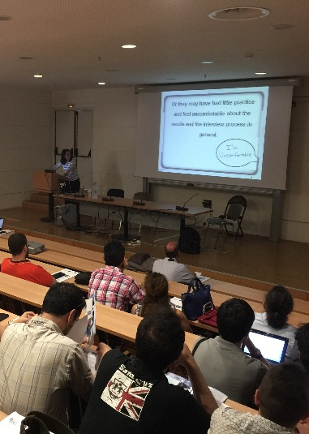{width="1.7770056867891513in"
    > height="2.4945056867891515in"}Η δράση Open Courses θα έχει ως
    > αποτέλεσμα την ανάπτυξη ψηφιακού εκπαιδευτικού υλικού. Το υλικό
    > αυτό θα προέλθει από τη μετατροπή/ συγκέντρωση σε ψηφιακή μορφή
    > ασκήσεων, σημειώσεων, διαφανειών και λοιπού υλικού που
    > χρησιμοποιείται σήμερα στην εκπαιδευτική διαδικασία, από την
    > ανάπτυξη νέου εκπαιδευτικού υλικού, καθώς και από την ποιοτική και
    > ποσοτική αναβάθμιση του περιεχομένου των υφιστάμενων ψηφιακών
    > μαθημάτων των ιδρυμάτων. Μέρος των ανοικτών ψηφιακών μαθημάτων θα
    > διαθέτουν και πολυμεσικό υλικό όπως εκφωνήσεις ή βιντεοδιαλέξεις
    > κ.α.

### Βιβλιοθήκη

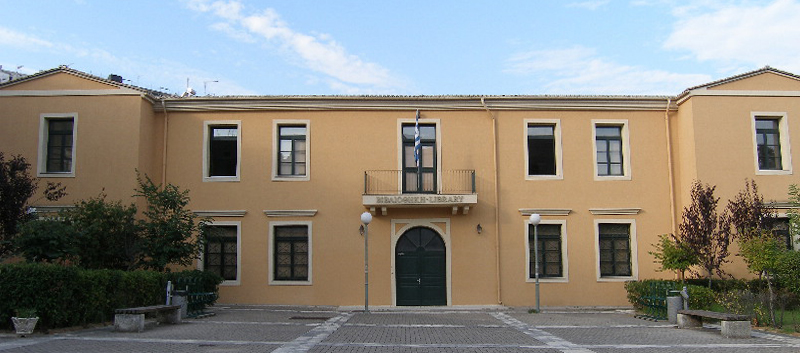{width="5.822916666666667in"
height="2.783333333333333in"}

Η βιβλιοθήκη του Τμήματος Πληροφορικής αποτελεί μέρος της κεντρικής
βιβλιοθήκης του Ιονίου Πανεπιστημίου. Είναι πλήρως αυτοματοποιημένη και
συνδεδεμένη με το πανεπιστημιακό δίκτυο. Σκοπός της είναι να
ικανοποιήσει τις ακαδημαϊκές και ερευνητικές ανάγκες των φοιτητών, του
διδακτικού και διοικητικού προσωπικού του Τμήματος αλλά και της
ευρύτερης πανεπιστημιακής κοινότητας του Ιονίου Πανεπιστημίου. Η
βιβλιοθήκη λειτουργεί καθημερινά 09:00 με 17:00 σε πλήρη λειτουργία και
17:00 με 20:00 ως αναγνωστήριο, και το Σάββατο 09:00 με 14:00 ως
αναγνωστήριο.

Ταχυδρομική διεύθυνση: Ιωάννου Θεοτόκη 72, Κέρκυρα, 49100

Τηλέφωνο: 26610 87755

Ιστότοπος: <http://iup.ionio.gr>

{width="1.5866524496937884in" height="2.3799792213473316in"}*Προσωπικό*
----------------------------------------------------------------------------------------------

### Διοίκηση και Διοικητικό Προσωπικό

> **Πρόεδρος**
>
> Παναγιώτης Βλάμος (Καθηγητής)
>
> **Γραμματεία**
>
> Προϊσταμένη Γραμματείας
>
> Λάσκαρι Έλενα
>
> Τμήμα Μαθηματικών Πανεπιστημίου Πατρών,
>
> MSc, Τμήμα Αρχειονομίας, Βιβλιοθηκονομίας και Μουσειολογίας, Ιόνιο
> Πανεπιστήμιο
>
> Tηλ. 26610 87763
>
> **Γραφείο Υποστήριξης Συστημάτων**
>
> Ειδικό Τεχνικό Εργαστηριακό Προσωπικό (Ε.Τ.Ε.Π.)
>
> Π.Ε. Τμήματος Πληροφορικής
>
> Βούλγαρης Σπύρος
>
> Τμήμα Ηλεκτρολόγων Μηχανικών και Μηχ. Η/Υ,
>
> Εθνικό Μετσόβιο Πολυτεχνείο,
>
> MSc, Τμήμα Αρχειονομίας, Βιβλιοθηκονομίας και Μουσειολογίας,
>
> Ιόνιο Πανεπιστήμιο
>
> Tηλ. 26610 87753
>
> **Ταχυδρομική Διεύθυνση**
>
> Κτήριο Αρεταίος, Πλατεία Τσιριγώτη 7, Κέρκυρα, 49100
>
> Τηλέφωνα: 26610 87760 - 3
>
> Fax: 26610 87766
>
> e-mail: <cs@ionio.gr>

### Διδακτικό Προσωπικό -- Μέλη ΔΕΠ

**Καθηγητής Βασίλειος Χρυσικόπουλος**

{width="1.6513888888888888in"
height="1.1944444444444444in"}Είναι κάτοχος πτυχίου του Μαθηματικού
Τμήματος του Αριστοτελείου Πανεπιστημίου Θεσσαλονίκης, μεταπτυχιακού
διπλώματος του Πανεπιστημίου Warwick, μεταπτυχιακού διπλώματος του
Chelsea College του Πανεπιστημίου του Λονδίνου και διδακτορικού
διπλώματος του Royal Holloway College του Πανεπιστημίου του Λονδίνου. Τα
ερευνητικά του ενδιαφέροντα αφορούν τα κρυπτογραφικά πρωτόκολλα, την
ασφάλεια πληροφοριών, την ασφάλεια δικτύων, την ασφάλεια σε ηλεκτρονικά
συστήματα ψηφοφοριών, τη διαχείριση κλειδιού σε ασύρματα δίκτυα, τις
ψηφιακές βιβλιοθήκες και την πληροφορική της υγείας.

**Καθηγητής Παναγιώτης Βλάμος**

{width="1.0805555555555555in"
height="1.3416666666666666in"}Είναι κάτοχος πτυχίου του Μαθηματικού
Τμήματος του Πανεπιστημίου Αθηνών και διδακτορικού διπλώματος της Σχολής
Εφαρμοσμένων Μαθηματικών και Φυσικών Επιστημών του Ε.Μ. Πολυτεχνείου. Τα
ερευνητικά του ενδιαφέροντα αφορούν σε εφαρμογές μαθηματικών μοντέλων σε
προβλήματα φυσικών επιστημών, χημικής μηχανικής και τεχνικών
αποκατάστασης εικόνας.

{width="1.13125in"
height="1.323611111111111in"}**Αναπληρωτής Καθηγητής Σπυρίδων Σιούτας**

Είναι κάτοχος διπλώματος, Master και διδακτορικού του Τμήματος
ΜηχανικώνΗ/Υ και Πληροφορικής της Πολυτεχνικής Σχολής του Πανεπιστημίου
Πατρών.Τα ερευνητικά του ενδιαφέροντα αφορούν σε βάσεις δεδομένων,
αλγόριθμουςκαι δομές δεδομένων, υπολογιστική γεωμετρία και γραφικά
υπολογιστών,ανάκτηση πληροφορίας σε ομότιμα δίκτυα Η/Υ, διαχείριση
πληροφορίας καιπροηγμένα πληροφοριακά συστήματα.

{width="1.13125in"
height="1.3576388888888888in"}**Επίκουρος Καθηγητής Θεόδωρος
Ανδρόνικος**

Είναι κάτοχος διπλώματος του Τμήματος Ηλεκτρολόγων Μηχανικών και
Μηχανικών Υπολογιστών του Ε.Μ. Πολυτεχνείου και διδακτορικού διπλώματος
από το Ε.Μ. Πολυτεχνείο. Τα ερευνητικά του ενδιαφέροντα αφορούν στο
διαδικτυακό προγραμματισμό και στα παράλληλα και κατανεμημένα ετερογενή
συστήματα ευρείας κλίμακας.

**Επίκουρος Καθηγητής Μάρκος Αυλωνίτης**

{width="1.2819444444444446in"
height="1.2430555555555556in"}Είναι κάτοχος πτυχίου και μεταπτυχιακού
διπλώματος του Φυσικού Τμήματος του Αριστοτέλειου Πανεπιστημίου
Θεσσαλονίκης και διδακτορικού διπλώματος του Γενικού Τμήματος της
Πολυτεχνικής Σχολής του Αριστοτέλειου Πανεπιστημίου Θεσσαλονίκης. Τα
ερευνητικά του ενδιαφέροντα αφορούν σε εφαρμοσμένες στοχαστικές
διεργασίες, μη-γραμμικά μη-τοπικά προβλήματα και συστήματα
αυτοοργάνωσης.

{width="1.10625in"
height="1.1284722222222223in"}**Επίκουρη Καθηγήτρια Κάτια - Λήδα
Κερμανίδου**

Είναι κάτοχος διπλώματος του Τμήματος Ηλεκτρολόγων Μηχανικών και
Τεχνολογίας Υπολογιστών του Πανεπιστημίου Πατρών και διδακτορικού
διπλώματος του ιδίου τμήματος. Τα ερευνητικά της ενδιαφέροντα
εστιάζονται στην τεχνητή νοημοσύνη, αυτόματη επεξεργασία κειμένου,
ανάπτυξη γραμματικών, αυτόματη ανάκτηση πληροφορίας.

**Επίκουρος Καθηγητής Παναγιώτης Κουρουθανάσης**

{width="1.1479166666666667in"
height="1.30625in"}Είναι κάτοχος διπλώματος της Σχολής Ηλεκτρολόγων
Μηχανικών και Μηχανικών Υπολογιστών του Εθνικού Μετσοβίου Πολυτεχνείου,
και κατέχει τον τίτλο του Διδάκτορα Μηχανικού από τον τομέα
Ηλεκτρονικής, Επικοινωνιών και Συστημάτων Πληροφορικής της ίδιας Σχολής.
Τα ερευνητικά του ενδιαφέροντα εστιάζονται στα ασύρματα τοπικά δίκτυα,
στα δίκτυα ad-hoc και αισθητήρων, και σε θέματα ποιότητας υπηρεσίας,
ενεργειακής αποδοτικότητας και βελτιστοποίησης.

{width="1.1069444444444445in"
height="1.2506944444444446in"}**Επίκουρος Καθηγητής Εμμανουήλ Μάγκος**

Είναι κάτοχος πτυχίου του Τμήματος Πληροφορικής του Πανεπιστημίου
Πειραιά και διδακτορικού διπλώματος του ιδίου τμήματος. Τα ερευνητικά
του ενδιαφέροντα αφορούν στη χρήση κρυπτογραφικών τεχνικών για την
προστασία της ασφάλειας και της ιδιωτικότητας στην Ασφάλεια Η/Υ και Π.Σ.
Ειδικότερα, Ασφάλεια και Ιδιωτικότητα σε Κινητά και Αδόμητα Δίκτυα,
σεΔίκτυα Αισθητήρων, σε Συστήματα Ηλεκτρονικών Εκλογών, σε Συστήματα
Ηλεκτρονικών Δημοπρασιών, ασφάλεια έναντι Ταχέως Εξαπλούμενου Κακόβουλου
Λογισμικού.

**Επίκουρος Καθηγητής Φοίβος Απόστολος Μυλωνάς**

{width="1.19375in"
height="1.3486111111111112in"}Είναι κάτοχος διπλώματος του Τμήματος
Ηλεκτρολόγων Μηχανικών & Μηχανικών Η/Υ του Εθνικού Μετσόβιου
Πολυτεχνείου, μεταπτυχιακού διπλώματος του Τμήματος Πληροφορικής και
Τηλεπικοινωνιών του Πανεπιστημίου Αθηνών και διδακτορικού διπλώματος του
Τμήματος Ηλεκτρολόγων Μηχανικών & Μηχανικών Η/Υ του Εθνικού Μετσόβιου
Πολυτεχνείου. Τα ερευνητικά του ενδιαφέροντα αφορούν στη διαχείριση
γνώσης και πληροφορίας, σε θέματα ανάλυσης και διαχείρισης πολυμεσικού
περιεχομένου, θέματα προσωποποίησης και εξατομίκευσης περιεχομένου και
στην κατά περίπτωση αξιοποίηση του εννοιολογικού πλαισίου.

**Επίκουρος Καθηγητής Κωνσταντίνος Οικονόμου**

{width="1.1944444444444444in"
height="1.242361111111111in"}Είναι κάτοχος διπλώματος του Τμήματος
Μηχανικών Η/Υ και Πληροφορικής του Πανεπιστημίου Πατρών, μεταπτυχιακού
διπλώματος του Imperial College και διδακτορικού διπλώματος του Τμήματος
Πληροφορικής και Τηλεπικοινωνιών του Πανεπιστημίου Αθηνών. Τα ερευνητικά
του ενδιαφέροντα αφορούν στις τηλεπικοινωνίες, στα δίκτυα υπολογιστών,
στα κατά περίπτωση δίκτυα καθώς και στα αυτόνομα δίκτυα.

**Επίκουρη Καθηγήτρια Αδαμαντία Πατέλη**

{width="1.1180555555555556in"
height="1.3868055555555556in"}Είναι κάτοχος πτυχίου του Τμήματος
Πληροφορικής του Οικονομικού Πανεπιστημίου Αθηνών, μεταπτυχιακού
διπλώματος του University of Manchester Institute of Scienceand
Technology (UMIST) και διδακτορικού διπλώματος του Τμήματος Διοικητικής
Επιστήμης και Τεχνολογίας (ΔΕΤ) του Οικονομικού Πανεπιστημίου Αθηνών. Τα
ερευνητικά της ενδιαφέροντα αφορούν στη Διοίκηση Πληροφοριακών
Συστημάτων, την Ψηφιακή Επιχειρηματικότητα και το ανοιχτό μοντέλο
Καινοτομίας.

{width="1.0798611111111112in"
height="1.382638888888889in"}**Επίκουρος Καθηγητής Μιχάλης
Στεφανιδάκης**

Είναι κάτοχος διπλώματος του Τμήματος Μηχανικών Ηλεκτρονικών Υπολογιστών
και Πληροφορικής του Πανεπιστημίου Πατρών και διδακτορικού διπλώματος
του ιδίου τμήματος. Τα ερευνητικά του ενδιαφέροντα αφορούν στη σχεδίαση
και μελέτη απόδοσης κατανεμημένων υπολογιστικών συστημάτων υψηλών
επιδόσεων, τα ενσωματωμένα συστήματα πραγματικού χρόνου και τις
εφαρμογές αυξημένης υπολογιστικής παρουσίας (ubiquitous computing).

{width="1.1131944444444444in"
height="1.4020833333333333in"}**Επίκουρος Καθηγητής Δημήτριος
Τσουμάκος**

Είναι κάτοχος διπλώματος του Τμήματος Ηλεκτρολόγων Μηχανικών & Μηχανικών
Η/Υ του Εθνικού Μετσόβιου Πολυτεχνείου, μεταπτυχιακού και διδακτορικού
διπλώματος του Τμήματος Επιστήμης Υπολογιστών του University of Maryland
στο College Park των Η.Π.Α. Τα ερευνητικά του ενδιαφέροντα εστιάζονται
στα κατανεμημένα συστήματα ευρείας κλίμακας και ιδιαίτερα στην αποδοτική
και κλιμακώσιμη διαχείριση μεγάλου όγκου δεδομένων, με έμφαση σε
εφαρμογές στο Διαδίκτυο.

{width="1.1402777777777777in"
height="1.36875in"}**Επίκουρη Καθηγήτρια Αγγελική Τσώχου**

Είναι κάτοχος πτυχίου Πληροφορικής και Μεταπτυχιακού Διπλώματος
Ειδίκευσης σε Πληροφοριακά Συστήματα από το Τμήμα Πληροφορικής του
Οικονομικού Πανεπιστημίου Αθηνών. Είναι κάτοχος διδακτορικού διπλώματος
από το Τμήμα Μηχανικών Πληροφοριακών και Επικοινωνιακών Συστημάτων του
Πανεπιστημίου Αιγαίου. Τα ερευνητικά της ενδιαφέροντα αφορούν στην
ανάλυση επικινδυνότητας και διαχείριση ασφάλειας και ιδιωτικότητας
πληροφοριών, σε μεθοδολογίες και πρακτικές ενημερότητας ασφάλειας
πληροφοριών, σε πρότυπα ασφάλειας και ιδιωτικότητας πληροφοριών και στην
ασφάλεια πληροφοριών σε περιβάλλοντα ηλεκτρονικής διακυβέρνησης.

**Επίκουρος Καθηγητής Κωνσταντίνος Χωριανόπουλος**

{width="1.167361111111111in"
height="1.225in"}Είναι κάτοχος διπλώματος του τμήματος Ηλεκτρονικών
Μηχανικών και Μηχανικών Η/Υ του Πολυτεχνείου Κρήτης, καθώς και
μεταπτυχιακού διπλώματος ειδίκευσης στο Μάρκετινγκ και στην Επικοινωνία,
και διδακτορικού διπλώματος του τμήματος Διοικητικής Επιστήμης και
Τεχνολογίας του Οικονομικού Πανεπιστημίου Αθηνών. Τα ερευνητικά του
ενδιαφέροντα αφορούν την περιοχή της επικοινωνίας ανθρώπου-υπολογιστή
για εφαρμογές πληροφόρησης, επικοινωνίας και ψυχαγωγίας, μέσω της
αμφίδρομης τηλεόρασης, των κινητών τηλεφώνων και των διάχυτων
υπολογιστικών συστημάτων.

### Διδακτικό Προσωπικό -- Μέλη ΕΔΙΠ

**Πανάρετος Αλέξανδρος **

BEng, Department of Computer Science, University of Wales Aberystwyth

MSc, Department of Computer Science, Essex University

Ph.D. Τμήμα Πληροφορικής, Ιόνιο Πανεπιστήμιο

Tηλ. 26610 87754

{width="4.470833333333333in" height="2.9895833333333335in"}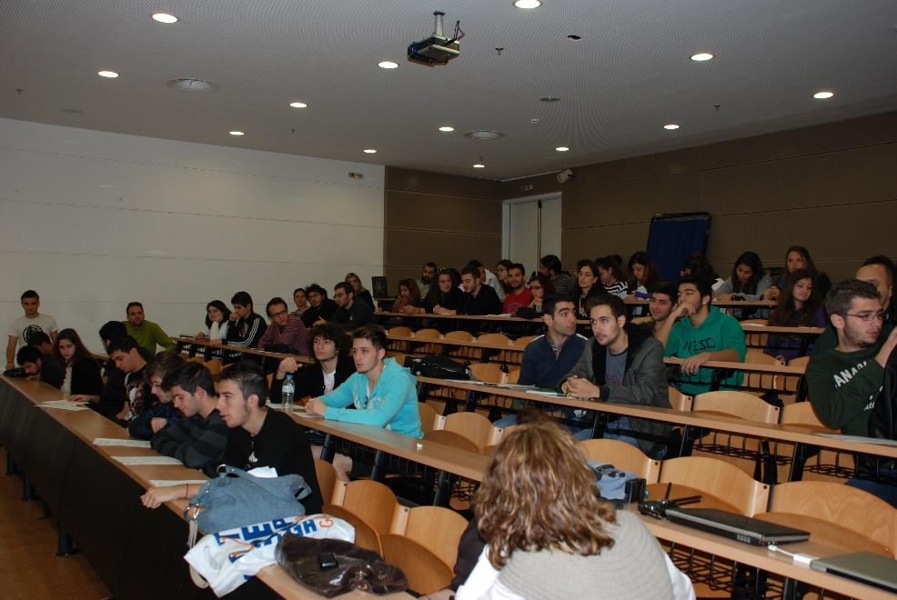{width="4.480555555555555in" height="3.0in"}{width="4.488888888888889in" height="2.9819444444444443in"}[ ]{.smallcaps}[3]{.smallcaps} [ΠΡΟΠΤΥΧΙΑΚΕΣ ΣΠΟΥΔΕΣ]{.smallcaps} {#προπτυχιακεσ-σπουδεσ .ListParagraph}
========================================================================================================================================================================================================================================================================================================

*3.1 Πρόγραμμα Προπτυχιακών Σπουδών Ακαδ. Έτους 2016-17 * {#πρόγραμμα-προπτυχιακών-σπουδών-ακαδ.-έτους-2016-17 .ListParagraph}
---------------------------------------------------------

[]{#_Toc456097474 .anchor}Το Τμήμα Πληροφορικής προσφέρει ένα
προπτυχιακό πρόγραμμα διάρκειας 4 ετών, το οποίο παρέχει στους
αποφοίτους του την επιστημονική γνώση και την πρακτική εξάσκηση που
απαιτούνται για να ανταποκριθούν στη σύγχρονη αγορά εργασίας του κλάδου
της Πληροφορικής.

[]{#_Toc456097475 .anchor}Τα μαθήματα χωρίζονται σε τρεις κατηγορίες:
κορμού, κατεύθυνσης και ελεύθερης επιλογής. Τα δύο πρώτα έτη (4 εξάμηνα)
σπουδών, οι φοιτητές παρακολουθούν μαθήματα κορμού και επιλογής. Στην
αρχή του 5ου εξαμήνου, οι φοιτητές επιλέγουν την κατεύθυνση στην οποία
ειδικεύονται, αποκτώντας με αυτό τον τρόπο μία εις βάθος γνώση και
εμπειρία. Το Τμήμα προσφέρει τις εξής κατευθύνσεις:

[]{#_Toc456097476 .anchor}**Α. Πληροφορική -- Ανθρωπιστικές και
Κοινωνικές Επιστήμες**

[]{#_Toc456097477 .anchor}**Β. Πληροφοριακά Συστήματα**

[]{#_Toc456097478 .anchor}Στο πλαίσιο των υποχρεωτικών μαθημάτων και των
μαθημάτων επιλογής του Προγράμματος Σπουδών, προβλέπονται και ώρες
διδασκαλίας για τα φροντιστηριακά και εργαστηριακά μαθήματα και την εν
γένει άσκηση των φοιτητών του Τμήματος.

**[Α΄ Εξάμηνο]{.smallcaps}**

  --------- ------------------------------------------ ---------- ----------- --------------------------------
  **Α/Α**   **ΚΟΡΜΟΣ**                                 **ΩΡΕΣ**   **ECTS\     **Εργαστήριο -- Φροντιστήριο**
                                                                  ΜΟΝΑΔΕΣ**   

  1.        Εισαγωγή στην Επιστήμη των Υπολογιστών     4          **6**       **-**

  2.        Εισαγωγή στον Προγραμματισμό               4          **6**       **2E**

  3.        Μαθηματικός Λογισμός                       4          **6**       **-**

  4.        Γραμμική Άλγεβρα                           4          **6**       **2^Ε^**

  5.        Πληροφορική στις Ανθρωπιστικές Επιστήμες   4          **6**       **2^Ε^**
  --------- ------------------------------------------ ---------- ----------- --------------------------------

**[B΄ Εξάμηνο]{.smallcaps}**

  --------- -------------------------------------------------- ---------- ----------- --------------------------------
  **Α/Α**   **ΚΟΡΜΟΣ**                                         **ΩΡΕΣ**   **ECTS\     **Εργαστήριο -- Φροντιστήριο**
                                                                          ΜΟΝΑΔΕΣ**   

  1.        Προγραμματισμός Υπολογιστών                        4          **6**       **2E**

  2.        Δομές Δεδομένων                                    4          **6**       **2E**

  3.        Διακριτά Μαθηματικά                                4          **6**       **2Φ**

  4.        Πιθανότητες                                        4          **6**       **2^Ε^**

            **ΜΑΘΗΜΑΤΑ ΕΠΙΛΟΓΗΣ **                                                    

  1.        Οργάνωση και Διοίκηση Επιχειρήσεων                 4          **4**       **-**

  2.        Ελεύθερη Επιλογή\                                  4          **4**       
            (Μάθημα από άλλο Τμήμα του Ιονίου Πανεπιστημίου)                          
  --------- -------------------------------------------------- ---------- ----------- --------------------------------

**[Γ΄ Εξάμηνο]{.smallcaps}**

  --------- ------------------------------------ ---------- ----------- --------------------------------
  **Α/Α**   **ΚΟΡΜΟΣ**                           **ΩΡΕΣ**   **ECTS\     **Εργαστήριο -- Φροντιστήριο**
                                                            ΜΟΝΑΔΕΣ**   

  1.        Διδακτική της Πληροφορικής           4          **4**       **-**

  2.        Αρχιτεκτονική Υπολογιστών            4          **6**       **2E**

  3.        Αντικειμενοστρεφής Προγραμματισμός   4          **6**       **2E**

  4.        Επικοινωνία Ανθρώπου-Υπολογιστή      4          **6**       **2Φ**

  5.        Στατιστική                           4          **6**       **2^Ε^**

            **ΜΑΘΗΜΑΤΑ ΕΠΙΛΟΓΗΣ **                          ** **       

  1.        Θεωρία της Πληροφορίας               4          **4**       **2 Φ**

  2.        Κρυπτογραφία                         4          **4**       **-**
  --------- ------------------------------------ ---------- ----------- --------------------------------

**[Δ΄ Εξάμηνο]{.smallcaps}**

  --------- ---------------------------------------------- ---------- ----------- --------------------------------
  **Α/Α**   **ΚΟΡΜΟΣ**                                     **ΩΡΕΣ**   **ECTS\     **Εργαστήριο -- Φροντιστήριο**
                                                                      ΜΟΝΑΔΕΣ**   

  1.        Αλγόριθμοι                                     4          **6**       **2Φ**

  2.        Βάσεις Δεδομένων Ι                             4          **6**       **2^Ε^**

  3.        Δίκτυα I                                       4          **6**       **2^Ε^**

  4.        Εισαγωγή στα Πληροφοριακά Συστήματα            4          **6**       **2^Ε^**

  5.        Ασφάλεια Υπολογιστών και Προστασία Δεδομένων   4          **6**       **2Φ**

            **ΜΑΘΗΜΑΤΑ ΕΠΙΛΟΓΗΣ **                                    ** **       

  1.        Θεωρία Υπολογισμού                             4          **4**       **-**

  2.        Κινητά και Κοινωνικά Μέσα                      4          **4**       **-**
  --------- ---------------------------------------------- ---------- ----------- --------------------------------

**[Ε΄ Εξάμηνο]{.smallcaps}**

  --------- ------------------------------------------------------- ---------- ----------- --------------------------------
  **Α/Α**   **ΚΟΡΜΟΣ**                                              **ΩΡΕΣ**   **ECTS\     **Εργαστήριο -- Φροντιστήριο**
                                                                               ΜΟΝΑΔΕΣ**   

  1.        Δίκτυα ΙI                                               4          **6**       **2^Ε^**

  2.        Βάσεις Δεδομένων ΙΙ                                     4          **6**       **2^Ε^**

  3.        Λειτουργικά Συστήματα                                   4          **6**       **2E**

  ** **     **ΥΠΟΧΡΕΩΤΙΚΑ ΚΑΤΕΥΘΥΝΣΗΣ\                              ** **      ** **       
            Πληροφοριακά Συστήματα (Π.Σ.) **                                               

  1.        Ανάλυση και Σχεδιασμός Π.Σ.                             4          **5**       **2Φ**

  2.        Μαθηματικός Προγραμματισμός                             4          **5**       **2^Ε^**

  ** **     **ΥΠΟΧΡΕΩΤΙΚΑ ΚΑΤΕΥΘΥΝΣΗΣ\                              ** **      ** **       
            Πληροφορική - Ανθρωπιστικές & Κοινωνικές Επιστήμες **                          

  1.        Πολυμέσα                                                4          **5**       **2^Ε^**

  2.        Γραφικά με Υπολογιστές                                  4          **5**       **2^Ε^**

            **ΜΑΘΗΜΑΤΑ ΕΠΙΛΟΓΗΣ **                                             ** **       

  1.        Ψηφιακή Επεξεργασία Εικόνας                             4          **4**       **2^Ε^**

  2.        Πολιτικές και Τεχνολογίες Ασφάλειας και Ιδιωτικότητας   4          **4**       **-**

  3.        Καινοτομία και Επιχειρηματικότητα                       4          **4**       **-**

  4.        Μοντέλα Κβαντικού και Μοριακού Υπολογισμού              4          **4**       **-**
  --------- ------------------------------------------------------- ---------- ----------- --------------------------------

**[ΣΤ΄ Εξάμηνο]{.smallcaps}**

  --------- ------------------------------------------------------- ---------- ----------- --------------------------------
  **Α/Α**   **ΚΟΡΜΟΣ**                                              **ΩΡΕΣ**   **ECTS\     **Εργαστήριο -- Φροντιστήριο**
                                                                               ΜΟΝΑΔΕΣ**   

  1.        Τεχνολογία Λογισμικού                                   4          **6**       **2^Ε^**

  2.        Τεχνητή Νοημοσύνη                                       4          **6**       **2^Ε^**

  ** **     **ΥΠΟΧΡΕΩΤΙΚΑ ΚΑΤΕΥΘΥΝΣΗΣ\                              ** **      ** **       
            Πληροφοριακά Συστήματα (Π.Σ.) **                                               

  1.        Τεχνολογίες Διαδικτύου                                  4          **5**       **2^Ε^**

  2.        Συστήματα Υποστήριξης Αποφάσεων                         4          **5**       **2Φ**

  ** **     **ΥΠΟΧΡΕΩΤΙΚΑ ΚΑΤΕΥΘΥΝΣΗΣ\                              ** **      ** **       
            Πληροφορική - Ανθρωπιστικές & Κοινωνικές Επιστήμες **                          

  1.        Αναγνώριση Προτύπων                                     4          **5**       **2^Ε^**

  2.        Ανάκτηση Πληροφορίας                                    4          **5**       **2^Ε^**

            **ΜΑΘΗΜΑΤΑ ΕΠΙΛΟΓΗΣ **                                             ** **       

  1.        Κατανεμημένα Δικτυοκεντρικά Συστήματα                   4          **4**       **2^Ε^**

  2.        Ειδικά Θέματα Ασφάλειας Πληροφοριών                     4          **4**       **-**

  3.        Μεταγλωττιστές                                          4          **4**       **2^Ε^**

  4.        Πρακτική άσκηση                                         \-         **8**       **-**
  --------- ------------------------------------------------------- ---------- ----------- --------------------------------

**[Ζ΄ Εξάμηνο]{.smallcaps}**

  --------- -------------------------------------------------------- ---------- ----------- --------------------------------
  **Α/Α**   **ΚΟΡΜΟΣ**                                               **ΩΡΕΣ**   **ECTS\     **Εργαστήριο -- Φροντιστήριο**
                                                                                ΜΟΝΑΔΕΣ**   

  1.        Πτυχιακή                                                            **6**       

  2.        Ηλεκτρονικό Eπιχειρείν                                   4          **6**       **2^Ε^**

  ** **     **ΥΠΟΧΡΕΩΤΙΚΑ ΚΑΤΕΥΘΥΝΣΗΣ\                               ** **      ** **       
            Πληροφοριακά Συστήματα (Π.Σ.) **                                                

  1.        Προσομοίωση και Μοντελοποίηση                            4          **5**       **2^Ε^**

  2.        Πληροφοριακά Συστήματα και Εφοδιαστική Αλυσίδα           4          **5**       **2^Ε^**

  ** **     **ΥΠΟΧΡΕΩΤΙΚΑ ΚΑΤΕΥΘΥΝΣΗΣ\                               ** **      ** **       
            Πληροφορική - Ανθρωπιστικές & Κοινωνικές Επιστήμες **                           

  1.        Γλωσσική Τεχνολογία                                      4          **5**       **2^Ε^**

  2.        Τεχνολογία Ψυχαγωγικού Λογισμικού και Εικονικοί Κόσμοι   4          **5**       **2^Ε^**

            **ΜΑΘΗΜΑΤΑ ΕΠΙΛΟΓΗΣ **                                              ** **       

  1.        Κοινωνικά και Νομικά Θέματα των ΤΠΕ                      4          **4**       **-**

  2.        Διαχείριση Έργων Πληροφορικής                            4          **4**       **-**

  3.        Λογικός Προγραμματισμός                                  4          **4**       **2^Ε^**

  4.        Αναπαράσταση Πληροφοριών και Γνώσης                      4          **4**       **-**

  5.        Διαχείριση Μεγάλου Όγκου Δεδομένων στο Διαδίκτυο         4          **4**       **-**

  6.        Ειδικά Θέματα Διδακτικής της Πληροφορικής                4          **4**       **-**
  --------- -------------------------------------------------------- ---------- ----------- --------------------------------

**[Η΄ Εξάμηνο]{.smallcaps}**

  --------- ---------------------------------------------------------------- ---------- ----------- --------------------------------
  **Α/Α**   **ΚΟΡΜΟΣ**                                                       **ΩΡΕΣ**   **ECTS\     **Εργαστήριο -- Φροντιστήριο**
                                                                                        ΜΟΝΑΔΕΣ**   

  1.        Πτυχιακή                                                                    **6**       

            **ΥΠΟΧΡΕΩΤΙΚΑ ΚΑΤΕΥΘΥΝΣΗΣ\                                                              
            Πληροφοριακά Συστήματα (Π.Σ.)**                                                         

  1.        Στρατηγική και Διοίκηση Πληροφοριακών Συστημάτων                 4          **5**       **-**

  2.        Διοίκηση Ασφάλειας Πληροφοριακών Συστημάτων                      4          **5**       **-**

  ** **     **ΥΠΟΧΡΕΩΤΙΚΑ ΚΑΤΕΥΘΥΝΣΗΣ\                                       ** **      ** **       
            Πληροφορική - Ανθρωπιστικές & Κοινωνικές Επιστήμες **                                   

  1.        Σημασιολογικός και Κοινωνικός Ιστός                              4          **5**       **2^Ε^**

  2.        Επεξεργασία Ομιλίας και Ήχου                                     4          **5**       **2^Ε^**

            **ΜΑΘΗΜΑΤΑ ΕΠΙΛΟΓΗΣ **                                                      ** **       

  1.        Αποθήκες και Εξόρυξη Δεδομένων                                   4          **4**       **-**

  2.        Ηλεκτρονική Διακυβέρνηση                                         4          **4**       **2^Ε^**

  3.        Παράλληλος Προγραμματισμός                                       4          **4**       **2^Ε^**

  4.        Χωρικές Βάσεις Δεδομένων και Γεωγραφικά Πληροφοριακά Συστήματα   4          **4**       **-**

  5.        Έξυπνα Περιβάλλοντα και Εφαρμογές                                4          **4**       **2E**

  6.        Μοντελοποίηση Δεδομένων και Συστήματα υποστήριξης αποφάσεων      4          **4**       **-**
  --------- ---------------------------------------------------------------- ---------- ----------- --------------------------------

 {#section .ListParagraph}

*3.2 Κανονισμός Προπτυχιακών Σπουδών * {#κανονισμός-προπτυχιακών-σπουδών .ListParagraph}
--------------------------------------

Ακολουθώς, αναφέρονται λεπτομερώς οι προϋποθέσεις απόκτηση πτυχίου:

Για την απόκτηση πτυχίου απαιτείται η επιτυχής συγγραφή της Πτυχιακής
εργασίας, η επιτυχής γραπτή δοκιμασία σε όλα τα υποχρεωτικά μαθήματα (Υ)
και σε τόσα μαθήματα επιλογής όσα χρειάζονται ώστε το άθροισμα των ECTS
των υποχρεωτικών μαθημάτων, των ECTS των μαθημάτων επιλογής, και των
ECTS που αντιστοιχούν στην πτυχιακή εργασία, να είναι **τουλάχιστον 240
ECTS**. Τα προσφερόμενα μαθήματα, όπως φαίνεται και από τους παρακάτω
πίνακες, αντιστοιχούν σε τουλάχιστον 60 ECTS ανά ακαδημαϊκό έτος. Η
συγγραφή της **Πτυχιακής Εργασίας** ισοδυναμεί με δύο μαθήματα επιλογής
που το καθένα αντιστοιχεί σε 6 ECTS. Επομένως η Πτυχιακή Εργασία
αντιστοιχεί συνολικά σε 12 ECTS. Η **Πρακτική Άσκηση** είναι
προαιρετική, συνολικής διάρκειας δύο μηνών. Σημειώνεται ότι η δήλωση της
πρακτικής άσκησης ως μαθήματος επιλογής γίνεται υπό προϋποθέσεις σύμφωνα
με τον Κανονισμό Πρακτικής Άσκησης.

Προϋπόθεση για την απόκτηση πτυχίου είναι η πιστοποιημένη γνώση της
Αγγλικής γλώσσας που αποδεικνύεται με κατάθεση **κρατικού πιστοποιητικού
γλωσσομάθειας τουλάχιστον επιπέδου Β2** ή άλλου αντίστοιχου, ή με
βεβαίωση παρακολούθησης σεμιναρίων Αγγλικής γλώσσας. Σε περίπτωση μη
κατοχής του κατάλληλου πιστοποιητικού ή βεβαίωσης, οι φοιτητές μπορούν
να παρακολουθούν μάθημα Αγγλικών που παρίδεται σε συνεργασία με άλλο
τμήμα του Ιονίου Πανεπιστημίου, όπως ορίζει η ΠΓΣ του Τμήματος. Επιτυχής
εξέταση του μαθήματος αποδεικνύει την πιστοποιημένη γνώσης της Αγγλικής
γλώσσας.

Οι φοιτητές έχουν τη δυνατότητα να δηλώσουν ως μάθημα επιλογής
(επιλεγόμενο), ένα υποχρεωτικό μάθημα άλλης κατεύθυνσης επιπλέον των
μαθημάτων επιλογής του εξαμήνου στο οποίο βρίσκονται (ή κατώτερου).

Στο πλαίσιο των υποχρεωτικών μαθημάτων (Υ) και των μαθημάτων επιλογής
(Ε) του Προγράμματος Σπουδών, προβλέπονται και ώρες διδασκαλίας γιa τα
και την εν γένει άσκηση των φοιτητών του Τμήματος.

Μόνο στο τρίτο (3ο) και τέταρτο (4ο) έτος σπουδών μπορούν οι φοιτητές να
δηλώνουν αριθμό επιλεγομένων μαθημάτων που υπερβαίνει τον καθορισμένο
από το Πρόγραμμα Σπουδών.

Οι φοιτητές δε μπορούν να δηλώσουν μαθήματα επιλογής μεγαλύτερων
εξαμήνων του Τμήματος ή άλλων Τμημάτων του Ιονίου Πανεπιστημίου.

Tα μαθήματα ελεύθερης επιλογής (ΕΕ), δηλαδή μαθήματα από άλλα Τμήματα
του Ιονίου Πανεπιστημίου, πρέπει να αντιστοιχούν σε τρεις (3) ή τέσσερις
(4) διδακτικές μονάδες στο Πρόγραμμα Σπουδών του άλλου Τμήματος. Η
Γραμματεία του Τμήματός μας κατοχυρώνει 4 διδακτικές μονάδες.

Εάν ένας φοιτητής έχει περάσει περισσότερα από τον απαιτούμενο για τη
λήψη πτυχίου αριθμό επιλεγομένων μαθημάτων μπορεί μόνο με έγγραφη δήλωσή
του να καθορίσει τα μαθήματα τα οποία θα κατοχυρώσει.

Η αντικατάσταση επιλεγόμενου μαθήματος (ανεξάρτητα από την επιτυχή ή μη
εξέταση του φοιτητή σε αυτό) μπορεί να γίνει μόνο με έγγραφη δήλωση
αντικατάστασης του φοιτητή.

Οι φοιτητές όλων των εξαμήνων μπορούν με έγγραφη δήλωση να δηλώσουν
μέχρι τέσσερα (4) μαθήματα για επανεξέταση. Η γραμματεία θα κατοχυρώσει
την υψηλότερη βαθμολογία.

Ο βαθμός πτυχίου προκύπτει από το άθροισμα των βαθμών όλων των
προσμετρούμενων μαθημάτων (συμπεριλαμβανομένων των βαθμών της πτυχιακής
εργασίας και της πρακτικής άσκησης) πολλαπλασιαζόμενου με τον συντελεστή
βαρύτητας για το καθένα από αυτά και διαιρούμενο με το άθροισμα των
συντελεστών βαρύτητας για όλα τα προσμετρούμενα μαθήματα. Το κάθε μάθημα
το οποίο προσμετράται στον υπολογισμό του βαθμού του πτυχίου έχει
συντελεστή βαρύτητας 1,5 (ενάμιση). Πιο συγκεκριμένα:

{width="5.791666666666667in"
height="3.879861111111111in"}Ο τρόπος βαθμολόγησης σε κάθε μάθημα
καθορίζεται από τον διδάσκοντα, ο οποίος υποχρεώνεται να οργανώσει, κατά
την κρίση του, γραπτές ή /και προφορικές εξετάσεις ή και να αξιολογήσει
τους φοιτητές με βάση εργασίες ή εργαστηριακές ασκήσεις. Σε περίπτωση
αποτυχίας σε υποχρεωτικό μάθημα, o φοιτητής υποχρεώνεται να το
επαναλάβει σε επόμενα εξάμηνα. Σε περίπτωση αποτυχίας σε κατ' επιλογή
υποχρεωτικό μάθημα, ο φοιτητής υποχρεώνεται είτε να το επαναλάβει σε
επόμενα εξάμηνα είτε να το αντικαταστήσει με άλλο κατ'επιλογή
υποχρεωτικό μάθημα.

*3.3 Περιεχόμενο Μαθημάτων* {#περιεχόμενο-μαθημάτων .ListParagraph}
---------------------------

> **[A΄ Εξάμηνο - Κορμός ]{.smallcaps}**

-   {width="1.270138888888889in"
    > height="1.09375in"}**Εισαγωγή στην Επιστήμη των Η/Υ**

> Η πληροφορική ως επιστήμη. Παρουσίαση της εξελικτικής πορείας της
> τεχνολογίας των υπολογιστών. Ο υπολογιστής ως επεξεργαστής δεδομένων.
> Το πρόγραμμα επεξεργασίας (λογισμικό). Το υλικό κατά το μοντέλο von
> Neumann. Δυαδική αναπαράσταση δεδομένων (bits και bytes, δυαδικοί
> αριθμοί, αποθήκευση πληροφορίας κειμένου, εικόνας και ήχου, ακέραιοι
> αριθμοί, συμπλήρωμα ως προς 2, αναπαράσταση κινητής υποδιαστολής).
> Πράξεις με δυαδικούς αριθμούς (πρόσθεση μη προσημασμένων αριθμών,
> πρόσθεση ακεραίων, πράξεις κινητής υποδιαστολής, λογικές πράξεις και
> πράξεις ολίσθησης). Οργάνωση υπολογιστών (η κεντρική μονάδα
> επεξεργασίας, η κύρια μνήμη και ιεραρχίες μνήμης, διευθυνσιοδότηση,
> εκτέλεση εντολών και κύκλος μηχανής, συσκευές και μέθοδοι
> Εισόδου-Εξόδου (Ε/Ε), διασύνδεση υποσυστημάτων, δίαυλοι συστήματος).
> Εισαγωγή στα Δίκτυα υπολογιστών. Εισαγωγή στα Λειτουργικά Συστήματα.
> Εισαγωγή στους αλγορίθμους & στις Γλώσσες Προγραμματισμού. Εισαγωγή
> στις Βάσεις Δεδομένων. Συμπίεση και Ασφάλεια Δεδομένων.

-   **Εισαγωγή στον Προγραμματισμό**

> {width="1.4381944444444446in"
> height="1.2527777777777778in"}Σύντομη εισαγωγή στην πληροφορική και
> στους υπολογιστές. Η έννοια του αλγόριθμου ως πεπερασμένη ακολουθία
> βημάτων για τη λύση προβλημάτων και των γλωσσών προγραμματισμού ως
> αυστηρών μέσων έκφρασης αλγορίθμων. Η γλώσσα "C", τα κύρια
> χαρακτηριστικά της και η διαδικασία μεταγλώττισης και εκτέλεσης
> προγραμμάτων. Η δομή του προγράμματος στη γλώσς "C", οι βασικές
> προγραμματιστικές εντολές και οι εντολές ελέγχου ροής του
> προγράμματος. Απλοί τύποι δεδομένων, ορισμός μεταβλητών, τελεστές και
> εκφράσεις. Πίνακες (μονοδιάστατοι και πολυδιάστατοι) και στοιχειώσεις
> δομές δεδομένων. Αφηρημένοι τύποι δεδομένων. Αναζήτηση και ταξινόμηση
> πινάκων. Απαριθμήσεις, δομές (structures), ενώσεις (unions). Δείκτες
> (pointers), σχέση μεταξύ δεικτών και πινάκων, συμβολοσειρών και
> δεικτών, μετατροπές τύπων. Δείκτες σε εγγραφές. Δυναμική παραχώρηση
> μνήμης. Γραμμικές λίστες, απλά συνδεδεμένες λίστες ουρές, στοίβες,
> διπλά συνδεδεμένες λίστες. Δέντρα και γράφοι, δυαδικά δέντρα
> αναζήτησης. Εργαστήριο προγραμματισμού
> {width="5.072916666666667in"
> height="1.3055555555555556in"}(επιλογή γλώσσας προγραμματισμού: "C").

-   **Μαθηματικός Λογισμός**

> Βασικά Σύνολα. Πραγματικοί Αριθμοί -- Αξιώματα του R -- Κλειστότητα
> του R. Μιγαδικοί Αριθμοί. Ευκλείδειοι χώροι. Ακολουθίες. Μονοτονία --
> Φράγματα, Υπακολουθίες, Σύγκλιση. Αριθμητικές Σειρές. Κριτήρια
> Σύγκλισης, Απόλυτη και Σχετική Σύγκλιση, Τηλεσκοπικές Σειρές.
> Συναρτήσεις μιας μεταβλητής. Πράξεις, Όριο και Συνέχεια, Παράγωγος,
> Βασικά Θεωρήματα Διαφορικού Λογισμού, Ακρότατα -- Κυρτότητα, Θεώρημα
> Taylor, Σειρές Taylor -- Δυναμοσειρές, Αόριστο Ολοκλήρωμα, Ορισμένο
> Ολοκλήρωμα, Γενικευμένα Ολοκληρώματα, Συναρτήσεις Βήτα και Γάμμα,
> Εφαρμογές Ολοκληρωμάτων, Διαφορικές εξισώσεις. Συναρτήσεις πολλών
> μεταβλητών, Είδη συναρτήσεων, Όριο και Συνέχεια, Κατευθυνόμενη --
> Μερική Παράγωγος, Ακρότατα -- Δεσμευμένα Ακρότατα. Ολοκλήρωση, Διπλή
> ολοκλήρωση, Πολλαπλή ολοκλήρωση, Αλλαγή Μεταβλητών, Εφαρμογές
> πολλαπλής ολοκλήρωσης, Θεωρία Fourier, FFT.

-   **Γραμμική Άλγεβρα**

> Σύνολα. Καρτεσιανά γινόμενα. Σχέσεις. Πράξεις. Αλγεβρικές δομές.
> Πίνακες, πράξεις πινάκων, ανάστροφος πίνακας, αντίστροφος πίνακας.
> Ορίζουσες και ιδιότητες οριζουσών. Γραμμικά συστήματα. Μέθοδος Gauss.
> Μέθοδος Gauss --Jordan. Λύση συστήματος με τον αντίστροφο πίνακα.
> Μέθοδος Cramer. Διανυσματικοί χώροι. Γραμμικές απεικονίσεις. Πυρήνας
> και εικόνα γραμμικής απεικόνισης. Αλλαγή βάσης. Ιδιοτιμές και
> ιδιοδιανύσματα. Διαγωνιοποίηση πίνακα. Εφαρμογές στην πληροφορική.

-   **Πληροφορική στις Ανθρωπιστικές Επιστήμες **

> {width="5.010416666666667in"
> height="3.032638888888889in"}Κοινωνία της Πληροφορίας.
> Δεδομένα-Πληροφορία-Γνώση -Σοφία. Εισαγωγή στο Διαδίκτυο και τον Ιστό.
> Εικονικά περιβάλλοντα Πληροφόρησης. Εικονικά Περιβάλλοντα Μάθησης.
> Μάθηση από Απόσταση. Ηλεκτρονικό Επιχειρείν. Ηλεκτρονικό εμπόριο.
> Τηλε-Εργασία. Ηλεκτρονική Διακυβέρνηση. Ηλεκτρονική Δημοκρατία.
> Ηλεκτρονική Τραπεζική. Ηλεκτρονική Υγεία. Το Ψηφιακό Χάσμα.
>
> **[Β΄ Εξάμηνο - Κορμός]{.smallcaps}**

-   **Προγραμματισμός Υπολογιστών **

> Τεχνικές για top-down, modular, και δομημένο σχεδιασμό για παραγωγή
> προγραμμάτων μεγάλου μεγέθους. Προχωρημένες δυναμικές δομές δεδομένων.
> Βασικές τεχνικές επεξεργασίας αρχείων (ακολουθιακές ή τυχαίας
> προσπέλασης). Κλάσεις και αντικείμενα. Προγραμματισμός με αντικείμενα.
> Τελεστές, μεταβλητές, μέθοδοι, καθοριζόμενοι τελεστές, σχέσεις,
> εξαρτήσεις, διαγράμματα κλάσεων. Συναρτήσεις: δήλωση ορισμός
> υπερφόρτωση συναρτήσεων. Δείκτες, αναφορές, προχωρημένες συναρτήσεις,
> υπερφόρτωση τελεστών. Διατάξεις. Κληρονομικότητα. Πολυμορφισμός.
> Διαχείριση εξαιρέσεων, ανίχνευση και χειρισμός λαθών. Προγραμματισμός
> με πρότυπα και με βιβλιοθήκες προτύπων. Αντικειμενοστραφής ανάλυση και
> σχεδίαση. Σχεδιαστικά υποδείγματα. Προκαθορισμένες βιβλιοθήκες.
> Εργαστήριο προγραμματισμού (Επιλογή Γλώσσας: "C++").

-   **Δομές Δεδομένων**

> Τύποι και δομές δεδομένων (ορισμοί, χρήσεις, διαχείριση, εφαρμογές).
> Στοίβα (stack), βασικές πράξεις, υλοποίηση στοίβας με πίνακα. Ουρά
> (queue), βασικές πράξεις, υλοποίηση ουράς με πίνακα. Λίστα (list),
> βασικές πράξεις, Συνδεδεμένη λίστα (linked list), υλοποίηση με χρήση
> δεικτών, Δένδρα, Δυαδικά Δένδρα (binary trees), βασικές πράξεις,
> υλοποίηση ΔΔ με πίνακα, με δείκτες και με αναδρομή. Δένδρα AVL. Δένδρα
> Β, βασικές πράξεις. Κατακερματισμό (hashing). Διαχείριση μνήμης.

-   {width="1.2097222222222221in"
    > height="1.1590277777777778in"}**Διακριτά Μαθηματικά**

> Εισαγωγή -- αναδρομικά προβλήματα: ο πύργος του Hanoi, διαμέριση
> επιπέδου, το πρόβλημα του Flavious Josephus. Βασικές αρχές της
> συνδυαστικής ανάλυσης: το αντικείμενο της συνδυαστικής, οι βασικές
> αρχές της συνδυαστικής, οι βασικοί συνδυαστικοί σχηματισμοί. Λογισμός
> με πεπερασμένα αθροίσματα: ιδιότητες, πολλαπλά αθροίσματα. Διακριτός
> λογισμός: αντιστοίχιση διακριτού και απειροστικού λογισμού, αρνητικές
> παραγοντικές δυνάμεις, πίνακας διαφορών -- αθροισμάτων. Διωνυμικοί
> συντελεστές -- ειδικοί αριθμοί: διωνυμικοί συντελεστές, βασικές
> ταυτότητες, αθροίσματα γινομένων, αριθμοί Stirling, βασικές
> ταυτότητες, αρμονικοί αριθμοί, αριθμοί Fibonacci, αριθμοί Catalan.
> Βασικές αρχές θεωρίας αριθμών: ευκλείδεια διαίρεση, διαιρετότητα,
> μέγιστος κοινός διαιρέτης, γραμμική διοφαντική εξίσωση, ελάχιστο κοινό
> πολλαπλάσιο, πρώτοι αριθμοί, πλήθος και άθροισμα διαιρετών. Ακέραιες
> συναρτήσεις -- γεννήτριες συναρτήσεις: ακέραιο μέρος πραγματικού
> αριθμού, αριθμητικές- πολλαπλασιαστικές συναρτήσεις, η συνάρτηση του
> Euler, η συνάρτηση του Legendre. Γεννήτρια συνάρτηση: εκθετική
> γεννήτρια συνάρτηση, γεννήτρια συνάρτηση αριθμών Catalan, γεννήτρια
> συνάρτηση αριθμών Fibonacci, γεννήτρια συνάρτηση αριθμών Stirling,
> λογισμός με γεννήτριες συναρτήσεις, πίνακας απλών ακολουθιών και
> γεννητριών τους, γεννήτριες συναρτήσεις ειδικών αριθμών.

-   **Πιθανότητες**

> Έννοια πιθανότητας. Αξιωματικός και εμπειρικός ορισμός πιθανότητας.
> Χώροι πιθανότητας. Δεσμευμένη πιθανότητα και ανεξαρτησία. Συνδυαστική
> ανάλυση. Έννοια τυχαίας μεταβλητής. Μονοδιάστατες κατανομές.
> Συναρτήσεις τυχαίας μεταβλητής. Μέση τιμή, ροπές, διασπορά,
> συντελεστής συσχέτισης, συναρτήσεις συσχέτισης. Πολυδιάστατες
> κατανομές. Νόμος του Bayes. Κεντρικό Οριακό θεώρημα. Ροπογεννήτριες
> και χαρακτηριστικές συναρτήσεις. Τυχαίοι περίπατοι. Στοχαστικές
>
> διεργασίες. Στάσιμες και εργοδικές στοχαστικές διεργασίες. Master
> Equation, Εξίσωση Langevin, Εξίσωση Fokker-Planck, Αλυσίδες Markov.
>
> **[Β΄ Εξάμηνο - Επιλογής]{.smallcaps}**

-   **Οργάνωση και Διοίκηση Επιχειρήσεων**

> Οργανωσιακή Θεωρία, Τι είναι Οργανισμός, Διαστάσεις Οργανωσιακού
> Σχεδιασμού, Στρατηγική Επιχειρήσεων, Αντιστοίχιση σχεδιασμού-στόxων
> και στρατηγικής, Αποτελεσματικότητα έναντι Αποδοτικότητας, Τύποι Δομής
> Οργανισμών, Συστήματα Πληροφορικής και Επικοινωνιών για τη λήψη
> Επιχειρηματικών Αποφάσεων, Αντίκτυπο της Ποιότητας της Πληροφορίας στη
> λήψη αποφάσεων, Επιχειρηματικές Διαδικασίες υποβοηθούμενες από την
> τεχνολογία RFID κ.α.
>
> **[Γ΄ Εξάμηνο - Κορμός]{.smallcaps}**

-   {width="1.43125in"
    > height="1.1868055555555554in"}**Διδακτική της Πληροφορικής**

> Η Πληροφορική στην Εκπαίδευση. Οι ΤΠΕ ως μέσο γνώσης, έρευνας και
> μάθησης στα διάφορα γνωστικά αντικείμενα. Βασικές έννοιες και
> χρησιμοποιούμενη ορολογία του τομέα της Διδακτικής της Πληροφορικής.
> Παραδοσιακές διδακτικές προσεγγίσεις και προσεγγίσεις που βασίζονται
> σε σύγχρονες θεωρίες μάθησης, μαθησιακές δυσκολίες σε βασικές έννοιες
> της Πληροφορικής, παραδείγματα από σχέδια μαθήματος και
> δραστηριότητες. Οργάνωση Μαθήματος: διδακτικά μοντέλα, διδακτικοί
> στόχοι, προσδοκώμενα αποτελέσματα, εκπαιδευτικέςτεχνικές, σχεδιασμός
> της διδασκαλίας. Αξιολόγηση: σκοποί, λειτουργίες, εργαλεία
> αξιολόγησης, ανατροφοδότηση. Διδακτικά προβλήματα και διδακτικές
> παρεμβάσεις με τη χρήση των ΤΠΕ. Διδασκαλία πληροφορικής σε άτομα με
> ειδικές ανάγκες. Αξιοποίηση του διαδικτύου για εκπαίδευση των μαθητών
> και διαρκή επιμόρφωση. Μάθηση από απόσταση μέσω των νέων τεχνολογιών.
> Γνωριμία με βασικές παιδαγωγικές θεωρήσεις, Η Πληροφορική στην
> εκπαίδευση. Πολιτική και βαθμός ενσωμάτωσης της πληροφορικής στην
> {width="3.7576388888888888in"
> height="0.9645833333333333in"}εκπαίδευση στην Ελλάδα και άλλες
> Ευρωπαϊκές χώρες.

-   **Αρχιτεκτονική Υπολογιστών**

> Εισαγωγή στην αρχιτεκτονική υπολογιστών. Ψηφιακή Λογική: συνδυαστικά
> και ακολουθιακά λογικά κυκλώματα. Αρχιτεκτονικές συνόλου εντολών:
> τύποι εντολών, κύκλος μηχανής και εκτέλεση εντολών, αρχιτεκτονικές
> CISC και RISC. Κεντρική μονάδα επεξεργασίας (ΚΜΕ): δομή και αρχές
> λειτουργίας. Απόδοση ΚΜΕ και μετροπρογράμματα. Παραλληλισμός σε
> επίπεδο εντολών: ΚΜΕ πολλαπλών κύκλων εκτέλεσης εντολής και
> pipelining. Επεξεργαστές superscalar και VLIW. Τεχνολογίες κύριας
> μνήμης. Ιεραρχίες μνήμης και κρυφές μνήμες. Εικονική μνήμη, υποστήριξη
> από ΚΜΕ. Διασύνδεση Εισόδου-Εξόδου (Ε/Ε), δίαυλοι και ελεγκτές Ε/Ε,
> διακοπές και τεχνικές άμεσης προσπέλασης μνήμης (DMA).

-   **Αντικειμενοστρεφής Προγραμματισμός**

> Εισαγωγή στην έννοια του αντικειμενοστρεφή προγραμματισμού. Βασικές
> έννοιες Java -- Μεταβλητές -- Δεδομένα -- Υπολογισμοί. Δομές
> διακλάδωσης, πίνακες. Κλάσεις, Αντικείμενα και Κληρονομικότητα στη
> Java. Περιβάλλοντα Αλληλεπίδρασης στη Java. Η έννοια της εξαίρεσης και
> οι διάφοροι τρόποι χειρισμού των εξαιρέσεων. Δημιουργία Applets και
> χρησιμοποίηση τεχνικών εισόδων -- εξόδων δεδομένων. Νήματα εκτέλεσης
> (threads) και παράλληλος προγραμματισμός με τη Java. Java graphics και
> animation. Java και προγραμματισμός για το διαδίκτυο. Εργαστήριο
> Προγραμματισμού (Επιλογή Γλώσσας:"Java").

-   {width="1.41875in"
    > height="1.4722222222222223in"}**Επικοινωνία Ανθρώπου -
    > Υπολογιστή**

> Ανθρώπινη ψυχολογία και νοητική δραστηριότητα επίλυσης προβλημάτων.
> Ανθρώπινη μνήμη, αναπαράσταση γνώσης στον άνθρωπο. Οικοδόμηση
> δεξιοτήτων. Ανάγκες χρήστη στο σχεδιασμό των user-interfaces.
> Ανθρωποκεντρική αποτίμηση και στρατηγικές σχεδιασμού και δοκιμής των
> user interfaces, τεχνικές αλληλεπίδρασης, λογισμικό διαχείρισης της
> αλληλεπίδρασης με το χρήστη. Σχεδίαση - προγραμματισμός και πρότυπη
> διεπαφή. Τεχνικές και μέθοδοι αξιολόγησης των αποτελεσμάτων ως προς
> την ευχρηστία.

-   **Στατιστική**

> Θεωρία δειγματοληψίας, Τυχαία δείγματα, Τυχαίοι αριθμοί. Περιγραφή
> στατιστικών δεδομένων με πίνακες και γραφήματα, Πίνακας συχνοτήτων,
> Ραβδόγραμμα, Ιστόγραμμα. Στατιστικές εκτιμήσεις, Διαστήματα
> εμπιστοσύνης, Στατιστική υπόθεση, Διαδικασία ελέγχου στατιστικής
> υπόθεσης, Περιοχή απόρριψης, Απόφαση ελέγχου, Παλινδρόμηση και
> Συσχέτιση. Η παραβολή ελαχίστων τετραγώνων, Ανάλυση διασποράς.
> Συντελεστής συσχέτισης και σημειακή εκτίμησή του. Σχέση συντελεστή
> συσχέτισης και παλινδρόμησης. Χρήση στατιστικού λογισμικού
>
> **[Γ΄ Εξάμηνο - Επιλογής]{.smallcaps}**

-   {width="1.5138888888888888in"
    > height="2.8361111111111112in"}**Θεωρία της Πληροφορίας**

> Εντροπία, σχετική εντροπία. Ο δεύτερος νόμος της θερμοδυναμικής.
> Ιδιότητα «ασυμπτωτικής ισοκατανομής». Εντροπία και στοχαστικές
> διαδικασίες. Συμπίεση δεδομένων. Βέλτιστοι Κώδικες, Κώδικας Huffman,
> Κώδικας Shannon-Fano-Elias. Αλγοριθμική πολυπλοκότητα Kolmogorov.
> Χωρητικότητα καναλιού μετάδοσης. Θεμελιώδες θεώρημα Shannon. Διαφορική
> εντροπία. Δίαυλος Gauss. Θεωρία πληροφορίας και προηγμένα θέματα
> στατιστικής. Μέγιστη Εντροπία. Κωδικοποίηση πηγής. Προσέγγιση με
> διαδικασίες Markov. Σώματα Galois. Συνάρτηση ρυθμού-απώλειας. Σήματα
> και θόρυβος. Κώδικες διόρθωσης σφαλμάτων. Κώδικες Hamming, Κώδικες
> Reed-Muller. Εφαρμογές της Θεωρίας της Πληροφορίας στη θεωρία
> επενδύσεων.

-   **Κρυπτογραφία**

> {width="1.2416666666666667in"
> height="1.0in"}Ιστορικά στοιχεία. Ορισμοί. Υπηρεσίες Ασφάλειας
> (Εμπιστευτικότητα, Ακεραιότητα, Αυθεντικότητα). Μοντέλο συστήματος,
> μοντέλο απειλών. Κλασσική κρυπτογραφία και Κρυπτανάλυση,
> μοναλφαβητικοί και πολυαλφαβητικοί κρυπτογραφικοί αλγόριθμοι. Απόλυτη
> και Υπολογιστική Ασφάλεια κρυπτογραφικών αλγορίθμων, Τυχαιότητα και
> Ψευδοτυχαιότητα, Κρυπτογραφικοί Γεννήτορες Παραγωγής Ψευδοτυχαιότητας.
> Μαθηματικά προαπαιτούμενα για την Κρυπτογραφία - Θεωρία αριθμών,
> Αριθμητική modulo, αλγεβρικέςδομές. Μοντέρνα κρυπτογραφία, Συμμετρικά
> Συστήματα προστασίας μυστικότητας, Αλγόριθμος DES, αλγόριθμος AES.
> Προστασία Ακεραιότητας και Αυθεντικότητας, Κρυπτογραφικές συναρτήσεις
> hash, Κώδικες αυθεντικοποίησης μηνύματος (MAC). Κρυπτογράφηση με
> Δημόσιο Κλειδί. Ντετερμινιστική κρυπτογράφηση, Αλγόριθμος RSA,
> Αλγόριθμος Rabin. Πιθανοτική κρυπτογράφηση, Αλγόριθμος ElGamal.
> Συστήματα Ψηφιακών υπογραφών, αλγόριθμος RSA, αλγόριθμος Rabin,
> Αλγόριθμος DSA. Διαχείριση Κρυπτογραφικών Κλειδιών. Υποδομές Δημόσιου
> Κλειδιού, Ψηφιακά Πιστοποιητικά.
>
> **[Δ΄Εξάμηνο - Κορμός]{.smallcaps}**

-   **Αλγόριθμοι**

> Η έννοια του αλγορίθμου και της πολυπλοκότητας. Βασικές έννοιες της
> ανάλυσης αλγορίθμων. Μαθηματικό υπόβαθρο. Τεχνικές επίλυσης
> αναδρομικών εξισώσεων. Τεχνικές σχεδίασης αλγορίθμων. Η τεχνική
> «διαίρει και βασίλευε». Ο αλγόριθμος της συγχώνευσης. Ο αλγόριθμος της
> γρήγορης ταξινόμησης. Ελάχιστος χρόνος εκτέλεσης αλγορίθμων διάταξης.
> Πολλαπλασιασμός αριθμών και πινάκων. Η τεχνική του δυναμικού
> προγραμματισμού. Ιδιότητα βέλτιστων επιμέρους δομών. Το πρόβλημα του
> πολλαπλασιασμού ακολουθίας πινάκων. Το ακέραιο πρόβλημα του σακιδίου.
> Το πρόβλημα της διαμέρισης. Η άπληστη τεχνική. Δρομολόγηση εργασιών,
> απληστία και ρέστα, το κλασματικό πρόβλημα του σακιδίου. Θεωρία
> Γραφημάτων. Αναπαράσταση γραφημάτων, αλγόριθμοι εξερεύνησης
> γραφημάτων. Αναζήτηση πρώτα σε πλάτος, αναζήτηση πρώτα σε βάθος.
> Τοπολογική ταξινόμηση. Ελάχιστα επικαλύπτοντα δένδρα. Άπληστος
> υπολογισμός ελάχιστου επικαλύπτοντος δέντρου. Συντομότερα μονοπάτια.
> Συντομότερα μονοπάτια μοναδικής πηγής. Συντομότερα μονοπάτια για όλα
> τα ζεύγη κορυφών. Οπισθοδρόμηση. Διακλάδωση και Φράξιμο. Βασικοί
> αλγόριθμοι συμβολοσειρών. Εισαγωγή στη Θεωρία
> {width="1.3611111111111112in"
> height="0.9652777777777778in"}Υπολογιστικής Πολυπλοκότητας.

-   **Βάσεις Δεδομένων Ι**

> Εισαγωγή στα συστήματα διαχείρισης βάσεων δεδομένων. Μοντελοποίηση
> σχεσιακών βάσεων δεδομένων (μοντέλο Οντοτήτων-Συσχετίσεων --ER-,
> σχεσιακό μοντέλο). Σχεσιακή άλγεβρα. Αρχές Κανονικοποίησης, γλώσσες
> επερωτήσεων (η γλώσσα SQL) και συστήματα τέταρτης γενιάς (4GLs),
> ευρετήρια (Β-δένδρα, πίνακες κατακερματισμού), επεξεργασία και
> βελτιστοποίηση επερωτήσεων, εισαγωγή στη διαχείριση δοσοληψιών.
> Πίνακες -- Δημιουργία πινάκων και συσχετίσεων - Ερωτήσεις (απλές,
> αριθμητικές) με χρήση της MSAccess και της SQL.

-   **Δίκτυα Ι**

> 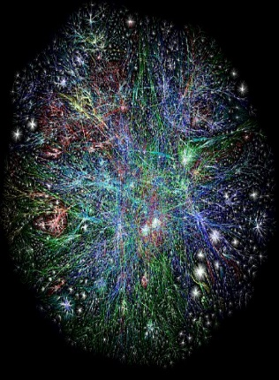{width="1.4347222222222222in"
> height="1.9534722222222223in"}Τηλεπικοινωνίες και Δίκτυα. Σήματα
> (αναλογικά-ψηφιακά), αρχές μετάδοσης δεδομένων, κωδικοποίηση
> δεδομένων. Μέσα μετάδοσης: Καλώδια συνεστραμμένου ζεύγους, ομοαξονικά
> καλώδια, οπτικές ίνες. Πρότυπα ενσύρματων δικτύων. Ασύρματα δίκτυα
> επικοινωνίας με ραδιοκύματα, μικροκύματα, υπέρυθρες. Πρότυπα ασύρματων
> δικτύων. Αρχιτεκτονικές πρωτοκόλλων: Το πρότυπο OSI, το πρότυπο
> TCP/IP. Τοπικά δίκτυα. Μητροπολιτικά δίκτυα -- Δίκτυα Ευρείας
> Περιοχής. Διασύνδεση δικτύων και δικτυακές συσκευές. Μεταφορά και
> Δρομολόγηση πακέτων. Τεχνικές μεταγωγής, Δίκτυα κορμού, αστική και
> εταιρική πρόσβαση στο Διαδίκτυο. Πρόσβαση PSTN, ISDN. Τεχνολογίες
> ευρυζωνικής πρόσβασης (DSL, Wi-fi, Wi-USB, Wi-Max), υπηρεσίες τρίτης
> γενιάς (3G). Διαχείριση Δικτύων.

-   **Εισαγωγή στα Πληροφοριακά Συστήματα**

> {width="1.5916666666666666in"
> height="1.1375in"}Η έννοια του συστήματος. Νόμοι και αρχές της Γενικής
> Θεωρίας Συστημάτων (δομή, όρια, εντροπία, κ.ά.). Μεθοδολογίες
> Δύσκαμπτων κι Ευμετάβλητων Συστημάτων. Θεωρία Ευμετάβλητων Συστημάτων
> του P. Checkland. Ο στρατηγικός ρόλος των Π.Σ. Κύκλος ζωής
> πληροφοριακών συστημάτων. Τεχνικές περιγραφής και ανάλυσης της δομής
> ενός πληροφοριακού συστήματος. Στρατηγικές και Μεθοδολογίες ανάπτυξης
> πληροφοριακών συστημάτων. Ποιότητα και παράγοντες επιτυχίας ενός Π.Σ.
> Οργανισμοί και λειτουργικές διαδικασίες. Πληροφορία, μάνατζμεντ και
> λήψη αποφάσεων. Οργανωτικός ανασχεδιασμός και ανασχεδιασμός
> επιχειρησιακών διαδικασιών.

-   **Ασφάλεια Υπολογιστών και Προστασία Δεδομένων**

> {width="5.098611111111111in"
> height="1.492361111111111in"}Εισαγωγή στην Ασφάλεια: Βασικοί ορισμοί,
> Μοντέλο Απειλών, Υπηρεσίες Ασφάλειας. Εισαγωγή στις έννοιες: Απειλή,
> Ευπάθεια, Κίνδυνος. Ασφάλεια Συστήματος - Έλεγχος Λογικής Πρόσβασης -
> Τοπική και Απομακρυσμένη Αυθεντικοποίηση Οντότητας: Κωδικοί Passwords,
> Απομακρυσμένη Αυθεντικοποίηση με κρυπτογραφικές τεχνικές, Κωδικοί μιας
> χρήσης, Ταυτοποίηση με Μηδενική Γνώση. Έλεγχος Λογικής Πρόσβασης -
> Εξουσιοδότηση: Πολιτικές και μοντέλα εξουσιοδότησης (MAC, DAC, RBAC).
> Ασφάλεια Λειτουργικού Συστήματος. Κακόβουλο λογισμικό: Μοντέλο
> Απειλών, μηχανισμοί αντιμετώπισης, ερευνητικά θέματα. Ασφάλεια
> Δικτύων: Μοντέλο απειλών στο Επίπεδο TCP/IP, ασφάλεια υπηρεσιών
> Διαδικτύου. Αυθεντικοποιημένη εδραίωση κλειδιού και Εφαρμογές:
> Συστήματα Διανομής κλειδιού, Συστήματα Μεταφοράς Κλειδιού, Συστήματα
> Συμφωνίας Κλειδιού. Ασφάλεια στο Web. Δικτυακά Συστήματα Firewalls.
> Εισαγωγή στην Ασφάλεια Ασύρματων Δικτύων.
>
> **[Δ΄Εξάμηνο -- Επιλογής]{.smallcaps}**

-   **Θεωρία Υπολογισμού**

> {width="1.40625in"
> height="1.9354166666666666in"}Τυπική προτασιακή λογική. Εισαγωγή στον
> πρωτοβάθμιο κατηγορηματικό λογισμό. Αξιωματική θεωρία συνόλων.
> Ορθότητα και πληρότητα στον πρωτοβάθμιο κατηγορηματικό λογισμό. Το
> θεώρημα της μη πληρότητας του Gödel. Θεωρία γραφημάτων. Θεωρία
> αναδρομής. Η κλάση των πρωταρχικών αναδρομικών συναρτήσεων, των
> αναδρομικών συναρτήσεων, των μερικών αναδρομικών συναρτήσεων. Μηχανές
> Turing και η θέση του Church. Γραμματικές. Η ιεραρχία του Chomsky.
> Κανονικές γραμματικές και γραμματικές χωρίς συμφραζόμενα. Πεπερασμένα
> αυτόματα, ντετερμινιστικά και μη ντετερμινιστικά αυτόματα. Αυτόματα
> στοίβας. Σχέση ανάμεσα σε γραμματικές και αυτόματα. Η έννοια της
> υπολογισιμότητας. Μη επιλύσιμα προβλήματα. Εισαγωγή στην
> πολυπλοκότητα. Η έννοια της πληρότητας. NP-πλήρη προβλήματα. Εφαρμογές
> των παραπάνω στο Λογικό Προγραμματισμό, στη γλώσσα προγραμματισμού
> Prolog, στη γλώσσα Datalog, στις βάσεις γνώσεων, στις συναρτησιακές
> γλώσσες προγραμματισμού.

-   **Κινητά και Κοινωνικά Μέσα**

> {width="2.484722222222222in"
> height="0.7138888888888889in"}Συνεργατικός Υπολογισμός. Συστήματα CSCW
> (Computer-Supported Cooperative Work). Ταξινόμηση Χώρου-Χρόνου.
> Ανάπτυξη εφαρμογών. Εφαρμογές σε Μέσα Κοινωνικής Δικτύωσης. Κινητός
> Υπολογισμός. Κινητές Εφαρμογές.
>
> **[Ε΄Εξάμηνο - Κορμός]{.smallcaps}**

-   **Δίκτυα ΙΙ**

> Σχεδιασμός και ανάπτυξη δικτύων υψηλών ταχυτήτων. Φυσικά Μέσα
> Μετάδοσης δικτύων υψηλών ταχυτήτων. Δίκτυα Frame Relay. Δίκτυα ΑΤΜ.
> Δίκτυα μεταγωγής Νοητού Κυκλώματος. Ασύρματα δίκτυα υψηλών ταχυτήτων.
> Σύγκλιση Τεχνολογιών και Δικτύων. Διαχείριση δικτύων TCP/IP.
> Πρωτόκολλο SNMP. Βάση Πληροφορίας Διαχείρισης. Διαχείριση δικτύων OSI.
> Πρωτόκολλο CMIP. Δένδρο Πληροφορίας Διαχείρισης. Διαχείριση
> γεφυρωμένων δικτύων. Σύγχρονες τεχνικές/μεθοδολογίες διαχείρισης WBM,
> CORBA, Java-based.

-   {width="1.5819444444444444in"
    > height="1.6555555555555554in"}**Βάσεις Δεδομένων ΙΙ**

> Μοντελοποίηση αντικειμενοστρεφών και αντικειμενο-σχεσιακών βάσεων
> δεδομένων, μοντελοποίηση ημι-δομημένης πληροφορίας (η γλώσσα XML),
> Παράλληλες - Κατανεμημένες βάσεις δεδομένων (αρχιτεκτονική
> client-server, διασπορά -- αντιγραφή - τοποθέτηση δεδομένων,
> επεξεργασία και βελτιστοποίηση ερωτήσεων, διαχείριση συναλλαγών), μη
> παραδοσιακές βάσεις δεδομένων (χωρικές, χωροχρονικές, πολυμέσων),
> εισαγωγή στις αποθήκες δεδομένων και την εξόρυξη γνώσης από μεγάλες
> βάσεις δεδομένων.

-   **Λειτουργικά Συστήματα**

> {width="5.197222222222222in"
> height="1.7138888888888888in"}Βασικές έννοιες, ιστορία Λ.Σ., Δομή.
> Διεργασίες: Μοντέλο και υλοποίηση διεργασιών, Διαδιεργασιακή
> επικοινωνία, Χρονοπρογραμματισμός διεργασιών. Συστήματα Διαχείρισης
> Μνήμης, Εναλλαγή, Κατάτμηση σε σταθερά και μεταβλητά τμήματα, τεχνικές
> ελέγχου μεταβολών της μνήμης, Ιδεατή Μνήμη, Σελιδοποίηση, Αλγόριθμοι
> Αντικατάστασης Σελίδων, Μοντελοποίηση Αλγορίθμων, Κατάτμηση. Συστήματα
> Αρχείων: Αρχεία και Κατάλογοι, Υλοποίηση, Ασφάλεια και Μηχανισμοί
> Προστασίας. Είσοδος/Έξοδος: Βασικές Αρχές για το Υλικό και το
> Λογισμικό, Δίσκοι, Ρολόγια, Τερματικά. Αδιέξοδα: Ανίχνευση και
> Επανόρθωση, Αποφυγή, Πρόληψη. Κατανεμημένα Λειτουργικά Συστήματα:
> Σχεδιαστικοί Στόχοι, Διαφορές Κατανεμημένων Λ.Σ. και Λ.Σ. Δικτύων,
> Επικοινωνία, Συγχρονισμός, Διεργασίες και Νήματα, Κατανεμημένα
> Συστήματα Αρχείων. Μελέτες Περίπτωσης χρήσης, προγραμματισμού και
> διαχείρισης σύγχρονων Λ.Σ.: Unix, Linux.
>
> **[Ε΄Εξάμηνο - Υποχρεωτικά Κατεύθυνσης «Πληροφοριακά
> Συστήματα»]{.smallcaps}**

-   {width="1.3909722222222223in"
    > height="1.3506944444444444in"}**Ανάλυση και Σχεδιασμός Π.Σ.**

> Μοντέλα διεργασίας ανάπτυξης Π.Σ. Αναλυτική περιγραφή του κύκλου ζωής
> ενός Π.Σ. (καθορισμός προβλήματος, μελέτη σκοπιμότητας, ανάλυση
> απαιτήσεων, λογικός και φυσικός σχεδιασμός, εγκατάσταση και
> συντήρηση). Μέθοδοι και τεχνικές συλλογής και ανάλυσης απαιτήσεων
> χρηστών. Ο ρόλος του αναλυτή. Αντικειμενοστρεφής σχεδίαση συστημάτων.
> Ανάλυση και σχεδίαση ΠΣ με χρήση της γλώσσας UML.

-   **Μαθηματικός Προγραμματισμός**

> Μοντελοποίηση προβλημάτων βελτιστοποίησης. Μορφοποίηση προβλημάτων σε
> προβλήματα γραμμικού προγραμματισμού. Γραφική επίλυση προβλημάτων
> γραμμικού προγραμματισμού. Η μέθοδος simplex -- περιθώριες μεταβλητές,
> βασική εφικτή λύση, τεχνητές μεταβλητές και συνθήκες αριστότητας.
> Αλγόριθμος simplex -- μέθοδος των πινάκων. Η μέθοδος των δύο φάσεων. Η
> μέθοδος του μεγάλου Μ. Η θεωρία της μεθόδου simplex. Η αναθεωρημένη
> μέθοδος simplex. Δυική θεωρία, αντιστοιχίες μεταξύ δυικών προβλημάτων,
> οικονομική ερμηνεία του δυϊκού προβλήματος. Ο δυϊκός αλγόριθμος
> simplex. Ανάλυση ευαισθησίας, μεταβολές στους συντελεστές της
> αντικειμενικής συνάρτησης και στους σταθερούς όρους των περιορισμών.
> Παραμετρικός προγραμματισμός. Ακέραιος προγραμματισμός, η μέθοδος των
> επίπεδων τόμων, η μέθοδος κλάδου και ορίου, το πρόβλημα μεταφοράς, το
> πρόβλημα αντιστοίχησης. Μη γραμμικός προγραμματισμός. Αναγκαίες και
> ικανές συνθήκες αριστότητας Karush-Kuhn-Tucker. Αλγόριθμοι μη
> γραμμικού προγραμματισμού χωρίς περιορισμούς. Η μέθοδος της πιο
> απότομης κλίσης, μέθοδος Newton, μέθοδοι σχεδόν-Newton και μέθοδοι
> συζυγών κλίσεων.
>
> [**Ε΄Εξάμηνο - Υποχρεωτικά Κατεύθυνσης «Πληροφορική - Ανθρωπιστικές
> &** **Κοινωνικές Επιστήμες»**]{.smallcaps}

-   **Πολυμέσα**

> Βασικές έννοιες. Διαλογικότητα. Υπερκείμενο. Υπερμέσα. Διαλογικά
> πολυμέσα. Διεπαφή χρήστη. Μορφές αναπαράστασης πληροφορίας σε
> συστήματα πολυμέσων. Κείμενο, Γραφικά, Animation, Ψηφιακό video, Ήχος.
> Συμπίεση Πολυμέσων. Η αρχιτεκτονική συστημάτων υπερκειμένου. Υπερμέσα
> (hypermedia). Τεχνολογία πολυμεσικών υπολογιστών (περιφερειακά,
> διεπαφές, κτλ). Λειτουργικά συστήματα που υποστηρίζουν διαδραστικά
> πολυμέσα. Λογισμικό. Προγραμματισμός και ανάπτυξη πολυμεσικών
> εφαρμογών. Ειδικά θέματα πολυμέσων σε δίκτυα επικοινωνιών.

-   **Γραφικά με Υπολογιστές**

> Βασικές έννοιες γραφικών με υπολογιστές και εφαρμογές τους. Τρόποι
> αναπαράστασης, παραγωγής και απεικόνισης τριδιάστατων δεδομένων.
> Μετασχηματισμοί και συστήματα συντεταγμένων. Φωτισμός και χρωματισμός.
> Απεικόνιση υφής και εφαρμογές της. Αλγόριθμοι σκίασης αντικειμένων.
> Δομές δεδομένων και εφαρμογή στην επιτάχυνση απεικόνισης. Συστήματα
> σωματιδίων (particles). Βασικές αρχές κίνησης (animation).
> Αρχιτεκτονικές σύνθεσης γραφικών, προγραμματισμός επεξεργαστών
> γραφικών με χρήση vertex και pixel shaders. API γραφικών (DirectX και
> OpenGL). Προχωρημένες τεχνικές απεικόνισης σε προγραμματιζόμενους
> επεξεργαστές γραφικών.
>
> {width="2.638888888888889in" height="1.7375in"}
>
> 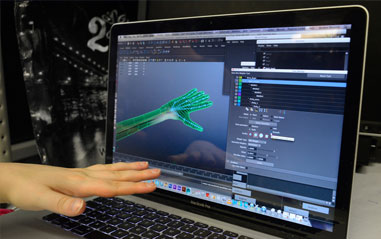{width="2.5597222222222222in"
> height="1.7340277777777777in"}
>
> **[Ε΄Εξάμηνο - Μαθήματα Επιλογής]{.smallcaps}**

-   **Ψηφιακή Επεξεργασία Εικόνας**

> {width="1.395138888888889in"
> height="1.2118055555555556in"}Εισαγωγή στην Ψηφιακή Επεξεργασία
> Εικόνας. Αναπαράσταση Ψηφιακών Εικόνων. Στοιχεία ενός Συστήματος
> Ψηφιακής Επεξεργασίας Εικόνας. Ψηφιακή Καταγραφή Εικόνας.
> Τμηματοποίηση και Αυτόματη Ευθυγράμμιση εικόνας. Εξαγωγή
> Χαρακτηριστικών και Ανάλυση εικόνας. Ανίχνευση Γραμμών, Δομή, Σχήμα,
> Υφή, Ταίριασμα, Τεμάχιση, Κατάταξη. Συμπίεση ψηφιακής εικόνας.
> Αλγόριθμοι ανίχνευσης ακμών. Μεθοδολογίες σχεδίασης ψηφιακών φίλτρων.
> Bέλτιστα γραμμικά φίλτρα. Αυτοπροσαρμοζόμενα φίλτρα. Στοιχεία
> Ανθρώπινης Ορασης. Μοντέλα Εικόνων. Δειγματοληψία καιΚβάντιση.
> Μετασχηματισμός Εικόνας: Μετασχηματισμός Fourier, DFT, FFT, Walsh,
> Hadamard, DCT, Hotelling, Hough. Βελτίωση εικόνας: Τροποποίηση
> Ιστογράμματος, Εξομάλυνση, Οξυνση. Αποκατάσταση Εικόνας: Μοντέλο
> Χειροτέρευσης, Αλγεβρική Μέθοδος, Αντίστροφο Φιλτράρισμα.

-   **Πολιτικές και Τεχνολογίες Ασφάλειας και Ιδιωτικότητας**

> Εννοιολογικό υπόβαθρο: ιδιωτικότητα, ψευδωνυμία, ανωνυμία,
> μη-συνδεσιμότητα, μη-ανιχνευσιμότητα και μη-παρατηρησιμότητα, ασφάλεια
> πληροφοριών, ευπάθειες, απειλές, επικινδυνότητα. Ιδιωτικότητα κατά το
> σχεδιασμό (privacy by design). Ανάλυση και διαχείριση επικινδυνότητας:
> απαιτήσεις ασφάλειας πληροφοριακών συστημάτων, μεθοδολογίες ανάλυσης
> και διαχείρισης επικινδυνότητας (OCTAVE, CRAMM, SBA scenario).
> Πολιτικές και κανονισμοί ασφάλειας πληροφοριακών συστημάτων. Ανάλυση
> επικινδυνότητας ιδιωτικότητας. Ιδιωτικότητα στην κοινωνία της
> πληροφορίας (ηλεκτρονικό εμπόριο, ηλεκτρονική διακυβέρνηση, κοινωνικά
> δίκτυα). Συμπεριφορά χρηστών και προστασία ιδιωτικότητας: αντίληψη
> ιδιωτικότητας, πρόθεση αποκάλυψης πληροφοριών σε ηλεκτρονικά
> περιβάλλοντα, ιδιωτικότητα και αποδοχή πληροφοριακών συστημάτων.
> Πολιτικές προστασίας ιδιωτικότητας και συμμόρφωση με νομικό και
> κανονιστικό πλαίσιο. Προηγμένες Τεχνολογίες Προστασίας ανωνυμίας και
> Ιδιωτικότητας.

-   **Καινοτομία και Επιχειρηματικότητα**

> Εισαγωγή στις έννοιες της Επιχειρηματικότητας και της Καινοτομίας.
> Eπιχειρηματικό περιβάλλον. Διαδικασία καινοτομίας και
> δημιουργικότητας. Μέθοδοι και εργαλεία μέτρησης καινοτομίας.
> Καινοτομία στην Ελλάδα. Κλειστή έναντι Ανοικτής Καινοτομίας. Σύλληψη
> Καινοτόμου Επιχειρηματικής Ιδέας. Επιλογή Βιώσιμου Επιχειρηματικού
> Μοντέλου. Επιχειρηματικό Πλάνο: Ανάπτυξη & Αξιολόγηση. Ίδρυση της
> επιχείρησης. Ανεύρεση Πόρων και Διαμόρφωση Συμφωνιών. Διερεύνηση
> Στρατηγικών Εξόδου. Η συμβολή της τεχνολογίας στην ανάπτυξη
> καινοτομίας. Διεθνής επιχειρηματικότητα και Μελέτες Περίπτωσης.

-   **Μοντέλα Κβαντικού και Μοριακού Υπολογισμού**

> {width="1.5784722222222223in"
> height="1.4715277777777778in"}Σύντομη εισαγωγή στα κλασικά
> υπολογιστικά μοντέλα με έμφαση στις μηχανές Turing. Εισαγωγή σε μη
> συμβατικά υπολογιστικά μοντέλα. Εισαγωγή στον μοριακό υπολογισμό. Το
> πείραμα του Adelman. Λύση δύσκολων προβλημάτων μέσω του DNA. Εισαγωγή
> στον Κβαντικό υπολογισμό. Βασικά στοιχεία κβαντομηχανικής σχετικά με
> την περιγραφή και τη λειτουργία ενός φυσικού κβαντικού συστήματος. Ο
> φορμαλισμός του Dirac. Οι αλγόριθμοι των Deutsch--Jozsa, του Simon,
> του Shor και του Grover. Προσομοίωση κβαντικών συστημάτων υπολογισμού
> στο Matlab. Ο υπολογιστής D-Wave Two™.
>
> **[ΣΤ΄ Εξάμηνο - Κορμός]{.smallcaps}**

-   **Τεχνολογία Λογισμικού**

> Βασικές αρχές τεχνολογίας λογισμικού, η ανάπτυξη λογισμικού ως
> βιομηχανική διαδικασία. Κύκλος ζωής λογισμικού, μοντέλα κύκλου ζωής.
> Μεθοδολογίες ανάπτυξης λογισμικού. Ανάλυση απαιτήσεων: προδιαγραφές
> και απαιτήσεις συστημάτων λογισμικού. Σχεδιασμός συστήματος:
> αρχιτεκτονικός σχεδιασμός, αρχιτεκτονική κατανεμημένων συστημάτων,
> αντικειμενοστραφής σχεδιασμός, σχεδιασμός συστημάτων πραγματικού
> χρόνου, σχεδιασμός με επαναχρησιμοποίηση, σχεδιασμός διεπαφής χρήστη.
> Επαλήθευση και επικύρωση, έλεγχος συστήματος. Διοίκηση: διοίκηση
> έργου, σχεδίαση ανάπτυξης συστήματος και έλεγχος ανάπτυξης, διοίκηση
> ποιότητας, διοίκηση συστατικών του λογισμικού. Διαδικασία παράδοσης
> και συντήρησης συστημάτων λογισμικού.

-   **Τεχνητή Νοημοσύνη**

> {width="2.9180555555555556in"
> height="2.0395833333333333in"}Ιστορική αναδρομή, βασικές έννοιες,
> Αναπαράσταση γνώσης, Αλγόριθμοι αναζήτησης, επίλυση προβλημάτων,
> τεχνικές εξαγωγής συμπερασμάτων. Προτασιακή και κατηγορική Λογική.
> Σημασιολογικά δίκτυα. Μηχανική Μάθηση, Νευρωνικά Δίκτυα, Γενετικοί
> Αλγόριθμοι, Έμπειρα Συστήματα, Επεξεργασία Φυσικής Γλώσσας, Όραση
> Μηχανής, Ρομποτική. Αρχιτεκτονικές Ευφυών Πρακτόρων. Σύστημα
> κατανεμημένων πρακτόρων. Επικοινωνία, Ανταγωνισμός, Συνεργασία και
> Διαπραγμάτευση. Γλώσσες επικοινωνίας ευφυών πρακτόρων. Γλώσσες
> Προγραμματισμού για Τεχνητή Νοημοσύνη (Prolog).
>
> **[ΣΤ΄ Εξάμηνο - Υποχρεωτικά Κατεύθυνσης «Πληροφοριακά
> Συστήματα»]{.smallcaps}**

-   **Τεχνολογίες Διαδικτύου**

> Προγραμματισμός στον πελάτη (Client-side programming): HTML, HTML5 και
> JavaScript. Προγραμματισμός στον εξυπηρετητή (Server-side
> programming): Web Servers, δομή και λειτουργία. Η γλώσσα PHP. Βάσεις
> δεδομένων στο Διαδίκτυο: MySQL, σύνδεση με Apache Web Server,
> PHP/Python. Web services. Πρωτόκολλο επικοινωνίας SOAP. Μεταδεδομένα
> στον παγκόσμιο ιστό: XML-JSON. Υπολογιστικά Νέφη (Cloud Computing) και
> υπηρεσίες τους (Software-as-a-Service -- SaaS). Google AppEngine.
> Επιθέσεις και Ασφάλεια στον Παγκόσμιο Ιστό. Web 2.0, 3.0.

-   **Συστήματα Υποστήριξης Αποφάσεων**

> Εισαγωγή στη θεωρία Αποφάσεων, Η φιλοσοφία των Συστημάτων Υποστήριξης
> Αποφάσεων και ο ρόλος τους στις διαδικασίες λήψης αποφάσεων στην
> επιχείρηση, Αρχιτεκτονική Συστημάτων Υποστήριξης Αποφάσεων, Συστημάτων
> Υποστήριξης Αποφάσεων βασισμένα στη διαχείριση Βάσεων Δεδομένων και
> Συστημάτων Υποστήριξης Αποφάσεων βασισμένα στη διαχείριση Βάσεων
> Μοντέλων, Τεχνικές και Μοντέλα λήψης αποφάσεων: Δέντρα αποφάσεων,
> μαθηματικός προγραμματισμός, ανάλυση ευαισθησίας, what-if ανάλυση,
> ανάλυση βάσει στόχων. Πολυκριτηριακά Συστημάτων Υποστήριξης Αποφάσεων,
> Συστήματα υποστήριξης ομαδικής λήψης αποφάσεων (GDSS). Αξιοποίηση
> Αποθηκών Δεδομένων (Data Warehouses) και τεχνικών Εξόρυξης Δεδομένων
> (Data Mining) για την υποστήριξη της λήψης αποφάσεων, Συστήματα
> πληροφόρησης και υποστήριξης ανωτέρων στελεχών (EIS-ESS), Γεωγραφικά
> Πληροφοριακά Συστήματα (GIS). Βασισμένα στη γνώση (KMS) και Έμπειρα
> Συστήματα (ES), Εφαρμογές και παραδείγματα ΣΥΑ.
>
> [**ΣΤ΄Εξάμηνο - Υποχρεωτικά Κατεύθυνσης «Πληροφορική -- Ανθρωπιστικές
> &** **Κοινωνικές Επιστήμες»**]{.smallcaps}

-   **Αναγνώριση Προτύπων**

> {width="1.5694444444444444in"
> height="1.7354166666666666in"}Μέθοδοι και συστήματα αναγνώρισης
> προτύπων. Όρια στην ακρίβεια μέτρησης της αξιοπιστίας αναγνώρισης.
> Κατευθυνόμενη εκπαίδευση και αυτοεκπαίδευση. Συναρτήσεις απόστασης.
> Ταξινόμηση με κριτήριο την μικρότερη απόσταση και τα κοντινότερα
> πρότυπα. Γραμμικές και μη γραμμικές συναρτήσεις απόφασης. Ο αλγόριθμος
> Perceptron. Ταξινομητές Bayes, ταξινομητές πλησιέστερου γείτονα.
> Παραμετρική και μη παραμετρική εκτίμηση της πυκνότητας πιθανότητας
> προτύπων: Μεγιστοποίηση εντροπίας, εκτιμητής Parzen, ορθοκανονικές
> συναρτήσεις, μέθοδοι των RobbinsMonro και KieferWolfowitz, LMS.
> Μέθοδοι ελαχίστων τετραγώνων. Πολυστρωματικά τεχνητά νευρωνικά δίκτυα.
> Aναδρομικά τεχνητά νευρωνικά δίκτυα. Εκπαίδευση διόρθωσης λάθους,
> Hebbian και ανταγωνιστική εκπαίδευση. Πολυεπίπεδο perceptron.
> Οπισθοδρομική διάδοση του σφάλματος. Δίκτυα ακτινικών συναρτήσεων.
> Μηχανή Hopfield. Μάθηση με και χωρίς επιτήρηση. Ιεραρχική ομαδοποίηση
> δεδομένων. Ασαφής λογική. Γενετικοί αλγόριθμοι και αρχές εξελικτικού
> υπολογισμού.

-   **Ανάκτηση της Πληροφορίας**

> Μοντέλα Ανάκτησης Πληροφορίας. Αυτόματη Ευρετηρίαση και Αποθήκευση
> Πληροφορίας. Ανάκτηση Κειμένου. Τεχνικές και μέθοδοι αναπαράστασης
> κειμένων. Χρήση και βελτίωση αναπαραστάσεων κειμένων μέσω της
> ταξινόμησης λέξεων-κλειδιών και προσδιορισμού της βαρύτητάς τους. O
> αλγόριθμος PageRank του Google. Ακρίβεια και ανάκληση (Precision and
> Recall) ως μέθοδοι αξιολόγησης μηχανών αναζήτησης. Pat trees,
> signature files και inverted file indices ως αλγόριθμοι μηχανών
> αναζήτησης στο Διαδίκτυο. Ταξινόμηση και ομαδοποίηση εγγράφων (με
> αναφορές σε βασικές τεχνικές αναγνώρισης προτύπων) -- Η τεχνική του
> Clustering. Ανάκτηση Πολυμεσικών Εγγράφων. Προηγμένες Τεχνικές:
> Πολυγλωσσική ανάκτηση πληροφορίας. Aνάκτηση Πληροφορίας στο Διαδίκτυο.
> Αποτίμηση συστημάτων ανάκτησης πληροφορίας. Μελέτες Περιπτώσεων.
>
> **[ΣΤ΄Εξάμηνο - Μαθήματα Επιλογής]{.smallcaps}**

-   **Κατανεμημένα Δικτυοκεντρικά Συστήματα**

> {width="3.928472222222222in"
> height="1.2020833333333334in"}Τεχνολογίες RPC, JAVA RMI, CORBA.
> Προγραμματιστικά Νήματα (Threads), Συγχρονισμός (Synchronization).
> Κατανεμημένη επεξεργασία από την σκοπιά του λογισμικού συστημάτων.
> Middleware επικοινωνιών, απομακρυσμένη κλήση διαδικασιών,
> απομακρυσμένη ενεργοποίηση μεθόδων και εξαναγκασμένη εκπομπή,
> υποστήριξη λειτουργικών συστημάτων, κατανεμημένα συστήματα αρχείων,
> κατανεμημένη διαχείριση δοσοληψιών, εξισορρόπηση φόρτου, κατανεμημένες
> γλώσσες προγραμματισμού, ανοχή σε σφάλματα, θέματα κατανεμημένου
> χρονισμού και κατανεμημένοι αλγορίθμοι.

-   **Ειδικά Θέματα Ασφάλειας Πληροφοριών**

> {width="1.5659722222222223in"
> height="1.2194444444444446in"}Ειδικά θέματα στην Ασφάλεια Συστήματος:
> Ασφάλεια Βάσεων Δεδομένων, Ψηφιακή Εγκληματολογία. Ειδικά Θέματα στην
> Ασφάλεια Δικτύων: Ασφάλεια Ασύρματων και Κινητών Δικτύων. Ειδικά
> Θέματα στην Ασφάλεια Επικοινωνιών και Κατανεμημένων Συστημάτων:
> Ασφαλής διαδιεργασιακή επικοινωνία, Το Σύστημα Kerberos, Ασφαλείς
> Υπηρεσίες Καταλόγου, το Σύστημα DNSSec. Ειδικά θέματα ανάλυσης και
> διαχείρισης επικινδυνότητας: Αποτίμηση Επικινδυνότητας, Εργαλεία
> λογισμικού για την ανάλυση επικινδυνότητας. Ερευνητική θεώρηση της
> Ασφάλειας Πληροφοριών.

-   **Μεταγλωττιστές**

> {width="1.2631944444444445in"
> height="2.097916666666667in"}Συντακτική δομή των γλωσσών
> προγραμματισμού και βασικές αρχές μετάφρασης σε μορφές εκτελέσιμες από
> τον υπολογιστή. Διαφορές γλωσσών χαμηλού και υψηλού επιπέδου. Οργάνωση
> λειτουργίας μεταφραστών, διερμηνευτών, συμβολομεταφραστών, συνδετών
> και φορτωτών: θεωρία και πράξη. Τεχνικές μεταγλώττισης, γραμματικές,
> μέθοδοι ανίχνευσης, περιβάλλοντα εκτέλεσης. Αλγόριθμοι για λεξική και
> συντακτική ανάλυση. Μέθοδοι υλοποίησης. Εσωτερική αναπαράσταση πηγαίου
> κώδικα, πίνακες συμβόλων και ενδιάμεσος κώδικας. Συντακτικά
> κατευθυνόμενη μετάφραση. Διαχείριση λαθών. Αυτόματη δημιουργία
> λεκτικών και συντακτικών αναλυτών με τα εργαλεία LEX και YACC.
> Δημιουργία εκτελέσιμου κώδικα. Κλήση συναρτήσεων και πέρασμα
> παραμέτρων. Δέσμευση καταχωρητών. Περιβάλλοντα εκτέλεσης. Διαχείριση
> μνήμης κατά την εκτέλεση. Ιδιαιτερότητες γλωσσών προγραμματισμού και
> σετ εντολών. Θέματα φορητότητας. Βελτιστοποίηση παραγόμενου κώδικα:
> τοπικές και σφαιρικές βελτιστοποιήσεις. Ασφάλεια γλωσσών
> προγραμματισμού.
>
> **[Ζ΄ Εξάμηνο - Κορμός]{.smallcaps}**

-   **Ηλεκτρονικό Επιχειρείν**

> Εισαγωγή στην Ψηφιακή Οικονομία και το Ηλεκτρονικό Επιχειρείν. Βασικοί
> Ορισμοί. Ηλεκτρονικό Εμπόριο vs. Ηλεκτρονικό Επιχειρείν. Μοντέλα και
> Εφαρμογές Διεπιχειρησιακού (B2B) Ηλεκτρονικού Επιχειρείν. Μοντέλα
> καιΑξίας στην Ψηφιακή Οικονομία (Εταιρικές Πύλες, Ηλεκτρονική
> Διακυβέρνηση, Διαχείριση Σχέσεων με Πελάτες - CRM). Ηλεκτρονικά
> Συστήματα Πληρωμών (e-Payment). Τεχνολογίες και Δικτυακές Υποδομές
> (Intranets/Extranets, Δίκτυα VPN). Ηλεκτρονικό Μάρκετινγκ και
> Επικοινωνία. Ασφάλεια και Προστασία στο Ηλεκτρονικό Επιχειρείν.
> Νομοθετικό Πλαίσιο και Ηθική στο Ηλεκτρονικό Επιχειρείν. Στρατηγική
> Διαχείριση Ηλεκτρονικού Επιχειρείν. Νέες Μορφές Ηλεκτρονικού
> Επιχειρείν (Κινητό και Ασύρματο Επιχειρείν).
>
> **[Ζ΄ Εξάμηνο - Υποχρεωτικά Κατεύθυνσης «Πληροφοριακά
> Συστήματα»]{.smallcaps}**

-   {width="1.3909722222222223in"
    > height="2.1756944444444444in"}**Προσομοίωση και Μοντελοποίηση**

> Προσομοίωση και εξομοίωση. Δομή και κατασκευή μοντέλων προσομοίωσης.
> Παραγωγή τυχαίων αριθμών και τυχαίων μεταβλητών. Μηχανισμοί ροής
> χρόνου. Στοχαστικά μοντέλα αλληλεπιδραστικής προσομοίωσης. Προσομοίωση
> γεγονότων, προσομοίωση δραστηριοτήτων. Γλώσσες προσομοίωσης. Ανάπτυξη
> προγραμμάτων προσομοίωσης, εξειδικευμένες γλώσσες προσομοίωσης.
> Ανάλυση αποτελεσμάτων, επικύρωση και επαλήθευση των αποτελεσμάτων.
> Τεχνικές προσδιορισμού μαθηματικών μοντέλων από δεδομένα-μετρήσεις
> κρίσιμων μεγεθών του συστήματος/διαδικασίας. Μοντέλα δυναμικών
> συστημάτων, μοντελοποίηση ως μαύρο κουτί, αναδρομικοί αλγόριθμοι
> προσδιορισμού παραμέτρων του μοντέλου, αξιολόγηση μοντέλου,
> προεπεξεργασία δεδομένων, πρακτικά θέματα αναγνώρισης συστημάτων.

-   **Πληροφοριακά Συστήματα και Εφοδιαστική Αλυσίδα**

> Πληροφοριακά Συστήματα (Π.Σ.) επιχειρήσεων - νέες τεχνολογίες στο
> μάνατζμεντ (πληροφοριακά συστήματα & διαδίκτυο, τηλε-εργασία, εικονική
> επιχείρηση - συνεργασία). Επιχειρηματικές διεργασίες, ανασχεδίαση
> επιχειρηματικών διεργασιών, ενοποίηση Π.Σ. επιχείρησης, διαχείριση και
> λειτουργία Π.Σ. Συστήματα Εφοδιασμού (Logistics) - Προσδιορισμός του
> ρόλου των πληροφοριακών συστημάτων Logistics στη σύγχρονη επιχείρηση.
> Περιγραφή βημάτων σχεδιασμού και ανάλυσης ενός πληροφοριακού
> συστήματος Logistics. Η υποστήριξη της λήψης αποφάσεων μάρκετινγκ με
> τη βοήθεια των συστημάτων πληροφορικής. Συστήματα συγκέντρωσης και
> διαχείρισης των πληροφοριών. Διαχείριση γνώσης και εξόρυξη δεδομένων.
> Γλώσσες τέταρτης γενεάς. Η χρήση αυτοματοποιημένων εργαλείων στην
> ανάπτυξη ενός πληροφοριακού συστήματος. Εισαγωγή στην ασφάλεια Π.Σ.
>
> **[Ζ΄ Εξάμηνο - Υποχρεωτικά Κατεύθυνσης «Πληροφορική - Ανθρωπιστικές &
> Κοινωνικές Επιστήμες»]{.smallcaps}**

-   **Γλωσσική Τεχνολογία**

> {width="1.6055555555555556in"
> height="1.13125in"}Αρχές Υπολογιστικής Γλωσσολογίας και Επεξεργασίας
> Φυσικής Γλώσσας. Ανάπτυξη γραμματικών μοντέλων και περιβάλλοντα
> υλοποίησης γραμματικών φορμαλισμών (CFG, UG, LFG, HPSG). Αρχές
> μορφολογικής, συντακτικής, σημασιολογικής και πραγματολογικής
> ανάλυσης. Σημασιολογική αναπαράσταση. Σώματα κειμένων και στατιστική
> επεξεργασία φυσικής γλώσσας. Σύνθεση φυσικής γλώσσας. Εφαρμογές
> γλωσσικής τεχνολογίας: υπολογιστική λεξικογραφία, αυτόματη μετάφραση,
> δημιουργία περίληψης κειμένου, εξαγωγή γλωσσολογικής πληροφορίας,
> κατηγοριοποίηση κειμένων, επικοινωνία ανθρώπου-μηχανής με φυσική
> γλώσσα.

-   **Τεχνολογία Ψυχαγωγικού Λογισμικού και Εικονικοί Κόσμοι**

> Ιστορία και εξέλιξη του ψυχαγωγικού λογισμικού (βιντεοπαιχνιδιών). Η
> βιομηχανία ψυχαγωγικού λογισμικού σήμερα, τα είδη των παιχνιδιών, το
> προφίλ του χρήστη, διαθέσιμες πλατφόρμες παιχνιδιών, επιχειρηματικά
> μοντέλα και μάρκετινγκ. Internet και ψυχαγωγικό λογισμικό, διαδικτυακά
> παιχνίδια πολλών χρηστών (MMOGs), η οικονομία και παραοικονομία τους.
> Αρχές θεωρίας σχεδιασμού ψυχαγωγικού λογισμικού, οι φάσεις ανάπτυξης,
> η ομάδα ανάπτυξης και ειδικότητες. Προγραμματισμός ψυχαγωγικού
> λογισμικού, διαθέσιμα εργαλεία, διαφορές για κάθε πλατφόρμα. Σύγχρονες
> τεχνικές γραφικών και τεχνητή νοημοσύνη στα παιχνίδια. Μηχανές
> ψυχαγωγικού λογισμικού. Ανάπτυξη και διαχείριση ψηφιακού περιεχομένου.
> Εναλλακτικές εφαρμογές ψυχαγωγικού λογισμικού. Κοινωνικός αντίκτυπος,
> θέματα εθισμού και βίας στα βιντεοπαιχνίδια.

{width="5.235416666666667in"
height="2.2736111111111112in"}

> **[Ζ΄Εξάμηνο - Μαθήματα Επιλογής]{.smallcaps}**

-   **Κοινωνικά και Νομικά Θέματα των ΤΠΕ**

> Δικαιώματα και Υποχρεώσεις στην Κοινωνία της Πληροφορίας: Νομικό και
> κανονιστικό πλαίσιο, ηθικά και κοινωνιολογικά ζητήματα, θέματα
> κουλτούρας, δεοντολογία, ερευνητικές προεκτάσεις. Ηλεκτρονικό Έγκλημα
> - κυβερνοέγκλημα. Επεξεργασία προσωπικών και ευαίσθητων δεδομένων στην
> παροχή Διαδικτυακών υπηρεσιών: νομικά, ηθικά, κοινωνιολογικά και
> τεχνολογικά ζητήματα. Ηλεκτρονική Υπογραφή και Ηλεκτρονικές
> Συναλλαγές. Κοινωνικά Δίκτυα. Κοινωνικά και νομικά θέματα σε Υπηρεσίες
> Εξαρτώμενης της Γεωγραφικής Θέσης, χρήση οργανωσιακών διαδικτυακών
> πόρων για προσωπικές δραστηριότητες.

-   **Διαχείριση Έργων Πληροφορικής**

> Εισαγωγή, βασικές έννοιες και στόχοι της διαχείρισης έργων. Βασικά
> χαρακτηριστικά έργων ανάπτυξης Πληροφοριακών συστημάτων (ΠΣ). Ανάλυση
> του έργου σε δραστηριότητες, με έμφαση στα έργα ανάπτυξης ΠΣ.
> Προγραμματισμός δραστηριοτήτων, παραδοτέων προϊόντων και ποιοτικού
> ελέγχου τους. Προγραμματισμός χρήσης πόρων. Οικονομικός
> προγραμματισμός. Δικτυωτή ανάλυση. Παρακολούθηση της υλοποίησης των
> δραστηριοτήτων, της παράδοσης των προϊόντων και των ποιοτικών ελέγχων.
> Παρακολούθηση χρήσης πόρων. Οικονομική παρακολούθηση. Μέθοδοι
> διαχείρισης αποκλίσεων. Βασικές κατηγορίες κινδύνων σε έργα ανάπτυξης
> ΠΣ και τρόποι διαχείρισής τους. Θέματα σύνταξης, αξιολόγησης, επιλογής
> προσφορών, διαδικασίες επιλογής αναδόχου.

-   **Λογικός Προγραμματισμός**

> Βασικές Αρχές Λογικού Προγραμματισμού. Εφαρμογές στην αναπαράσταση
> γνώσης και στην εξαγωγή συμπεράσματος. Προτασιακή και Κατηγορηματική
> Λογική. Γλώσσα προγραμματισμού Prolog: ιδιότητες και σύνταξη. Αναδρομή
> και οπισθοδρόμηση. Επεξεργασία λιστών. Μη ντετερμινιστικός
> προγραμματισμός. Λογική ανώτερης τάξης. Διαδικασίες απόδειξης.
> Εξελιγμένες τεχνικές και εφαρμογές λογικού προγραμματισμού.

-   **Αναπαράσταση Πληροφοριών και Γνώσης**

> Σημασιολογική αναπαράσταση γνώσης, διαχείριση γνώσης, οργάνωση
> πληροφορίας, Web 3.0, οντολογίες και αναπαράσταση γνώσης πεδίου,
> φολκσονομίες, δομημένες περιγραφές, συλλογιστική, σημασιολογικοί
> κανόνες, ικανοποίηση περιορισμών, υπολογιστική λογική, προχωρημένα
> θέματα γλωσσών σημασιολογίας (RDF, OWL), αναπαράσταση γνώσης στο
> κοινωνικό πλαίσιο, θέματα αβεβαιότητας και ασάφειας.

-   {width="1.5868055555555556in"
    > height="1.3284722222222223in"}**Διαχείριση Μεγάλου Όγκου Δεδομένων
    > στο Διαδίκτυο**

> Στα πλαίσια αυτού του μαθήματος θα επικεντρωθούμε στην έννοια «μεγάλου
> όγκου δεδομένα» (big data) και θα μελετήσουμε μοντέρνες τεχνικές και
> πλατφόρμες αποθήκευσης και διαχείρισης τέτοιων δεδομένων.
> Συγκεκριμένα, θα μελετηθούν: Aρχιτεκτονικές και συστήματα μεγάλης
> κλίμακας: Δίκτυα ομοτίμων (Peer-to-Peer) και Υπολογιστικά Νέφη (Cloud
> Computing). Βάσεις δεδομένων στο διαδίκτυο: Σχεσιακές, παράλληλες και
> κατανεμημένες βάσεις, με έμφαση στις τεχνολογίες κατανεμημένων
> συστημάτων αρχείων (HDFS), ΝοSQL (HBase, Cassandra),
> graph-databases(Neo4j), NewSQL. Μοντέλα υπολογισμού μεγάλου όγκου
> δεδομένων (MapReduce, BSP) και πλατφόρμες που τις εφαρμόζουν (Hadoop,
> Hama, Stratosphere, κλπ). Εφαρμογές των παραπάνω και υλοποίηση
> αλγορίθμων με κατανεμημένο τρόπο.

-   **Ειδικά Θέματα Διδακτικής της Πληροφορικής**

> {width="1.4638888888888888in"
> height="2.220138888888889in"}Η Πληροφορική στην Εκπαίδευση. Οι ΤΠΕ ως
> μέσο γνώσης, έρευνας και μάθησης στα διάφορα γνωστικά αντικείμενα.
> Βασικές έννοιες και χρησιμοποιούμενη ορολογία του τομέα της Διδακτικής
> της Πληροφορικής. Παραδοσιακές διδακτικές προσεγγίσεις και
> προσεγγίσεις που βασίζονται σε σύγχρονες θεωρίες μάθησης, μαθησιακές
> δυσκολίες σε βασικές έννοιες της Πληροφορικής, παραδείγματα από σχέδια
> μαθήματος και δραστηριότητες. Οργάνωση Μαθήματος: διδακτικά μοντέλα,
> διδακτικοί στόχοι, προσδοκώμενα αποτελέσματα, εκπαιδευτικές τεχνικές,
> σχεδιασμός της διδασκαλίας. Αξιολόγηση: σκοποί, λειτουργίες, εργαλεία
> αξιολόγησης, ανατροφοδότηση. Διδακτικά προβλήματα και διδακτικές
> παρεμβάσεις με τη χρήση των ΤΠΕ. Διδασκαλία πληροφορικής σε άτομα με
> ειδικές ανάγκες. Αξιοποίηση του διαδικτύου για εκπαίδευση των μαθητών
> και διαρκή επιμόρφωση. Μάθηση από απόσταση μέσω των νέων τεχνολογιών.
> Γνωριμία με βασικές παιδαγωγικές θεωρήσεις, Η Πληροφορική στην
> εκπαίδευση. Πολιτική και βαθμός ενσωμάτωσης της πληροφορικής στην
> εκπαίδευση στην Ελλάδα και άλλες Ευρωπαϊκές χώρες.
>
> **[Η΄Εξάμηνο - Υποχρεωτικά Κατεύθυνσης «Πληροφοριακά
> Συστήματα»]{.smallcaps}**

-   **Στρατηγική και Διοίκηση Π.Σ.**

> Επιχειρηματική στρατηγική. Στρατηγικό management. Διαδικασία
> στρατηγικού σχεδιασμού. Ανάλυση εξωτερικού και εσωτερικού
> περιβάλλοντος. Η στρατηγική σημασία των Πληροφοριακών Συστημάτων
> (Π.Σ.). Μέθοδοι αξιολόγησης στρατηγικών Π.Σ. Ο στρατηγικός ρόλος των
> ενδο-επιχειρησιακών Π.Σ. Σύνδεση της επιχειρηματικής στρατηγικής και
> των Π.Σ. Επίδραση των Πληροφοριακών Συστημάτων στην αλυσίδα αξίας της
> επιχείρησης. Κρίσιμοι παράγοντες επιτυχίας στη διαδικασία διαμόρφωσης
> στρατηγικής Πληροφοριακών Συστημάτων. Πληροφοριακά Συστήματα και
> αναδιοργάνωση επιχειρησιακών διαδικασιών. Διοίκηση υπηρεσιών
> Πληροφοριακών Συστημάτων σε έναν οργανισμό.

-   **Διοίκηση Ασφάλειας Πληροφοριακών Συστημάτων**

> {width="1.6in"
> height="1.2409722222222221in"}Εννοιολογικό υπόβαθρο: αγαθά
> πληροφοριακών συστημάτων, ευπάθειες, απειλές, επικινδυνότητα,
> διαθεσιμότητα, εμπιστευτικότητα, ακεραιότητα, Αναγκαιότητα και
> σκοπιμότητα της ασφάλειας στην κοινωνία της πληροφορίας. Πλαίσια
> διοίκησης της ασφάλειας σε οργανωσιακά περιβάλλοντα, ISO 27001, COBIT
> και άλλα πρότυπα ασφάλειας (ISO 27002, ISO 27005). Ανάλυση και
> διαχείριση επικινδυνότητας: απαιτήσεις ασφάλειας πληροφοριακών
> συστημάτων, μεθοδολογίες ανάλυσης και διαχείρισης επικινδυνότητας
> (OCTAVE, CRAMM, SBA scenario). Αντίμετρα προστασίας ασφάλειας:
> Πολιτικές και κανονισμοί ασφάλειας πληροφοριακών συστημάτων, Πολιτικές
> Ελέγχου Πρόσβασης και Ταυτοποίησης, Προηγμένες Πολιτικές
> Εξουσιοδότησης. Πολιτικές Ασφάλειας Δικτύων, Πολιτικές Κρυπτογραφίας.
> Συμμόρφωση χρηστών με πολιτικές ασφάλειας: παράγοντες μη συμμόρφωσης,
> κοινωνική μηχανική, κατάχρηση διαδικτυακών πόρων, συνθηματικά.
> Επιχειρησιακή συνέχεια, στρατηγικές και υποδομές πληροφοριακών
> συστημάτων για ανάκαμψη από καταστροφή. Νομικό και κανονιστικό
> πλαίσιο.
>
> [**Η΄ Εξάμηνο - Υποχρεωτικά Κατεύθυνσης «Πληροφορική - Ανθρωπιστικές
> και** **Κοινωνικές Επιστήμες»**]{.smallcaps}

-   **Σημασιολογικός και Κοινωνικός Ιστός**

> Μοντέλα και δομές πληροφορίας με στόχο την αποδοτική διαχείριση
> δεδομένων του Παγκόσμιου Ιστού, οργάνωση πληροφορίας στον Παγκόσμιο
> Ιστό, Σημασιολογικός Ιστός (Semantic Web), οντολογίες, γλώσσες
> σημασιολογίας, σχήματα (RDF, OWL, κ.λ.π), τεχνολογίες linked-data και
> γλώσσα ερωτημάτων SPARQL, επεξεργασία chat text, text analytics, text
> mining, web sentiment analysis, επεξεργασία δεδομένων από κοινωνικά
> δίκτυα, Web 2.0 τεχνολογίες, μηχανές αναζήτησης Ιστού.

-   **Επεξεργασία Ομιλίας και Ήχου**

> Μοντελοποίηση του μηχανισμού παραγωγής ομιλίας: Μηχανισμός παραγωγής
> ομιλίας, Ήχοι ομιλίας. Ψηφιακή προεπεξεργασία κειμένου ομιλίας:
> Επιλογή της συχνότητας δειγματοληψίας, Ψηφιοποίηση, Βραχύχρονη ανάλυση
> σήματος ομιλίας, Επιλογή μήκους πλαισίου, Προέμφαση, Επιλογή φίλτρου
> «παραθύρου», Ρυθμός μετακίνησης πλαισίων. Ακουστικές παράμετροι:
> Εξαγωγή παραμέτρων, Ακουστικές πληροφορίες διάκρισης ομιλητών,
> Ενέργεια και μηδενικές διελεύσεις, Θεμελιώδης συχνότητα, Μέθοδοι
> υπολογισμού τονικότητας, Φασματογράφημα, Συντονισμοί φωνητικού
> καναλιού (FORMANTS), Συντελεστές γραμμικής πρόγνωσης (LPC), τράπεζα
> φίλτρων, συντελεστές ανάκλασης, Cepstral Συντελεστές. Βασικές Τεχνικές
> Επεξεργασίας ομιλίας. Κρυμμένα Μοντέλα Μarkov: Ορισμός και θεμελιώδεις
> αλγόριθμοι. Συστήματα αναγνώρισης/κατανόησης ομιλίας, Συστήματα
> Αναγνώρισης Ομιλητή. Σύνθεση ομιλίας. Ψηφιακές τεχνικές αφαίρεσης
> θορύβου.
>
> **[Η΄Εξάμηνο - Μαθήματα Επιλογής]{.smallcaps}**

-   **Αποθήκες και Εξόρυξη Δεδομένων**

> Αποθήκες Δεδομένων. Εισαγωγή στο πρόβλημα της Εξόρυξης Γνώσης.
> Μεθοδολογίες και Αλγόριθμοι. Αποθήκες Δεδομένων Data Warehouses Data
> Mining Clustering Association Rules Classification Decision Trees
> Κανόνες συσχέτισης (Association Rules). Κατηγοριοποίηση
> (classification). Τεχνικές και Αλγόριθμοι Εξόρυξης Γνώσης. Αποθήκες
> δεδομένων και τεχνολογία OLAP. Προπαρασκευή δεδομένων για εξόρυξη
> γνώσης. Κανόνες συσχέτισης (association rules). Κατηγοριοποίηση
> (classification) και πρόβλεψη - δέντρα απόφασης και νευρωνικά δίκτυα.
> Εξόρυξη γνώσης από πολύπλοκους τύπους δεδομένων -- χρονική.

-   {width="1.375in"
    > height="1.1479166666666667in"}**Ηλεκτρονική Διακυβέρνηση**

> Η δημόσια διοίκηση και το ηλεκτρονικό περιβάλλον, τα κύρια προβλήματα
> της δημόσιας διοίκησης στη κοινωνία της πληροφορίας, οι βασικές
> λειτουργίες της δημόσιας διοίκησης, ανασχεδιασμός διοικητικών
> διαδικασιών, παροχή δημοσίων υπηρεσιών μέσω διαδικτύου, στάνταρντς και
> διαλειτουργικότητα εφαρμογών, διαχείριση γνώσης και ηλεκτρονική
> διακυβέρνηση, e-democracy (ηλεκτρονική δημοκρατία), e-participation
> (ηλεκτρονική συμμετοχή), e-voting (ηλεκτρονική ψηφοφορία), θέματα
> ασφάλειας και ιδιωτικότητας, κοινωνική αποδοχή των ηλεκτρονικών
> διαδικασιών, νομικά θέματα, διεθνής διακυβερνητική συνεργασία.

-   **Παράλληλος Προγραμματισμός**

> {width="1.5604166666666666in"
> height="2.036111111111111in"}Δομικά στοιχεία ενός υπολογιστικού
> συστήματος: μια ανάλυση απόδοσης. Κρυφές μνήμες και ιεραρχίες μνημών.
> Παραλληλισμός σε επίπεδο εντολών και pipelining. Παράλληλος
> προγραμματισμός με εντολές SSE. Παραλληλισμός σε επίπεδο νημάτων
> (threads). Εισαγωγή στον προγραμματισμό με Posix Threads.
> Προγραμματισμός OpenMP. Το υπολογιστικό μοντέλο GPU. Προγραμματισμός
> CUDA/OpenCL.

-   **Χωρικές Βάσεις Δεδομένων και Γεωγραφικά Πληροφοριακά Συστήματα
    > (ΓΠΣ)**

> Εισαγωγή στις Βάσεις Χωρικών Δεδομένων. Μοντέλα και Λειτουργίες.
> Εννοιολογικός και Λογικός Σχεδιασμός. Γλώσσες Ερωτημάτων. Δεικτοδότηση
> Χωρικών Δεδομένων. Συστήματα ΒΔ για χωρικά δεδομένα (Oracle Spatial,
> MS SQL Server, PostgreSQL/PostGIS). Συστατικά μέρη Γ.Π.Σ.: δεδομένα --
> υλικό -- λογισμικό. Φύση και διαχείριση γεωγραφικών δεδομένων. Μοντέλα
> -- δομές χωρικών δεδομένων. Εισαγωγή στο σχεδιασμό Γ.Π.Σ.. Οργάνωση
> και αποθήκευση των γεωγραφικών δεδομένων. Βασική ανάλυση Γεωχωρικών
> δεδομένων. Παραγόμενα GIS. Εκμάθηση λογισμικών ΣΓΠ. Συστήματα
> Υποστήριξης Χωρικών Αποφάσεων.

-   **Εξυπνα Περιβάλλοντα και Εφαρμογές**

> {width="1.6069444444444445in"
> height="1.4715277777777778in"}Tεχνολογία των έξυπνων περιβαλλόντων. Η
> open-source πλατφόρμα Arduino. Αρχιτεκτονικές Εφαρμογών Arduino.
> Τεχνολογίες και εφαρμογές εξυπνου σπιτιού (smart home). Κυκλώματα
> αισθητήρων και ασύρματων συσκευών. Ανάπτυξη διαδραστικών εφαρμογών
> έξυπνου περιβάλλοντος. Ορισμός και εφαρμογές του Internet of Things
> (IoT). Χρήση Open--Source Πλατφόρμας Arduino. Άλλες πλατφόρμες
> ανάπτυξης εξυπνων εφαρμογών.

-   **Μοντελοποίηση Δεδομένων και Συστήματα Υποστήριξης Αποφάσεων**

> Επεξεργασία ετερογενών/πολυδιάστατων δεδομένων (π.χ. βιοιατρικών) με
> ευφυείς τεχνικές. Εξόρυξη πληροφορίας από βάσεις δεδομένων (π.χ.
> βιοιατρικές βάσεις δεδομένων). Μοντελοποίηση δεδομένων και γνώσης με
> σκοπό την υλοποίηση συστημάτων υποστήριξης απόφασης. Επεξεργασία
> δεδομένων με τεχνικές υπολογιστικής μοντελοποίησης. Εφαρμογές
> συστημάτων υποστήριξης απόφασης σε διάφορους τομείς της ζωής και της
> κοινωνίας (π.χ. στον τομέα της υγείας).

*3.4 Κατευθύνσεις * {#κατευθύνσεις .ListParagraph}
-------------------

[]{#_Toc456097480 .anchor}**Α. Πληροφορική - Ανθρωπιστικές και
Κοινωνικές Επιστήμες **

[]{#_Toc456097481 .anchor}Οι εφαρμογές της Πληροφορικής στους τομείς των
Ανθρωπιστικών και Κοινωνικών Επιστημών καλύπτουν ένα ευρύτατο φάσμα
θεμάτων και ενδιαφερόντων. Βασικός άξονας των εφαρμογών είναι η μελέτη
της επίδρασης των νέων Τεχνολογιών στην ανθρώπινη σκέψη, αντίληψη,
εργασία και δημιουργία, στις κοινωνικές σχέσεις, στην εκπαίδευση, στις
επιστήμες, στην πολιτική και πολιτιστική δράση, καθώς και της επίδρασης
της ανθρώπινης παρουσίας, νόησης και συμπεριφοράς, ατομικής και ομαδικής
στην ίδια την επιστήμη της Πληροφορικής και των Επικοινωνιών. Η
κατεύθυνση αυτή ανταποκρίνεται τόσο στη διεθνή πραγματικότητα και τις
εκπαιδευτικές και ερευνητικές ανάγκες του χώρου της Πληροφορικής, όσο
και στη φυσιογνωμία του Ιονίου Πανεπιστημίου, τις ανάγκες του Ιονίου
χώρου, αλλά και του Ελληνικού χώρου γενικότερα. Η κατεύθυνση στις
Ανθρωπιστικές και Κοινωνικές Επιστήμες δε σημαίνει απλά έμφαση σε
εφαρμογές της Πληροφορικής στους αντίστοιχους τομείς, αλλά κυρίως
διεπιστημονικότητα στην μεθοδολογία και στους τρόπους ενσωμάτωσης των
νέων τεχνολογιών στο σώμα των αντίστοιχων γνωστικών πεδίων. Οι τομείς
ενδιαφέροντος της κατεύθυνσης είναι: α) Υπολογιστική Γλωσσολογία, β)
Ιστορική και Πολιτισμική Πληροφορική, γ) Ψηφιακή Διαδρασιακή Τηλεόραση,
δ) Βιντεοπαιχνίδια, και ε) Συστήματα Πολυμεσικής Επικοινωνίας και
Διάδρασης από Απόσταση.

[]{#_Toc456097482 .anchor}Γνωστικά πεδία που εντάσσονται στα
ενδιαφέροντα αυτής της κατεύθυνσης είναι:

-   []{#_Toc456097483 .anchor}Επικοινωνία Ανθρώπου-Υπολογιστή

-   []{#_Toc456097484 .anchor}Τεχνητή Νοημοσύνη

-   []{#_Toc456097485 .anchor}Τεχνολογίες Ψυχαγωγικού Λογισμικού

-   []{#_Toc456097486 .anchor}Επεξεργασία Φυσικής Γλώσσας

-   []{#_Toc456097487 .anchor}Γραφικά με Υπολογιστή και Επεξεργασία
    > Εικόνας

-   []{#_Toc456097488 .anchor}Σχεδιασμός και Διαχείριση Πολυμέσων

-   []{#_Toc456097489 .anchor}Κοινωνικά και Συνεργατικά Συστήματα

-   []{#_Toc456097490 .anchor}Τεχνολογίες εικονικών κόσμων

-   []{#_Toc456097491 .anchor}Επεξεργασία Ομιλίας και Ήχου

-   []{#_Toc456097492 .anchor}Εξόρυξη ανθρωπιστικών δεδομένων

**Β. Πληροφοριακά Συστήματα **

Τα Πληροφοριακά Συστήματα (ΠΣ) έχουν καταστεί σήμερα, ένας κρίσιμος
παράγοντας της παραγωγής, των υπηρεσιών και της διοίκησης των
οργανισμών. Η αποτελεσματική και αποδοτική χρήση των τεχνολογιών της
πληροφορίας και επικοινωνίας (ΤΠΕ) είναι ένα σημαντικό στοιχείο στην
επίτευξη ανταγωνιστικού πλεονεκτήματος για εμπορικές επιχειρήσεις και
ποιοτικών υπηρεσιών για κυβερνητικούς και μη οργανισμούς. Κατά συνέπεια,
οι ΤΠΕ/ΠΣ είναι σήμερα αναπόσπαστο τμήμα της στρατηγικής κάθε
οργανισμού, μικρού ή μεγάλου, δημόσιου ή ιδιωτικού. Τα ΠΣ, ως πεδίο
πανεπιστημιακής έρευνας και εκπαίδευσης, ξεκίνησαν από τη δεκαετία του
1960, όταν οι οργανισμοί επέκτειναν τη χρήση των τεχνολογιών της
πληροφορίας για τον ανασχεδιασμό λειτουργικών διαδικασιών, την
υποστήριξη λήψης επιχειρησιακών αποφάσεων και την υλοποίηση στρατηγικών
ανταγωνισμού. Παράλληλα προς τα πανεπιστημιακά προγράμματα σπουδών
σχετικά με τη διαχείριση οικονομικών πόρων και ανθρώπινου δυναμικού,
προέκυψε η ανάγκη για τη δημιουργία προγραμμάτων σπουδών για την
ανάπτυξη αλλά και την διαχείριση των Τεχνολογιών Πληροφορικής και
Επικοινωνιών. Τα γνωστικά αντικείμενα που πρέπει να κατέχουν οι
επιστήμονες Πληροφοριακών Συστημάτων προσδιορίζονται στο ACM Model
Curriculum and Guidelines for Undergraduate Degree Programs in
Information Systems (ACM IS 2010) και είναι:

-   Θεμελιώδεις Αρχές Πληροφοριακών Συστημάτων

-   Διαχείριση Δεδομένων και Πληροφορίας

-   Αρχιτεκτονική Επιχειρήσεων

-   Διαχείριση Εργων Πληροφορικής

-   Υποδομή (Υλικό, Λογισμικό) Τεχνολογίας Πληροφορικής

-   Ανάλυση και Σχεδίαση Πληροφοριακών Συστημάτων

-   Στρατηγική, Διοίκηση και Απόκτηση Πληροφοριακών Συστημάτων

Οι ικανότητες που αναμένεται να αποκτήσουν οι φοιτητές ολοκληρώντας τις
σπουδές τους στην κατεύθυνση Πληροφοριακών Συστημάτων περιλαμβάνουν:

-   Βελτίωση οργανωσιακών διαδικασιών,

-   Εκμετάλλευση ευκαιρών που αναδύονται από τεχνολογικές καινοτομίες,

-   Κατανόηση και κάλυψη πληροφοριακών απαιτήσεων,

-   Σχεδίαση και διαχείριση επιχειρησιακής αρχιτεκτονικής,

-   Αναγνώριση και εκτίμηση λύσεων και προσδιορισμός εναλλακτικών,

-   Ασφάλεια δεδομένων και υποδομής,

-   Κατανόηση, διοίκηση και έλεγχος ρίσκου της Τεχνολογίας Πληροφορικής.

{width="3.7784722222222222in"
height="2.2152777777777777in"}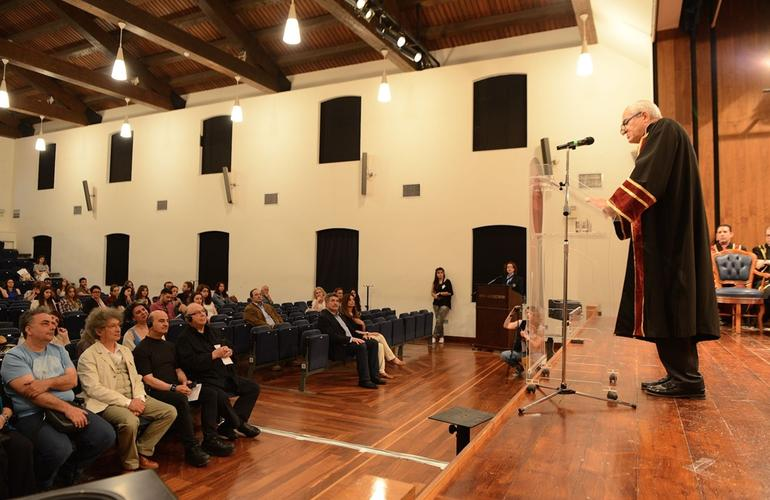{width="3.560416666666667in"
height="2.3118055555555554in"}H φοίτηση στο Τμήμα Πληροφορικής διαρκεί
τέσσερα ακαδημαϊκά έτη ή οκτώ εξάμηνα σπουδών. Στην αρχή του κάθε
εξαμήνου οι φοιτητές καλούνται, μετά από ανακοίνωση της Γραμματείας του
Τμήματος, να υποβάλουν δήλωση με την οποία επιλέγουν Υποχρεωτικά
Επιλεγόμενα (ΥΕ) μαθήματα από το Πρόγραμμα Σπουδών. Οι φοιτητές έχουν τη
δυνατότητα να δηλώσουν ως επιλεγόμενο, ένα υποχρεωτικό μάθημα άλλης
κατεύθυνσης.

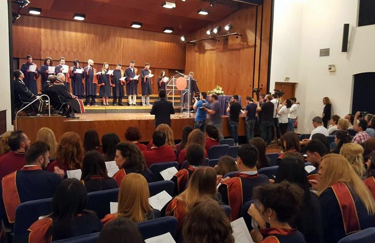{width="4.135416666666667in"
height="2.4722222222222223in"}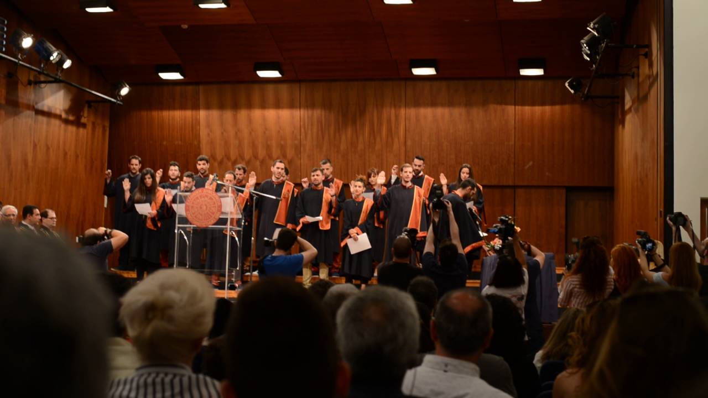{width="4.1819444444444445in"
height="2.3520833333333333in"}

{width="1.479861111111111in"
height="2.220833333333333in"}

*3.5 Πτυχιακή Eργασία (ΠΕ)* {#πτυχιακή-eργασία-πε .ListParagraph}
---------------------------

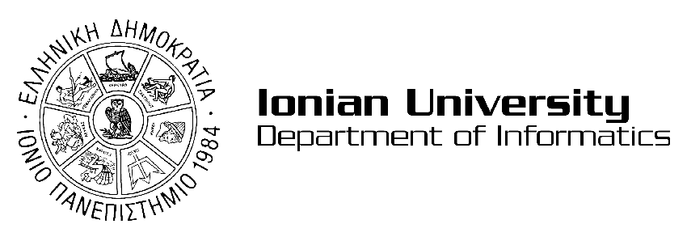{width="2.0in"
height="0.7006944444444444in"}{width="5.96875in"
height="3.3541666666666665in"}Η πτυχιακή εργασία είναι υποχρεωτική.
Αντιστοιχεί σε δύο υποχρεωτικά μαθήματα με συντελεστή βαρύτητας 2 (δύο)
για το καθένα, έχει, δηλαδή, συντελεστή βαρύτητας 4 (τέσσερα). Επίσης
αντιστοιχεί σε 8 (οκτώ) διδακτικές μονάδες (4 για το κάθε μάθημα) ή 12
(δώδεκα) μονάδες ECTS.

-   **Περιγραφή της πτυχιακής εργασίας**

Η ΠΕ είναι πρωτότυπη, ο σχεδιασμός και η υλοποίησή της αποτελούν
προσωπική σύνθεση του συγγραφέα της. Σκοπός της ΠΕ είναι να αποδείξει
τις ερευνητικές και μεθοδολογικές ικανότητες του φοιτητή καθώς και την
εξοικείωσή του με το γνωστικό αντικείμενο στο οποίο αυτή εντάσσεται. Το
θέμα της ΠΕ αναφέρεται σε ένα από τα γνωστικά αντικείμενα (υποχρεωτικά ή
επιλογής αλλά όχι ελεύθερης επιλογής) του εκάστοτε ισχύοντος
προγράμματος σπουδών του Τμήματος. Η έκταση της ΠΕ είναι κατ' ελάχιστο
70 σελίδες. Η διαπραγμάτευση του θέματος (πρόλογος, εισαγωγή, κύριο
σώμα, συμπεράσματα) ανέρχεται τουλάχιστον σε 50 σελίδες, ενώ οι
υπόλοιπες 20 σελίδες καλύπτουν τη βιβλιογραφία, τα περιεχόμενα και
ενδεχομένως το παράρτημα και τα ευρετήρια. Σημειώνεται πως τυχόν κώδικας
που έχει αναπτυχθεί αποτελεί μέρος του παραρτήματος της ΠΕ και όχι του
κυρίου μέρους εκτός και αν υπάρχει σαφής αιτιολόγηση.

-   **Επιλογή του θέματος και εποπτεία της ΠΕ**

Το θέμα της ΠΕ προτείνεται από το φοιτητή, σε συνεννόηση με έναν από
τους διδάσκοντες του Τμήματος ο οποίος θα είναι ο Επιβλέπων της ΠΕ. Η
έγκριση του θέματος βρίσκεται στη διακριτική ευχέρεια του Επιβλέποντα. Ο
Επιβλέπων αναλαμβάνει την ευθύνη παρακολούθησης της ΠΕ σε όλο το
διάστημα εκπόνησής της. Όταν εγκριθεί το θέμα ορίζονται και άλλα δύο
μέλη εκ των διδασκόντων του Τμήματος ως μέλη της Τριμελούς Επιτροπής ΠΕ
για τη συγκεκριμένη ΠΕ. Σε όλες τις Τριμελείς Επιτροπές ΠΕ θα πρέπει
υποχρεωτικά να υπάρχει ένα τουλάχιστον μέλος ΔΕΠ του Τμήματος. Εάν
ανακύψουν σοβαρές δυσκολίες στη συνεργασία Επιβλέποντα - φοιτητή, το
ζήτημα παραπέμπεται στην Τριμελή Επιτροπή ΠΕ. Οι διδάσκοντες του
Τμήματος αποδέχονται την επίβλεψη μέχρι τεσσάρων (4) νέων ΠΕ για κάθε
ακαδημαϊκό έτος.

-   **Διαδικασία εκπόνησης της ΠΕ **

Κάθε φοιτητής μπορεί να αρχίσει την εκπόνηση της ΠΕ από την έναρξη του
Ζ' εξαμήνου. Ο φοιτητής επιλέγει το θέμα της ΠΕ και τον Επιβλέποντα. Στη
συνέχεια έρχεται σε συνεννόηση με τον Επιβλέποντα, ο οποίος θα προβεί
στην τελική διατύπωση και έγκριση του θέματος και στην αποδοχή της
επίβλεψης της ΠΕ ή στην πρόταση νέου θέματος. Αφού προσδιορισθεί (α) το
θέμα της ΠΕ, (β) ο Επιβλέπων και (γ) τα λοιπά δύο μέλη της Τριμελούς
Επιτροπής ΠΕ, ο φοιτητής υποβάλλει αίτηση στη γραμματεία του Τμήματος
αναφέροντας το Θέμα, τον Επιβλέποντα και τα μέλη της Τριμελούς Επιτροπής
ΠΕ, η οποία εγκρίνεται από την επόμενη Γενική Συνέλευση του Τμήματος. Οι
αιτήσεις υποβάλλονται από την 1.10 έως 15.11 κάθε έτους. Αιτήσεις που
υποβάλλονται εκτός των παραπάνω προθεσμιών δε γίνονται δεκτές. Μετά την
κατοχύρωση του θέματος αλλαγή μπορεί να γίνει μόνο μετά από αιτιολόγηση
του φοιτητή, έγκριση του Επιβλέποντα και αίτηση στη γραμματεία. Αλλαγή
του Επιβλέποντα μπορεί να γίνει μετά από αίτηση του φοιτητή για σοβαρό
λόγο. Η αίτηση απευθύνεται στη Γενική Συνέλευση του Τμήματος, μέσω
Γραμματείας. Τυχόν αλλαγή στο πρόσωπο του Επιβλέποντα υποχρεώνει το
φοιτητή να ακολουθήσει και πάλι την προβλεπόμενη από τον Κανονισμό
διαδικασία για την εκπόνηση ΠΕ, δηλαδή, νέα αίτηση τη νέα ακαδημαϊκή
χρονιά. Η συνεργασία φοιτητή και Επιβλέποντα γίνεται με διαδοχικές
συναντήσεις. Όταν η εργασία αποκτήσει την πρώτη ολοκληρωμένη μορφή της
υποβάλλεται για ανάγνωση και σχολιασμό στον Επιβλέποντα. Ο φοιτητής στη
βάση των σχολίων του Επιβλέποντα βελτιώνει την ΠΕ και καταθέτει το
τελικό κείμενο. Ο Επιβλέπων δίνει στο φοιτητή την άδεια να υποστηρίξει
την ΠΕ εάν κρίνει ότι έχουν επιτευχθεί οι στόχοι αυτής. Στην αντίθετη
περίπτωση επιστρέφει στον φοιτητή την εργασία για βελτίωση. Όταν ο
φοιτητής λάβει την άδεια να υποστηρίξει την εργασία του παραδίδει από
ένα αντίτυπο αυτής στα μέλη της Τριμελούς Επιτροπής ΠΕ.

-   **Μορφή ΠΕ**

Η ΠΕ είναι εκτυπωμένη σε χαρτί Α4. Η τυπωμένη επιφάνεια κάθε σελίδας
περιλαμβάνει περίπου 500 λέξεις ή 3000 χαρακτήρες. Παράδειγμα της
ακριβούς μορφοποίησης της ΠΕ είναι αναρτημένο στην αντίστοιχη ιστοσελίδα
του Τμήματος στο Διαδίκτυο σε ηλεκτρονική μορφή. Ενδεικτικά αναφέρεται
πως το κυρίως κείμενο περιλαμβάνει περίπου 25.000 λέξεις ή 150.000
χαρακτήρες ενώ η δομή της ΠΕ έχει ως εξής: (α) λευκή σελίδα, (β) σελίδα
τίτλου, (γ) πρόλογος, (δ) εισαγωγή,(ε) κύριο σώμα, (στ) συμπεράσματα,
(ζ) παράρτημα (μη υποχρεωτικό), (η) βιβλιογραφία, (θ) ευρετήρια (μη
υποχρεωτικό), (ι) περιεχόμενα, (ια) λευκή σελίδα. Το κείμενο της ΠΕ
παραδίδεται στην τελική του μορφή, υποχρεωτικά, σε ηλεκτρονική μορφή
(αρχείο Η/Υ) τόσο πηγαίου χαρακτήρα (π.χ. word document, latex files)
όσο και τελικής μορφής (π.χ. pdf ή ps αρχείο) καθώς και το όποιο
λογισμικό αναπτύχθηκε σε πηγαίο κώδικα.

-   **Υποστήριξη της πτυχιακής εργασίας **

Η υποστήριξη της ΠΕ γίνεται μετά από άδεια του Επιβλέποντα ενώπιον της
Τριμελούς Επιτροπής ΠΕ. Ο φοιτητής παρουσιάζει την εργασία του και
απαντά σε ερωτήσεις. Η υποστήριξη της ΠΕ ορίζεται κατά προτίμηση στο
μήνα πριν την επόμενη εξεταστική περίοδο ή και κατά τη διάρκεια αυτής.
Στο τέλος της υποστήριξης τα τρία μέλη της Επιτροπής βαθμολογούν την ΠΕ.
Ο μέσος όρος της βαθμολογίας ανακοινώνεται αμέσως στον υποψήφιο και
κοινοποιείται εγγράφως στη Γραμματεία. Ο βαθμός κατοχυρώνεται με αίτηση
του φοιτητή στη γραμματεία κατά την οποία προσκομίζει βεβαίωση από τη
βιβλιοθήκη πως έχει παραδώσει αντίγραφο της ΠΕ υπογεγραμμένο από την
Τριμελή Επιτροπή ΠΕ. Η Βιβλιοθήκη τηρεί αλφαβητικούς καταλόγους
συγγραφέων και θεμάτων ΠΕ που έχουν υποστηριχθεί. Οι ΠΕ δε δανείζονται
αλλά μπορούν να χρησιμοποιηθούν εντός της Βιβλιοθήκης. Φωτοαντίγραφα
μέρους ή συνόλου ΠΕ γίνονται μόνο μετά από έγγραφη άδεια του συγγραφέα.

*3.6 Πρακτική Ασκηση * {#πρακτική-ασκηση .ListParagraph}
----------------------

Με την από 16/03/2016 απόφαση της 7^ης^ Συνεδρίασης της Προσωρινής
Γενικής Συνέλευσης του Τμήματος Πληροφορικής του Ιονίου Πανεπιστημίου,
αποφασίστηκε η θεσμοθέτηση του νέου κύκλου της Πρακτικής Άσκησης, καθώς
και η εισαγωγή της Πρακτικής Άσκησης στο Πρόγραμμα Σπουδών του Τμήματος
Πληροφορικής ως προαιρετική επιλογή των φοιτητών από το ακαδημαϊκό έτος
2015-2016. Το Μάθημα «Πρακτική Άσκηση» έχει κωδικό μαθήματος
(συγκεκριμένα τον κωδικό ΗΥ900) και διδάσκοντα τον Επιστημονικό Υπεύθυνο
Επίκουρο Καθηγητή Θεόδωρο Ανδρόνικο.

Η διάρκεια του νέου κύκλου της Πρακτικής Άσκησης θα είναι συνολικά δύο
(2) μήνες και συγκεκριμένα την περίοδο των θερινών διακοπών, δηλαδή κατά
τους μήνες Ιούλιο και Αύγουστο, μετά το 6ο διδακτικό εξάμηνο σπουδών.

Οι Πιστωτικές Μονάδες (ECTS) που αντιστοιχούν είναι 4 ECTS ανά μήνα
απασχόλησης, δηλ. συνολικά 8 μονάδες ECTS. Οι μονάδες ECTS, που
αποδίδονται στην Πρακτική Άσκηση προσμετρούνται κανονικά στις απαιτήσεις
λήψης πτυχίου και αντιστοιχούν σε αυτά ενός εξαμηνιαίου μαθήματος.
Επιπλέον, το Τμήμα δίνει βαθμό στο Μάθημα «Πρακτική Άσκηση».

Οι φοιτητές θα δηλώνουν την Πρακτική Άσκηση, ως προαιρετική επιλογή,
στις αρχές του 6oy εξαμήνου σπουδών.

Η υλοποίηση αυτής της δραστηριότητας θα γίνεται με ευθύνη Επιτροπής
Πρακτικής Άσκησης, η οποία θα ορίζεται με απόφαση της Προσωρινής Γενικής
Συνέλευσης του Τμήματος Πληροφορικής και θα έχει ετήσια θητεία.

-   **Στόχοι της Πρακτικής Άσκησης**

Η επιστήμη της Πληροφορικής είναι μια επιστήμη με απεριόριστες πρακτικές
εφαρμογές. Οι φοιτητές του Τμήματος έχουν μια πρώτη ευκαιρία να δουν
εφαρμογές της επιστήμης τους στα πλαίσια των εργαστηριακών τους
ασκήσεων. Οι ασκήσεις όμως αυτές για λόγους χώρου, κόστους, ασφάλειας,
κ.α. συνήθως διεξάγονται σε πειραματικές διατάξεις υπό κλίμακα
(μοντέλα).

Η Πρακτική Άσκηση δίνει τη δυνατότητα στους φοιτητές να αντιμετωπίσουν
πραγματικά προβλήματα που σχετίζονται με την επιστήμη τους στην αγορά
εργασίας, καθώς επίσης και να εξοικειωθούν με εξοπλισμό που μετά το
πέρας των σπουδών τους είναι δυνατό να κληθούν να χρησιμοποιήσουν.

Η Πρακτική Άσκηση των φοιτητών τους βοηθά να ενημερωθούν ως προς τη
μορφή και το περιεχόμενο των δραστηριοτήτων Έρευνας, Τεχνολογίας και
Ανάπτυξης των Επιχειρήσεων, Υπηρεσιών ή Οργανισμών που τους εκπαιδεύουν
και να εξοικειωθούν με τις εν γένει δραστηριότητες και την οργάνωσή
τους.

Η Πρακτική Άσκηση δίνει την ευκαιρία στις Επιχειρήσεις, Υπηρεσίες και
Οργανισμούς να γνωρίσουν φοιτητές στα πλαίσια μιας διαδικασίας
μελλοντικής επιλογής του επιστημονικού τους προσωπικού.

Με την Πρακτική Άσκηση των φοιτητών επιτυγχάνεται η αμφίδρομη διάχυση
γνώσεων, πληροφοριών και τρόπων σκέψης μεταξύ μελών της Πανεπιστημιακής
και της Επιχειρηματικής κοινότητας με θετικές επιπτώσεις στη σύνδεση
Έρευνας και Παραγωγής.

Οι εμπειρίες των ασκούμενων φοιτητών, μεταφερόμενες στο Τμήμα, έχουν ως
αποτέλεσμα την αναβάθμιση των παρεχόμενων σπουδών.

Η εξοικείωση των φοιτητών με το εργασιακό περιβάλλον και τις απαιτήσεις
ενός επαγγελματικού χώρου, θα τους επιτρέψει να αποκτήσουν ρεαλιστικές
απόψεις σχετικά με τις εργασιακές σχέσεις, το ύψος των απολαβών και την
αγορά εργασίας, όπως διαμορφώνονται στο ελληνικό και ευρωπαϊκό
γίγνεσθαι.

-   **Αντικείμενα της Πρακτικής Άσκησης**

Τα αντικείμενα της Πρακτικής Άσκησης των φοιτητών πρέπει να είναι συναφή
με το αντικείμενο των σπουδών τους. Η Πρακτική Άσκηση θα περιλαμβάνει
δραστηριότητες σχετικές με τα γνωστικά αντικείμενα των Τομέων του
Τμήματος. Οι δραστηριότητες αυτές μπορούν να αφορούν:

-   Ανάπτυξη λογισμικού που μπορούν να αξιοποιήσουν οι επιχειρήσεις για
    βελτίωση της λειτουργίας τους σε διοικητικό και τεχνικό επίπεδο.

-   Ενημέρωση των ασκούμενων φοιτητών για την διάρθρωση και λειτουργία
    των επιχειρήσεων ή οργανισμών απασχόλησής τους.

-   Χειρισμό συσκευών ή εργαλείων σύγχρονης τεχνολογίας.

-   Διεξαγωγή μετρήσεων, συλλογή και ανάλυση στοιχείων που μπορούν να
    αξιοποιηθούν από τους ασκούμενους φοιτητές στα πλαίσια των
    διπλωματικών εργασιών ώστε να ληφθούν αποφάσεις ή να προταθούν
    λύσεις σε πιθανά προβλήματα.

-   Παρατήρηση διαδικασιών παραγωγής με σκοπό την απόκτηση εμπειριών που
    αφορούν την οργάνωση παραγωγικής διαδικασίας.

<!-- -->

-   **Εξεύρεση φορέων για την Υλοποίηση της Πρακτικής Άσκησης**

Η δραστηριότητα αυτή αρχίζει με την έναρξη του χειμερινού εξαμήνου κάθε
ακαδημαϊκού έτους και μπορεί να συνεχιστεί μέχρι και τη λήξη του εαρινού
εξαμήνου του ιδίου ακαδημαϊκού έτους. Κατά τη διάρκεια της περιόδου
αυτής, το Γραφείο Διασύνδεσης συνεπικουρούμενο από τον Επιστημονικό
Υπεύθυνο της Πρακτικής Άσκησης και τα μέλη της Επιτροπής Πρακτικής
Άσκησης φροντίζει για την αναζήτηση φορέων για εκπόνηση Πρακτικής
Άσκησης από τους φοιτητές του Τμήματος, ερχόμενο σε επικοινωνία με
ενδιαφερόμενους φορείς. Αναζήτηση και εξεύρεση φορέων για την εκπόνηση
της Πρακτικής Άσκησης είναι δυνατό να γίνεται και από τους ίδιους τους
φοιτητές. Οι θέσεις που προκύπτουν με αυτόν τον τρόπο τίθενται στην
κρίση του Επιστημονικού Υπεύθυνου για την Πρακτική Άσκηση, ο οποίος μετά
από σχετική διερεύνηση ποιότητας τις εγκρίνει ή όχι.

Οι φορείς που έχουν προκύψει μετά από διερεύνηση των φοιτητών θεωρείται
ότι καταλαμβάνονται κατά προτίμηση από τους φοιτητές που τις βρήκαν,
εφόσον αυτοί πληρούν τα κριτήρια επιλογής που αναφέρονται στη συνέχεια.

-   **Υποβολή Αιτήσεων, Αξιολόγηση τους, Επιλογή των Φοιτητών και
    Ενημέρωση των Φορέων Απασχόλησης**

Οι αιτήσεις εκπόνησης Πρακτικής Άσκησης θα πρέπει να κατατίθενται στο
εξειδικευμένο Πληροφοριακό Σύστημα ή, σε ειδικές περιπτώσεις και κατόπιν
εγκρίσεως της Επιτροπής Πρακτικής Άσκησης, στην Γραμματεία του Τμήματος.
Η έναρξη και η χρονική διάρκεια της περιόδου υποβολής αιτήσεων θα
καθορίζονται από τον Επιστημονικό Υπεύθυνο για την Πρακτική Άσκηση και
σε κάθε περίπτωση θα γίνονται κατά τη διάρκεια του εαρινού εξαμήνου του
εκάστοτε ακαδημαϊκού έτους.

Οι αιτήσεις αξιολογούνται από τον Επιστημονικό Υπεύθυνο και την Επιτροπή
Πρακτικής Άσκησης. Με βάση τα κριτήρια που αναλύονται παρακάτω, ο
Επιστημονικός Υπεύθυνος και η Επιτροπή Πρακτικής Άσκησης εισηγούνται στη
Γενική Συνέλευση του Τμήματος, η οποία και προβαίνει στην τελική επιλογή
των φοιτητών για τη κάλυψη των υπαρχόντων θέσεων.

-   Τα κριτήρια επιλογής των φοιτητών για τις υπάρχουσες θέσεις
    Πρακτικής Άσκησης είναι:

-   Το εξάμηνο φοίτησης: τουλάχιστον φοιτητές του 6ουεξαμήνου.

-   Ο αριθμός των μονάδων ECTS: ο αιτούμενος φοιτητής θα πρέπει να έχει
    συμπληρώσει 120 μονάδες ECTS τη στιγμή που υποβάλει την αίτηση ως
    αναγκαία προϋπόθεση. Στην ειδική περίπτωση που υπάρχουν ελεύθερες
    θέσεις Πρακτικής Άσκησης, αλλά ο αιτούμενος φοιτητής δεν έχει
    συμπληρώσει 120 μονάδες ECTS, η Γενική Συνέλευση του Τμήματος
    ενδέχεται να κάνει δεκτή την αίτησή του αν κρίνει ότι θα συμπληρώσει
    120 μονάδες ECTS κατά την τρέχουσα εαρινή εξεταστική περίοδο.

-   Ο μέσος όρος της βαθμολογίας, εφόσον πληρούνται οι προϋποθέσεις (1)
    και (2).

Σε περίπτωση ισοβαθμίας στα πιο πάνω κριτήρια, δίνεται προτεραιότητα σε
άτομα που ανήκουν σε ευαίσθητες κοινωνικές ομάδες (π.χ., AμεA), εφόσον
πληρούνται οι προϋποθέσεις (1) (2) και (3). Σε περίπτωση ισοβαθμίας στα
πιο πάνω κριτήρια και εφόσον δεν υπάρχουν άτομα που ανήκουν σε
ευαίσθητες κοινωνικές ομάδες, δίνεται προτεραιότητα σε φοιτητές
μεγαλύτερων ετών.

-   **Υποχρεώσεις Επόπτη Διδάσκοντα**

Η δραστηριότητα αυτή αρχίζει τον Ιούλιο κάθε έτους και διαρκεί δύο (2)
μήνες συνολικά. Κατά τη διάρκεια της περιόδου αυτής γίνεται η τοποθέτηση
των φοιτητών στους χώρους απασχόλησης και η διεξαγωγή της Πρακτικής
Άσκησης. Κάθε Επόπτης Διδάσκοντας Πρακτικής Άσκησης έχει την ευθύνη για
την παρακολούθηση και αξιολόγηση της Πρακτικής Άσκησης το πολύ τεσσάρων
(4) φοιτητών κάθε φορά. Η παρακολούθηση γίνεται με τρόπο που θεωρεί
δόκιμο ο Επόπτης Διδάσκοντας και ενδέχεται να περιλαμβάνει τηλεφωνική
επικοινωνία με το Φορέα Υποδοχής ή δειγματοληπτική επίσκεψη στο Φορέα
Υποδοχής.

Κάθε ασκούμενος φοιτητής συντάσσει μια σειρά από αναφορές, όπου
καταγράφονται οι δραστηριότητές του. Οι αναφορές αυτές ελέγχονται και
υπογράφονται από τον υπεύθυνο του Φορέα Υποδοχής. Μετά το πέρας της
Πρακτικής Άσκησης, ο ασκούμενος φοιτητής υποβάλλει τελική έκθεση
αξιολόγησης-πεπραγμένων προς τον Επόπτη Διδάσκοντα και την Επιτροπή
Πρακτικής Άσκησης.

-   **Αξιολόγηση **

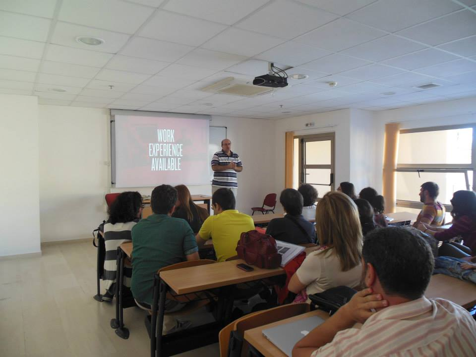{width="3.276388888888889in"
height="2.3868055555555556in"}Οι Επόπτες και τα μέλη της Επιτροπής
Πρακτικής Άσκησης αξιολογούν τα υποβαλλόμενα αποτελέσματα και τις
αναφορές των ασκούμενων φοιτητών, και εφόσον κρίνουν ότι η Πρακτική
Άσκηση περατώθηκε επιτυχώς, εισηγούνται προς τη Γενική Συνέλευση το
βαθμό που λαμβάνει ο ασκούμενος.

Ιστότοπος: <http://internship.di.ionio.gr/>

*3.7 Erasmus * {#erasmus .ListParagraph}
--------------

Το τμήμα Πληροφορικής συμμετέχει στο πρόγραμμα ανταλλαγής φοιτητών
ERASMUS, για την υποδοχή και αποστολή φοιτητών από και προς άλλες χώρες.
Για αυτό το σκοπό, το τμήμα διατηρεί συνεργασίες με αντίστοιχα τμήματα
της Ευρωπαϊκής Ένωσης και συμμετέχει στο σύστημα αναγνώρισης μαθημάτων
με βάση τις μονάδες ECTS. Αναλυτικές πληροφορίες για το ύψος των
υποτροφιών και τις προθεσμίες των αιτήσεων δίνονται από το γραφείο
ERASMUS του πανεπιστημίου στην ηλεκτρονική διεύθυνση
<http://sites.ionio.gr/international/gr/erasmus/>. Στην ίδια διεύθυνση,
είναι διαθέσιμες και οι διμερείς συνεργασίες του τμήματος με
πανεπιστήμια του εξωτερικού και οι διαθέσιμες θέσεις για εξερχόμενους
φοιτητές.

Το Τμήμα Πληροφορικής παρέχει τη δυνατότητα παρακολούθησης κορμού
μαθημάτων σε αγγλική γλώσσα σε φοιτητές της αλλοδαπής που επιθυμούν να
επισκεφθούν το Τμήμα Πληροφορικής μέσω του Erasmus+, τα οποία
αντιστοιχούν σε 30 ECTS μονάδες συνολικά ανά εξάμηνο. Σημειώνεται ότι
έκαστο μάθημα θα προσφέρεται μόνο εφόσον έχει δηλωθεί από τουλάχιστον 9
εισερχόμενους φοιτητές Erasmus+ στο Τμήμα Πληροφορικής.

Τα μαθήματα που δύναται να διδάσκονται σε αγγλική γλώσσα είναι τα εξής:

  **Α/Α**   **Μαθήματα**                                            **Εξάμηνο**   **ECTS**
  --------- ------------------------------------------------------- ------------- ----------
  1.        Ηλεκτρονικό Επιχειρείν                                  Χειμερινό     7,5
  2.        Ψηφιακή Επεξεργασία Εικόνας                             Χειμερινό     7,5
  3.        Διαχείριση Μεγάλου Όγκου Δεδομένων στο Διαδίκτυο        Χειμερινό     7,5
  4.        Πολιτικές και Τεχνολογίες Ασφάλειας και Ιδιωτικότητας   Χειμερινό     7,5
  5.        Επεξεργασία Ομιλίας και Ήχου                            Εαρινό        7,5
  6.        Ανάκτηση Πληροφορίας                                    Εαρινό        7,5
  7.        Κοινωνικός και Σημασιολογικός Ιστός                     Εαρινό        7,5
  8.        Διοίκηση Ασφάλειας Πληροφοριακών Συστημάτων             Εαρινό        7,5

[ ]{.smallcaps}[4 ΜΕΤΑΠΤΥΧΙΑΚΕΣ ΣΠΟΥΔΕΣ]{.smallcaps} {#μεταπτυχιακεσ-σπουδεσ .ListParagraph}
====================================================

[]{#_Toc455573395 .anchor}To Τμήμα Πληροφορικής της Σχολής Επιστήμης της
Πληροφορίας και Πληροφορικής του Ιονίου Πανεπιστημίου προσφέρει δύο
Μεταπτυχιακά Προγράμματα Σπουδών (Π.Μ.Σ.) με τίτλους:

1.  **Π.Μ.Σ «Πληροφορική»**

2.  **Π.Μ.Σ \"Βιοπληροφορική και Νευροπληροφορική\"**

Και τα δύο Π.Μ.Σ. απονέμουν:

**α. Μεταπτυχιακό Δίπλωμα Ειδίκευσης (Μ.Δ.Ε.), και **

**β. Διδακτορικό Δίπλωμα (Δ.Δ.)**

Επίσης, το Τμήμα Πληροφορικής έχει, σύμφωνα με την ισχύουσα νομοθεσία
και τις κείμενες διατάξεις τη δυνατότητα να προσφέρει θέσεις για
μεταδιδακτορικές σπουδές (ΜΔ.Σ.) στην Πληροφορική.

*4.1 Π.Μ.Σ.-Μ.Δ.Ε. «Πληροφορική»* {#π.μ.σ.-μ.δ.ε.-πληροφορική .ListParagraph}
---------------------------------

To Τμήμα Πληροφορικής λειτουργεί από το ακαδημαϊκό έτος 2015-2016
Μεταπτυχιακό Πρόγραμμα Σπουδών (Π.Μ.Σ.) με τίτλο "Πληροφορική" (ΦΕΚ
2071/29.07.2014, τ. B).

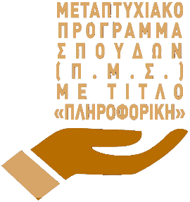{width="1.225in"
height="1.30625in"}{width="5.976388888888889in"
height="2.8194444444444446in"}

Αντικείμενο του Προγράμματος Μεταπτυχιακών Σπουδών (Π.Μ.Σ.) είναι η
επιστημονική κατάρτιση και ειδίκευση επιστημόνων στις ακόλουθες
Κατευθύνσεις εξειδίκευσης:

1.  **"Τεχνολογίες Πληροφορικής και Πληροφοριακά Συστήματα"**

2.  **"Τεχνολογίες και Εφαρμογές Πληροφορικής στις Ανθρωπιστικές και
    > Κοινωνικές Επιστήμες"**

Στο Πρόγραμμα Μεταπτυχιακών Σπουδών, γίνονται δεκτοί ως υποψήφιοι,
πτυχιούχοι τμημάτων Α.Ε.Ι. και Τ.Ε.Ι. της ημεδαπής ή αναγνωρισμένων
ομοταγών ιδρυμάτων της αλλοδαπής.

Η χρονική διάρκεια σπουδών για την απονομή του Μ.Δ.Ε ορίζεται σε τρία
(3) εξάμηνα. Στα δύο πρώτα εξάμηνα θα γίνεται διδασκαλία μαθημάτων και
το τελευταίο εξάμηνο οι φοιτητές θα εκπονούν τη διπλωματική τους
εργασία.

### 4.1.1 Κατευθύνσεις ΠΜΣ «Πληροφορική» {#κατευθύνσεις-πμσ-πληροφορική .ListParagraph}

**Κατεύθυνση: Τεχνολογίες Πληροφορικής και Πληροφοριακά Συστήματα**

Στόχος της κατεύθυνσης "Τεχνολογίες Πληροφορικής και Πληροφοριακά
Συστήματα" του Π.M.Σ είναι η παροχή εξειδικευμένων γνώσεων μεταπτυχιακού
επιπέδου και η καλλιέργεια κρίσιμων επιδεξιοτήτων στον τομέα των
Πληροφοριακών Συστημάτων. Με την επιλογή των μαθημάτων κατεύθυνσης,
επιχειρείται μια διεπιστημονική προσέγγιση στον τομέα των Πληροφοριακών
Συστημάτων, προκειμένου να διερευνηθεί επαρκώς η συσχέτιση των
Τεχνολογιών Πληροφορικής και Επικοινωνιών με την βιώσιμη λειτουργία αλλά
και την συνεχή ανάπτυξη των σύγχρονων οργανισμών. Ολοκληρώνοντας την
κατεύθυνση «Πληροφοριακά Συστήματα», οι απόφοιτοι του μεταπτυχιακού
προγράμματος θα είναι εφοδιασμένοι με θεωρητικές γνώσεις αλλά και
πρακτικές δεξιότητες, ικανές να αντεπεξέλθουν αποτελεσματικά στις
αυξανόμενες ανάγκες των οργανισμών για υλοποίηση αλλά και διαχείριση
προηγμένων πληροφοριακών συστημάτων.

**Κατεύθυνση: Τεχνολογίες και Εφαρμογές Πληροφορικής στις Ανθρωπιστικές
και Κοινωνικές Επιστήμες**

Η κατεύθυνση του "Τεχνολογίες και Εφαρμογές Πληροφορικής στις
Ανθρωπιστικές και Κοινωνικές Επιστήμες" εστιάζει στην μελέτη τεχνικών
και εφαρμογών της επιστήμης της Πληροφορικής στις Ανθρωπιστικές και
Κοινωνικές Επιστήμες. Πιο συγκεκριμένα, μέσα από τα μαθήματα της
κατεύθυνσης, διερευνώνται οι διεπιστημονικές περιοχές που συνδυάζουν τις
Νέες Τεχνολογίες με την Κοινωνιολογία, την Γλωσσολογία, την Ψυχολογία,
την Γνωστική Επιστήμη, τις Τέχνες, τον Πολιτισμό, την Ιστορία, την
Εκπαίδευση. Στην διερεύνηση αυτή, κεντρικός πυρήνας είναι ο Άνθρωπος και
στόχος είναι η χρήση των Τεχνολογιών προς όφελος της ανθρώπινης
έκφρασης, μάθησης, συνεργασίας και κοινωνικότητας. Ο φοιτητής της
κατεύθυνσης αυτής μελετά σύγχρονα ερευνητικά θέματα που αφορούν τη χρήση
ΤΠΕ για την ενίσχυση την συνεργατικότητας, της κοινωνικότητας, της
διαδικασίας μάθησης αλλά και για ψυχαγωγικούς σκοπούς. Επιπλέον εξερευνά
τον αντίκτυπο που έχουν οι ΤΠΕ στην κοινωνία, το πώς την επηρεάζουν και
την διαμορφώνουν.

### 4.1.2 Πρόγραμμα Σπουδών ΠΜΣ «Πληροφορική» {#πρόγραμμα-σπουδών-πμσ-πληροφορική .ListParagraph}

Το πρόγραμμα σπουδών αποτελείται από τα ακόλουθα στάδια:

> \[α\] έναν κύκλο εντατικών διαλέξεων διάρκειας 2 εβδομάδων που
> πραγματοποιείται στην έδρα του Τμήματος στην αρχή κάθε ακαδημαϊκού
> εξαμήνου,
>
> \[β\] ηλεκτρονικές διαδικασίες σύγχρονης και ασύγχρονης μάθησης, με
> αξιοποίηση σχετικής πλατφόρμας, κατά τη διάρκεια όλων των εβδομάδων
> σπουδών των δύο πρώτων ακαδημαϊκών εξαμήνων.

\[γ\] Το τελευταίο εξάμηνο οι φοιτητές θα εκπονούν τη διπλωματική τους
εργασία.

Τα μαθήματα των δύο κατευθύνσεων και η κατανομή τους ανά εξάμηνο
παρουσιάζονται στον ακόλουθο πίνακα:

+-------------+-------------+-------------+-------------+-------------+
| **[Κατεύθυν |
| ση:         |
| ]{.smallcap |
| s}**        |
|             |
| **[Τεχνολογ |
| ίες         |
| Πληροφορική |
| ς           |
| και         |
| Πληροφοριακ |
| ά           |
| Συστήματα   |
| ]{.smallcap |
| s}**        |
+=============+=============+=============+=============+=============+
|             | **Α'        | **Υ/Ε**     | **ΠΙΣΤΩΤΙΚΕ |
|             | Εξάμηνο**   |             | Σ           |
|             |             |             | ΜΟΝΑΔΕΣ/ECT |
|             |             |             | S**         |
+-------------+-------------+-------------+-------------+-------------+
| 1           | Ερευνητικές | **Υ**       | **6**       |
|             | μέθοδοι     |             |             |
+-------------+-------------+-------------+-------------+-------------+
| 2           | Τεχνητή     | **Υ**       | **6**       |
|             | Νοημοσύνη   |             |             |
+-------------+-------------+-------------+-------------+-------------+
| 3           | > Διοικητικ | **Υ**       | **6**       |
|             | ή           |             |             |
|             | > πληροφορι |             |             |
|             | ακών        |             |             |
|             | > συστημάτω |             |             |
|             | ν           |             |             |
+-------------+-------------+-------------+-------------+-------------+
| 4           | > Προχωρημέ | **Υ**       | **6**       |
|             | να          |             |             |
|             | > θέματα σε |             |             |
|             | > βάσεις    |             |             |
|             | > και δομές |             |             |
|             | > δεδομένων |             |             |
+-------------+-------------+-------------+-------------+-------------+
| 5           | > Προχωρημέ | **Υ**       | **6**       |
|             | να          |             |             |
|             | > θέματα    |             |             |
|             | > δικτύων   |             |             |
|             | > δεδομένων |             |             |
+-------------+-------------+-------------+-------------+-------------+
|             | ΣΥΝΟΛΟ      |             | **30**      |
|             | ΠΙΣΤΩΤΙΚΩΝ  |             |             |
|             | ΜΟΝΑΔΩΝ/ECT |             |             |
|             | S           |             |             |
+-------------+-------------+-------------+-------------+-------------+
|             |
+-------------+-------------+-------------+-------------+-------------+
|             | **Β'        | **Υ/Ε**     | **ΠΙΣΤΩΤΙΚΕ |
|             | Εξάμηνο**   |             | Σ           |
|             |             |             | ΜΟΝΑΔΕΣ/ECT |
|             |             |             | S**         |
+-------------+-------------+-------------+-------------+-------------+
| 1           | > Επιλέγοντ | Κατανεμημέν | **E/K**     | **6**       |
|             | αι          | α           |             |             |
|             | > 3 έως 5   | πληροφοριακ |             |             |
|             | > μαθήματα  | ά           |             |             |
|             |             | συστήματα   |             |             |
+-------------+-------------+-------------+-------------+-------------+
| 2           |             | Ηλεκτρονική | **E/K**     | **6**       |
|             |             | επιχειρηματ |             |             |
|             |             | ικότητα     |             |             |
+-------------+-------------+-------------+-------------+-------------+
| 3           |             | Προγραμματι | **E/K**     | **6**       |
|             |             | σμός        |             |             |
|             |             | σημασιολογι |             |             |
|             |             | κού         |             |             |
|             |             | ιστού       |             |             |
+-------------+-------------+-------------+-------------+-------------+
| 4           |             | Ασφάλεια    | **E/K**     | **6**       |
|             |             | πληροφοριακ |             |             |
|             |             | ών          |             |             |
|             |             | συστημάτων  |             |             |
|             |             | και δικτύων |             |             |
+-------------+-------------+-------------+-------------+-------------+
| 5           |             | Βιοπληροφορ | **E/K**     | **6**       |
|             |             | ική         |             |             |
+-------------+-------------+-------------+-------------+-------------+
| 6           | > Επιλέγοντ | Πληροφορική | **Ε**       | **6**       |
|             | αι          | στην        |             |             |
|             | > έως 2     | εκπαίδευση  |             |             |
|             | > μαθήματα  |             |             |             |
+-------------+-------------+-------------+-------------+-------------+
| 7           |             | > Πληροφορι | **Ε**       | **6**       |
|             |             | κή          |             |             |
|             |             | > και νέα   |             |             |
|             |             | > μέσα      |             |             |
+-------------+-------------+-------------+-------------+-------------+
| 8           |             | Εξόρυξη     | **Ε**       | **6**       |
|             |             | δεδομένων   |             |             |
|             |             | και         |             |             |
|             |             | διαχείριση  |             |             |
|             |             | γνώσης      |             |             |
+-------------+-------------+-------------+-------------+-------------+
| 10          |             | Προσομοίωση | **Ε**       | **6**       |
|             |             | και         |             |             |
|             |             | μοντελοποίη |             |             |
|             |             | ση          |             |             |
+-------------+-------------+-------------+-------------+-------------+
| 11          |             | Ψυχαγωγικό  | **Ε**       | **6**       |
|             |             | λογισμικό   |             |             |
+-------------+-------------+-------------+-------------+-------------+
|             | ΣΥΝΟΛΟ      |             | **30**      |
|             | ΠΙΣΤΩΤΙΚΩΝ  |             |             |
|             | ΜΟΝΑΔΩΝ/ECT |             |             |
|             | S           |             |             |
+-------------+-------------+-------------+-------------+-------------+
|             | **Γ'        | **Υ/Ε**     | **ΠΙΣΤΩΤΙΚΕ |
|             | Εξάμηνο**   |             | Σ           |
|             |             |             | ΜΟΝΑΔΕΣ/ECT |
|             |             |             | S**         |
+-------------+-------------+-------------+-------------+-------------+
|             | Εκπόνηση    | **Υ**       | **30**      |
|             | Διπλωματική |             |             |
|             | ς           |             |             |
|             | Εργασίας    |             |             |
+-------------+-------------+-------------+-------------+-------------+
| **[Κατεύθυν |
| ση:         |
| ]{.smallcap |
| s}**        |
|             |
| **[Τεχνολογ |
| ίες         |
| και         |
| Εφαρμογές   |
| Πληροφορική |
| ς           |
| στις        |
| Ανθρωπιστικ |
| ές          |
| και         |
| Κοινωνικές  |
| Επιστήμες]{ |
| .smallcaps} |
| **          |
+-------------+-------------+-------------+-------------+-------------+
|             | **Α'        | **Υ/Ε**     | **ΠΙΣΤΩΤΙΚΕ |
|             | Εξάμηνο**   |             | Σ           |
|             |             |             | ΜΟΝΑΔΕΣ/ECT |
|             |             |             | S**         |
+-------------+-------------+-------------+-------------+-------------+
| 1           | Ερευνητικές | **Υ**       | **6**       |
|             | μέθοδοι     |             |             |
+-------------+-------------+-------------+-------------+-------------+
| 2           | Τεχνητή     | **Υ**       | **6**       |
|             | Νοημοσύνη   |             |             |
+-------------+-------------+-------------+-------------+-------------+
| 3           | Διαχείριση  | **Υ**       | **6**       |
|             | λειτουργικώ |             |             |
|             | ν           |             |             |
|             | συστημάτων  |             |             |
+-------------+-------------+-------------+-------------+-------------+
| 4           | Ειδικά      | **Υ**       | **6**       |
|             | θέματα      |             |             |
|             | ασφάλειας   |             |             |
|             | και         |             |             |
|             | ιδιωτικότητ |             |             |
|             | ας          |             |             |
|             | στο         |             |             |
|             | διαδίκτυο   |             |             |
+-------------+-------------+-------------+-------------+-------------+
| 5           | Διάδραση    | **Υ**       | **6**       |
|             | ανθρώπου -- |             |             |
|             | υπολογιστή  |             |             |
+-------------+-------------+-------------+-------------+-------------+
|             | ΣΥΝΟΛΟ      |             | **30**      |
|             | ΠΙΣΤΩΤΙΚΩΝ  |             |             |
|             | ΜΟΝΑΔΩΝ/ECT |             |             |
|             | S           |             |             |
+-------------+-------------+-------------+-------------+-------------+
|             |
+-------------+-------------+-------------+-------------+-------------+
|             | **Β'        | **Υ/Ε**     | **ΠΙΣΤΩΤΙΚΕ |
|             | Εξάμηνο**   |             | Σ           |
|             |             |             | ΜΟΝΑΔΕΣ/ECT |
|             |             |             | S**         |
+-------------+-------------+-------------+-------------+-------------+
| 1           | > Επιλέγοντ | Πληροφορική | **E/K**     | **6**       |
|             | αι          | στην        |             |             |
|             | > 3 έως 5   | εκπαίδευση  |             |             |
|             | > μαθήματα  |             |             |             |
+-------------+-------------+-------------+-------------+-------------+
| 2           |             | Πληροφορική | **E/K**     | **6**       |
|             |             | και νέα     |             |             |
|             |             | μέσα        |             |             |
+-------------+-------------+-------------+-------------+-------------+
| 3           |             | Εξόρυξη     | **E/K**     | **6**       |
|             |             | δεδομένων   |             |             |
|             |             | και         |             |             |
|             |             | διαχείριση  |             |             |
|             |             | γνώσης      |             |             |
+-------------+-------------+-------------+-------------+-------------+
| 5           |             | Προσομοίωση | **E/K**     | **6**       |
|             |             | και         |             |             |
|             |             | μοντελοποίη |             |             |
|             |             | ση          |             |             |
+-------------+-------------+-------------+-------------+-------------+
| 6           |             | Ψυχαγωγικό  | **Ε/Κ**     | **6**       |
|             |             | λογισμικό   |             |             |
+-------------+-------------+-------------+-------------+-------------+
| 7           | > Επιλέγοντ | Κατανεμημέν | **Ε**       | **6**       |
|             | αι          | α           |             |             |
|             | > έως 2     | πληροφοριακ |             |             |
|             | > μαθήματα  | ά           |             |             |
|             |             | συστήματα   |             |             |
+-------------+-------------+-------------+-------------+-------------+
| 8           |             | Ηλεκτρονική | **Ε**       | **6**       |
|             |             | επιχειρηματ |             |             |
|             |             | ικότητα     |             |             |
+-------------+-------------+-------------+-------------+-------------+
| 9           |             | Προγραμματι | **Ε**       | **6**       |
|             |             | σμός        |             |             |
|             |             | σημασιολογι |             |             |
|             |             | κού         |             |             |
|             |             | ιστού       |             |             |
+-------------+-------------+-------------+-------------+-------------+
| 10          |             | Ασφάλεια    | **Ε**       | **6**       |
|             |             | πληροφοριακ |             |             |
|             |             | ών          |             |             |
|             |             | συστημάτων  |             |             |
|             |             | και δικτύων |             |             |
+-------------+-------------+-------------+-------------+-------------+
| 11          |             | Βιοπληροφορ | **Ε**       | **6**       |
|             |             | ική         |             |             |
+-------------+-------------+-------------+-------------+-------------+
|             | ΣΥΝΟΛΟ      |             | **30**      |
|             | ΠΙΣΤΩΤΙΚΩΝ  |             |             |
|             | ΜΟΝΑΔΩΝ/ECT |             |             |
|             | S           |             |             |
+-------------+-------------+-------------+-------------+-------------+
|             | **Γ'        | **Υ/Ε**     | **ΠΙΣΤΩΤΙΚΕ |
|             | Εξάμηνο**   |             | Σ           |
|             |             |             | ΜΟΝΑΔΕΣ/ECT |
|             |             |             | S**         |
+-------------+-------------+-------------+-------------+-------------+
|             | Εκπόνηση    | **Υ**       | **30**      |
|             | Διπλωματική |             |             |
|             | ς           |             |             |
|             | Εργασίας    |             |             |
+-------------+-------------+-------------+-------------+-------------+
| Υ:          | Υποχρεωτικό |
|             | Μάθημα      |
+-------------+-------------+-------------+-------------+-------------+
| Ε:          | Μάθημα      |
|             | Επιλογής    |
+-------------+-------------+-------------+-------------+-------------+
| Ε/Κ:        | Επιλογή     |
|             | Κατεύθυνσης |
+-------------+-------------+-------------+-------------+-------------+

Το σύνολο των μονάδων ECTS που απαιτούνται για την απονομή του
μεταπτυχιακού διπλώματος ειδίκευσης ανέρχεται σε 90 μονάδες.

Τα διδασκόμενα μαθήματα είναι εξαμηνιαία και κάθε κύκλος σπουδών που
οδηγεί σε Μ.Δ.Ε. περιλαμβάνει διδακτική παρακολούθηση (θεωρία και
φροντιστηριακές ασκήσεις), ερευνητική απασχόληση και εργαστηριακές
ασκήσεις. Στο τέλος των εξαμήνων οι φοιτητές, εφόσον έχουν εκπληρώσει
τις παραπάνω υποχρεώσεις τους, μπορούν να προσέλθουν στις εξετάσεις,
γραπτές ή προφορικές.

Ως γλώσσα διδασκαλίας ορίζεται η Ελληνική, εκτός των μαθημάτων που θα
διδαχθούν από διακεκριμένους επιστήμονες της αλλοδαπής, οπότε και ως
γλώσσα διδασκαλίας θα ορίζεται κατά περίπτωση η Αγγλική.

Η συγγραφή των Μεταπτυχιακών Διπλωματικών Εργασιών μπορεί να γίνει στην
ελληνική ή στην Αγγλική ύστερα από επιλογή του φοιτητή και σε συνεννόηση
με τον επόπτη καθηγητή.

*4.2 Π.Μ.Σ. -- Μ.Δ.Ε. «Βιοπληροφορική και Νευροπληροφορική»* {#π.μ.σ.-μ.δ.ε.-βιοπληροφορική-και-νευροπληροφορική .ListParagraph}
------------------------------------------------------------

Το Τμήμα Πληροφορικής της Σχολής Επιστήμης της Πληροφορίας και
Πληροφορικής του Ιονίου Πανεπιστημίου λειτουργεί από το ακαδημαϊκό έτος
2016−2017 Μεταπτυχιακό Πρόγραμμα Σπουδών (Π.Μ.Σ.) με τίτλο
«Βιοπληροφορική και Νευροπληροφορική» (ΦΕΚ 1338/02.07.2015, τ. B).

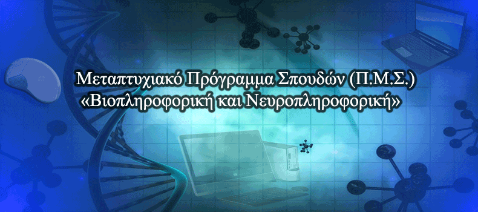{width="6.322916666666667in"
height="2.936111111111111in"}

Αντικείμενο του Προγράμματος Μεταπτυχιακών Σπουδών (Π.Μ.Σ.) είναι η
επιστημονική κατάρτιση και ειδίκευση επιστημόνων στις ακόλουθες
Κατευθύνσεις εξειδίκευσης:

1.  **«Βιοπληροφορική και Υπολογιστική Βιολογία» **

2.  **«Νευροπληροφορική και Υπολογιστικές Νευροεπιστήμες»**

Στο Πρόγραμμα Μεταπτυχιακών Σπουδών (ΠΜΣ) γίνονται δεκτοί ως υποψήφιοι,
πτυχιούχοι σχολών επιστημών υγείας, θετικών, βιολογικών, οικονομικών,
ανθρωπιστικών, πολυτεχνικών σχολών ΑΕΙ της ημεδαπής και αναγνωρισμένων
ομοταγών Ιδρυμάτων της αλλοδαπής καθώς και Πτυχιούχοι Τμημάτων Τ.Ε.Ι. με
συναφή γνωστικά αντικείμενα.

Η χρονική διάρκεια σπουδών για την απονομή του Μ.Δ.Ε ορίζεται σε τρία
(3) εξάμηνα. Στα δύο πρώτα εξάμηνα θα γίνεται διδασκαλία μαθημάτων και
το τελευταίο εξάμηνο οι φοιτητές θα εκπονούν τη διπλωματική τους
εργασία.

### 4.2.1 Πρόγραμμα Σπουδών ΠΜΣ «Βιοπληροφορική και Νευροπληροφορική» {#πρόγραμμα-σπουδών-πμσ-βιοπληροφορική-και-νευροπληροφορική .ListParagraph}

Το πρόγραμμα σπουδών αποτελείται από τα ακόλουθα στάδια:

-   Έναν κύκλο εντατικών διαλέξεων και εργαστηριακών ασκήσεων διάρκειας
    2 εβδομάδων που πραγματοποιείται στην έδρα του Τμήματος κάθε
    ακαδημαϊκό εξάμηνο

-   Ηλεκτρονικές διαδικασίες σύγχρονης και ασύγχρονης μάθησης, με
    αξιοποίηση σχετικής πλατφόρμας, κατά τη διάρκεια όλων των εβδομάδων
    σπουδών των δύο πρώτων ακαδημαϊκών εξαμήνων

-   Για τα δύο πρώτα εξάμηνα θα περιλαμβάνονται εξετάσεις με φυσική
    παρουσία στην έδρα του Τμήματος

-   Το τελευταίο εξάμηνο οι φοιτητές θα εκπονούν τη διπλωματική τους
    εργασία

Τα μαθήματα και η κατανομή τους ανά εξάμηνο παρουσιάζονται στον ακόλουθο
πίνακα:

  ------------------------------------------------------------------------ ---------------------------------------------------------------- ------------------------------ -----------------
  **[Κατεύθυνση: Βιοπληροφορική και Υπολογιστική Βιολογία]{.smallcaps}**                                                                                                   
                                                                           **Α ́ Εξάμηνο**                                                   **Πιστωτικές Μονάδες/ ECTS**   **Υ/Ε**
  1                                                                        Μαθηματική Μοντελοποίηση στη Βιολογία                            **6**                          **Υποχρεωτικό**
  2                                                                        Γλώσσες Προγραμματισμού και Βιολογικές Βάσεις Δεδομένων          **6**                          **Υποχρεωτικό**
  3                                                                        Χρήση βιολογικού εργαστηριακού εξοπλισμού                        **6**                          **Υποχρεωτικό**
  4                                                                        Βιοστατιστική                                                    **6**                          **Επιλογής**
  5                                                                        Βιοφυσική και Βιοχημεία                                          **6**                          **Επιλογής**
  6                                                                        Καταγραφή και Επεξεργασία Σημάτων Εγκεφάλου                      **6**                          **Επιλογής**
  7                                                                        Ευφυή συστήματα και εφαρμογές Τεχνητής Νοημοσύνης στην Ιατρική   **6**                          **Επιλογής**
                                                                           ΣΥΝΟΛΟ ΠΙΣΤΩΤΙΚΩΝ ΜΟΝΑΔΩΝ/ECTS                                   **30**                         
                                                                                                                                                                           
                                                                           **Β' Εξάμηνο**                                                   **Πιστωτικές Μονάδες/ ECTS**   **Υ/Ε**
  1                                                                        Αλγόριθμοι στη Μοριακή Βιολογία και στη Δομική Βιοπληροφορική    **6**                          **Υποχρεωτικό**
  2                                                                        Συγκριτική και Εξελικτική Γονιδιωματική                          **6**                          **Υποχρεωτικό**
  3                                                                        Πρωτεομική και Γενομική Ανάλυση                                  **6**                          **Υποχρεωτικό**
  4                                                                        Εργαλεία Διάδρασης Ανθρώπου − Υπολογιστή στις Νευροεπιστήμες     **6**                          **Επιλογής**
  5                                                                        Μοριακές Ασθένειες, Δομικός Σχεδιασμός Φαρμάκων                  **6**                          **Επιλογής**
  6                                                                        Σχεδιασμός ιατρικών πρωτοκόλλων                                  **6**                          **Επιλογής**
  7                                                                        Εφαρμογές Νανοτεχνολογίας στην Βιοιατρική                        **6**                          **Επιλογής**
                                                                           ΣΥΝΟΛΟ ΠΙΣΤΩΤΙΚΩΝ ΜΟΝΑΔΩΝ/ECTS                                   **30**                         
                                                                                                                                                                           
                                                                           **Γ' Εξάμηνο**                                                   **Πιστωτικές Μονάδες/ ECTS**   **Υ/Ε**
  1                                                                        Εκπόνηση Διπλωματικής Εργασίας                                   **30**                         **Υποχρεωτικό**
  ------------------------------------------------------------------------ ---------------------------------------------------------------- ------------------------------ -----------------

  ---------------------------------------------------------------------------------- ----------------------------------------------------------------- ------------------------------ -----------------
  **[Κατεύθυνση: Νευροπληροφορική και Υπολογιστικές Νευροεπιστήμες ]{.smallcaps}**                                                                                                    
                                                                                     **Α' Εξάμηνο**                                                    **Πιστωτικές Μονάδες/ ECTS**   **Υ/Ε**
  1                                                                                  Μαθηματική Μοντελοποίηση στη Βιολογία                             **6**                          **Υποχρεωτικό**
  2                                                                                  Γλώσσες Προγραμματισμού και Βιολογικές Βάσεις Δεδομένων           **6**                          **Υποχρεωτικό**
  3                                                                                  Χρήση βιολογικού εργαστηριακού εξοπλισμού                         **6**                          **Υποχρεωτικό**
  4                                                                                  Βιοστατιστική                                                     **6**                          **Επιλογής**
  5                                                                                  Βιοφυσική και Βιοχημεία                                           **6**                          **Επιλογής**
  6                                                                                  Καταγραφή και Επεξεργασία Σημάτων Εγκεφάλου                       **6**                          **Επιλογής**
  7                                                                                  Ευφυή συστήματα και εφαρμογές Τεχνητής Νοημοσύνης στην Ιατρική    **6**                          **Επιλογής**
                                                                                     ΣΥΝΟΛΟ ΠΙΣΤΩΤΙΚΩΝ ΜΟΝΑΔΩΝ/ECTS                                    **30**                         
                                                                                                                                                                                      
                                                                                     **Β ́ Εξάμηνο**                                                    **Πιστωτικές Μονάδες/ ECTS**   **Υ/Ε**
  1                                                                                  Νευροβιολογία και Μοντελοποίηση Κυτταρικών Συστημάτων             **6**                          **Υποχρεωτικό**
  2                                                                                  Συστήματα Ιατρικής απεικόνισης, Ανάλυση και Επεξεργασία Εικόνων   **6**                          **Υποχρεωτικό**
  3                                                                                  Μηχανική Νευρικής Αποκατάστασης                                   **6**                          **Υποχρεωτικό**
  4                                                                                  Εργαλεία Διάδρασης Ανθρώπου − Υπολογιστή στις Νευροεπιστήμες      **6**                          **Επιλογής**
  5                                                                                  Μοριακές Ασθένειες, Δομικός Σχεδιασμός Φαρμάκων                   **6**                          **Επιλογής**
  6                                                                                  Σχεδιασμός ιατρικών πρωτοκόλλων                                   **6**                          **Επιλογής**
  7                                                                                  Εφαρμογές Νανοτεχνολογίας στην Βιοιατρική                         **6**                          **Επιλογής**
                                                                                     ΣΥΝΟΛΟ ΠΙΣΤΩΤΙΚΩΝ ΜΟΝΑΔΩΝ/ECTS                                    **30**                         
                                                                                                                                                                                      
                                                                                     **Γ ́ Εξάμηνο**                                                    **Πιστωτικές Μονάδες/ ECTS**   **Υ/Ε**
  1                                                                                  Εκπόνηση Διπλωματικής Εργασίας                                    **30**                         **Υποχρεωτικό**
  ---------------------------------------------------------------------------------- ----------------------------------------------------------------- ------------------------------ -----------------

Τα διδασκόμενα μαθήματα είναι εξαμηνιαία και κάθε κύκλος σπουδών που
οδηγεί σε Μ.Δ.Ε περιλαμβάνει διδακτική παρακολούθηση (θεωρία,
φροντιστηριακές ασκήσεις), ενδεχόμενη ερευνητική απασχόληση και
εργαστηριακές ασκήσεις. Ως γλώσσα διδασκαλίας ορίζεται η Ελληνική. Εν
τούτοις, η συγγραφή των Μεταπτυχιακών Διπλωματικών Εργασιών μπορεί να
γίνει και στην Αγγλική ύστερα από επιλογή του φοιτητή σε συνεννόηση με
τον επόπτη καθηγητή.

Το πρόγραμμα σπουδών είναι δομημένο σε τρία εξάμηνα. Στα δύο πρώτα
εξάμηνα θα γίνεται διδασκαλία μαθημάτων και το τελευταίο εξάμηνο οι
φοιτητές θα εκπονούν τη διπλωματική τους εργασία. Η αντιστοιχία των
μαθημάτων του Π.Μ.Σ.-Μ.Δ.Ε. σε πιστωτικές μονάδες (ECTS) είναι έξι (6)
μονάδες για κάθε μάθημα και τριάντα (30) μονάδες για τη μεταπτυχιακή
διπλωματική εργασία. Το σύνολο των μονάδων ECTS που απαιτούνται για την
απονομή του Μ.Δ.Ε. ανέρχεται σε 90 μονάδες.

Τα δύο πρώτα ακαδημαϊκά εξάμηνα φοίτησης περιλαμβάνουν υποχρεωτική
παρακολούθηση μαθημάτων. Τα μαθήματα που οφείλει να παρακολουθήσει ο
φοιτητής στα δυο πρώτα εξάμηνα ορίζονται σε δέκα (10) συνολικά που
αντιστοιχούν σε 60 μονάδες ECTS.

Κατά το πρώτο ακαδημαϊκό εξάμηνο απαιτείται η παρακολούθηση

-   **Τριών (3) υποχρεωτικών μαθημάτων**

-   **Δύο (2) μαθημάτων επιλογής.**

Κατά το δεύτερο ακαδημαϊκό εξάμηνο απαιτείται η παρακολούθηση πέντε (5)
μαθημάτων εκ των οποίων:

-   **Τριών (3) μαθημάτων της επιλεχθείσας κατεύθυνσης**

-   **Δύο (2) μαθημάτων επιλογής.**

Τα μαθήματα μπορούν να περιλαμβάνουν εκτός από θεωρητική διδασκαλία,
παρακολούθηση και συμμετοχή σε εργαστηριακά μαθήματα και σεμινάρια,
ανάπτυξη ή/και χρήση υπολογιστικών εφαρμογών και προγραμματισμό.

Στο τέλος των εξαμήνων οι φοιτητές, εφόσον έχουν εκπληρώσει τις σχετικές
με τα μαθήματα υποχρεώσεις τους, μπορούν να προσέλθουν στις εξετάσεις. Η
εξέταση κάθε μαθήματος γίνεται γραπτά, με δυνατότητα εκπόνησης εργασιών
που συνολικά δεν θα έχουν βάρος μεγαλύτερο του 40% στον τελικό βαθμό του
μαθήματος.

Το τρίτο ακαδημαϊκό εξάμηνο διατίθεται για την εκπόνηση της
μεταπτυχιακής διπλωματικής εργασίας, η οποία είναι υποχρεωτική για όλους
τους μεταπτυχιακούς φοιτητές και σχετική με τα αντικείμενα της
κατεύθυνσης που έχει επιλέξει.

*4.3 Απόκτηση Διδακτορικού Διπλώματος (Π.Μ.Σ. -- Δ.Δ.)* {#απόκτηση-διδακτορικού-διπλώματος-π.μ.σ.-δ.δ. .ListParagraph}
-------------------------------------------------------

Το Πρόγραμμα Μεταπτυχιακών Σπουδών που οδηγεί στην απόκτηση διδακτορικού
διπλώματος (Π.Μ.Σ. -- Δ.Δ.) παρέχει εξειδίκευση στο γνωστικό πεδίο του
Τμήματος, αλλά και σε συγγενή πεδία, με στόχο τη διεξαγωγή διδακτορικής
έρευνας που είναι πρωτότυπη και αποτελεί σημαντική συμβολή στην
επιστημονική γνώση.

Το Π.Μ.Σ.-Δ.Δ. αποβλέπει στη διεξαγωγή υψηλής ποιότητας επιστημονικής
έρευνας και στη δημιουργία επιστημόνων ικανών να συμβάλουν στην πρόοδο
της επιστήμης, της έρευνας και των εφαρμογών. Οι απόφοιτοι του
Π.Μ.Σ.-Δ.Δ. προορίζονται να στελεχώσουν το ερευνητικό, επιχειρηματικό
και εκπαιδευτικό δυναμικό της Ελλάδας και του εξωτερικού.

Συγχρόνως, το Π.Μ.Σ.-Δ.Δ. αποτελεί για το Τμήμα, αλλά και το
Πανεπιστήμιο γενικότερα, πηγή ακαδημαϊκού κύρους και διεθνούς διάκρισης
και συμβάλλει στην ποιοτική και ποσοτική αναβάθμιση της έρευνας.

Δεκτοί, ως Υποψήφιοι Διδάκτορες (Υ.Δ.) στο Π.Μ.Σ.-Δ.Δ. γίνονται φοιτητές
που διαθέτουν Μεταπτυχιακό Δίπλωμα Ειδίκευσης Α.Ε.Ι. του εσωτερικού ή,
αναγνωρισμένου από τον ΔΟΑΤΑΠ, ισότιμου τίτλου σπουδών του εξωτερικού,
καθώς και Πιστοποιητικό επαρκούς γνώσης της Αγγλικής γλώσσας.

Ο Επιβλέπων Καθηγητής Διδακτορικού (Ε.Κ.Δ.), ο οποίος ορίζεται από τη
Γ.Σ. του Τμήματος, καθοδηγεί τη διδακτορική έρευνα του Υ.Δ. μεταφέροντάς
του επιστημονική εμπειρία και γνώση. Σε αυτό το πλαίσιο, ο ρόλος του
Ε.Κ.Δ. είναι σημαντικός και δεν υποκαθίσταται από τον ρόλο της
Συμβουλευτικής Επιτροπής. Η άμεση συνεργασία μεταξύ του Ε.Κ.Δ. και του
Υ.Δ. πρέπει να είναι τακτική καθ' όλη τη διάρκεια εκπόνησης της
διδακτορικής διατριβής του.

Η διάρκεια του Π.Μ.Σ.-Δ.Δ. δεν μπορεί να είναι μικρότερη από τρία (3)
έτη μετά την ημερομηνία ορισμού της Τριμελούς Συμβουλευτικής Επιτροπής
από τη Γ.Σ. του Τμήματος. Η μέγιστη διάρκεια σπουδών του Υ.Δ. στο
Π.Μ.Σ.-Δ.Δ. δεν μπορεί να υπερβαίνει τα έξι (6) έτη.

Η διδακτορική διατριβή συγγράφεται στην Ελληνική γλώσσα με εκτενή
περίληψη στην Αγγλική γλώσσα. Είναι δυνατή η συγγραφή της διδακτορικής
διατριβής στην Αγγλική γλώσσα με εκτενή περίληψη στην Ελληνική γλώσσα.

Η τελική κρίση και αξιολόγηση της διδακτορικής διατριβής του Υ.Δ.
γίνεται από επταμελή Εξεταστική Επιτροπή στην οποία συμμετέχουν τα τρία
μέλη της Συμβουλευτικής Επιτροπής και τέσσερα μέλη που ορίζονται από τη
Γ.Σ., σύμφωνα με την ισχύουσα νομοθεσία και τις κείμενες διατάξεις.

Στο πλαίσιο διασφάλισης της υψηλής ποιότητας των διδακτορικών που
χορηγεί το Τμήμα, πρέπει, για την περάτωση της διδακτορικής διατριβής
και τη σύσταση της επταμελούς Εξεταστικής Επιτροπής από τη Γ.Σ., να
ικανοποιούνται και οι ακόλουθες ελάχιστες προϋποθέσεις:

i)  Δύο (2) τουλάχιστον δημοσιεύσεις σε διεθνή επιστημονικά περιοδικά
    > (έντυπα ή ηλεκτρονικά) τα οποία έχουν συμπεριληφθεί σε Citation
    > Index ή διαθέτουν Impact Factor και είναι σε θεματική περιοχή που
    > συμπίπτει με το γνωστικό αντικείμενο της διατριβής. Σε περίπτωση
    > που δεν υπάρχουν οι παραπάνω δημοσιεύσεις, είναι δυνατόν να γίνουν
    > αποδεκτές δημοσιεύσεις σε διεθνή επιστημονικά περιοδικά (έντυπα ή
    > ηλεκτρονικά) που εκδίδονται από διεθνώς αναγνωρισμένους εκδοτικούς
    > οίκους ύστερα από απόφαση της Γ.Σ. και κατόπιν εισήγησης της Σ.Ε.

ii) Δύο (2) τουλάχιστον παρουσιάσεις σε διεθνή συνέδρια, σε θεματική
    > περιοχή που συμπίπτει με το γνωστικό αντικείμενο της διατριβής, με
    > σύστημα κριτών στην Ελλάδα ή το εξωτερικό που έχουν δημοσιευτεί
    > στα πρακτικά του συνεδρίου.

*4.4 Μεταδιδακτορικές Σπουδές στην Πληροφορική* {#μεταδιδακτορικές-σπουδές-στην-πληροφορική .ListParagraph}
-----------------------------------------------

Για την ενίσχυση του ερευνητικού έργου, το Τμήμα Πληροφορικής μπορεί να
αναθέσει τη διεξαγωγή μεταδιδακτορικής έρευνας σε μεταδιδακτορικούς
ερευνητές. Η μεταδιδακτορική έρευνα θα πρέπει να είναι μια πρωτότυπη
ερευνητική συμβολή στα γνωστικά αντικείμενα του Τμήματος Πληροφορικής.

Η θέση του μεταδιδακτορικού ερευνητή είναι άμισθη, χωρίς δίδακτρα και
ανεξάρτητη από τους φορείς χρηματοδότησης του ερευνητή. Ο
μεταδιδακτορικός ερευνητής μπορεί να χρηματοδοτείται από το Τμήμα για
μέρος ή το σύνολο της χρονικής διάρκειας της έρευνάς του, εφόσον αυτή
αποτελεί τμήμα ερευνητικού προγράμματος.

Η αίτηση για μεταδιδακτορική έρευνα δε γίνεται δεκτή αν έχει παρέλθει
διάστημα 6 ετών από την ανακήρυξη του ενδιαφερομένου σε διδάκτορα.

Η μεταδιδακτορική έρευνα δεν οδηγεί σε πιστοποιητικό ή τίτλο σπουδών. Το
διδακτορικό δίπλωμα είναι ο ανώτατος τίτλος σπουδών που χορηγεί ένα
πανεπιστήμιο. Η μεταδιδακτορική έρευνα αφορά την παραγωγή ερευνητικού
έργου από νέους διδάκτορες που αναζητούν συνεργασία με το Τμήμα και
υπαγωγή τους σε ένα ακαδημαϊκό ίδρυμα (academic affiliation).

Οι μεταδιδακτορικοί ερευνητές έχουν τα δικαιώματα χρήσης των υποδομών
του πανεπιστημίου που απολαμβάνουν οι υποψήφιοι διδάκτορες, το δικαίωμα
να χρησιμοποιούν το όνομα του Τμήματος ως ακαδημαϊκή στέγη τους και να
φέρουν την ιδιότητα του μεταδιδακτορικού ερευνητή (post-doctoral
researcher). Οι μεταδιδακτορικοί ερευνητές είναι υποχρεωμένοι να
αναφέρουν το Τμήμα Πληροφορικής του Ιονίου Πανεπιστημίου ως ακαδημαϊκή
στέγη τους (academic affiliation) σε κάθε δημοσίευμά τους καθώς και το
ερευνητικό εργαστήριο του Τμήματος στο οποίο έχουν ενταχθεί.

Ο υποψήφιος μεταδιδακτορικός ερευνητής θα πρέπει κατ' αρχήν να πληροί
τις παρακάτω προϋποθέσεις:

i)  Να είναι κάτοχος Διδακτορικού Διπλώματος ή αντίστοιχου Διδακτορικού
    > Διπλώματος άλλου Τμήματος ή ΑΕΙ της ημεδαπής ή αναγνωρισμένου από
    > το ΔΟΑΤΑΠ της αλλοδαπής,

ii) Να γνωρίζει την Αγγλική γλώσσα,

iii) Να προσκομίσει συστατικές επιστολές από μέλη ΔΕΠ (ένας εκ των
    > οποίων πρέπει απαραίτητα να είναι ο επιβλέπων Καθηγητής του στη
    > Διδακτορική Διατριβή),

iv) Να καταθέσει δημοσιευμένες επιστημονικές εργασίες σε έγκριτα
    > περιοδικά του εξωτερικού ή να προσκομίσει βεβαιώσεις αποδοχής

Η διάρκεια της μεταδιδακτορικής έρευνας είναι ετήσια με δυνατότητα
ανανέωσης από την Π.Γ.Σ. έως και δύο (2) φορές. Σε ειδικές περιπτώσεις η
διάρκειά της μπορεί να υπολείπεται του ενός έτους.

Μετά την ολοκλήρωση της έρευνας χορηγείται Πιστοποιητικό Διεξαγωγής
Μεταδιδακτορικής Έρευνας στο οποίο αναφέρεται το ΑΕΙ, το Τμήμα, το
όνομα, το επώνυμο, το όνομα πατέρα και ο τόπος καταγωγής του ερευνητή,
το γνωστικό αντικείμενο της έρευνας και η χρονική περίοδος διεξαγωγής
της. Το Πιστοποιητικό Διεξαγωγής Μεταδιδακτορικής Έρευνας δεν αποτελεί
τίτλο σπουδών. Υπογράφεται από τον Πρόεδρο του Τμήματος και τον
επικεφαλής της Γραμματείας του Τμήματος.

[5 ΕΡΕΥΝΑ ΣΤΟ ΤΜΗΜΑ ΠΛΗΡΟΦΟΡΙΚΗΣ]{.smallcaps} {#ερευνα-στο-τμημα-πληροφορικησ .ListParagraph}
=============================================

*5.1 Ερευνητικά Εργαστήρια* {#ερευνητικά-εργαστήρια .ListParagraph}
---------------------------

### 5.1.1 Θεσμοθετημένα Εργαστήρια {#θεσμοθετημένα-εργαστήρια .ListParagraph}

Στο Τμήμα Πληροφορικής λειτουργούν τα ακόλουθα θεσμοθετημένα εργαστήρια:

-   Εργαστήριο Βιοπληροφορικής και Ανθρώπινης Ηλεκτροφυσιολογίας
    (BiHELab)

-   Εργαστήριο Πληροφοριακών Συστημάτων και Βάσεων Δεδομένων (ISDLab).

-   Εργαστήριο Δικτύων, Πολυμέσων και Ασφάλειας Συστημάτων (NMSLab).

{width="0.8597222222222223in"
height="0.8166666666666667in"}{width="5.684027777777778in"
height="2.9875in"}

> **Εργαστήριο Βιοπληροφορικής και Ανθρώπινης Ηλεκτροφυσιολογίας**
>
> **Bioinformatics and Human Electrophysiology Lab (BiHELab)**

<http://bihelab.di.ionio.gr>

Το εργαστήριο Βιοπληροφορικής και Ανθρώπινης Ηλεκτροφυσιολογίας καλύπτει
τις ερευνητικές δραστηριότητες του Τμήματος Πληροφορικής του Ιονίου
Πανεπιστημίου, σχετικά με τις νευρολογικές διαταραχές και τη συσχέτιση
τους με τις υποκυτταρικές μετρήσεις βιοενέργειας. Οι νευροεκφυλιστικές
παθήσεις, προσβάλλουν πλέον ένα σημαντικό ποσοστό του πληθυσμού των
σύγχρονων δυτικών κοινωνιών. Τα τελευταία χρόνια καταβάλλεται μια
συστηματική προσπάθεια αποσαφήνισης των παθογενετικών παραγόντων αυτών
των νοσημάτων, τα οποία πιστεύεται ότι, ανεξάρτητα από τη
συμπτωματολογία, σε ένα μεγάλο βαθμό ακολουθούν κοινούς μηχανισμούς
παθογένεσης. Βασικός στόχος του εργαστηρίου είναι η καταγραφή νέων και
αποτελεσματικών πρωτοκόλλων διάγνωσης διαφόρων τύπων άνοιας και
συγκεκριμένα νευρολογικών διαταραχών μέσα από τον εντοπισμό, τη
χαρτογράφηση, τη βιολογική ανάλυση καθώς και τη μαθηματική μοντελοποίηση
και προσομοίωση όλων των παραγόντων που σχετίζονται με τις
μιτοχονδριακές δυσλειτουργίες, έτσι ώστε σύντομα να βελτιωθούν οι
υφιστάμενες τεχνικές αντιμετώπισης τους αλλά και να δημιουργηθούν στο
μέλλον νέες στοχευμένες θεραπείες.

Ο εξοπλισμός του εργαστηρίου, περιλαμβάνει εξειδικευμένα μηχανήματα
βιολογικών αναλύσεων, συστήματα για τη συλλογή και ανάλυση δεδομένων
απεικόνισης, μικροσκόπια, κάμερες υψηλής ανάλυσης, συσκευές μέτρησης
ανθρώπινης ηλεκτροφυσιολογίας, συσκευές μέτρησης πληθυσμού σωματιδίων
καθώς και υποστηρικτικά λογισμικά.

Στις δραστηριότητες του εργαστηρίου, εκτός από μέλη ΔΕΠ του Τμήματος
Πληροφορικής, συμμετέχουν επίσης μεταδιδακτορικοί ερευνητές, υποψήφιοι
διδάκτορες, μεταπτυχιακοί και προπτυχιακοί φοιτητές.

Η αρχική χρηματοδότηση και διαμόρφωση του εργαστηρίου, πραγματοποιήθηκε
με απόφαση του Περιφερειάρχη Ιονίων Νήσων στον Άξονα Προτεραιότητας «09
- Αειφόρος Ανάπτυξη και Ποιότητα Ζωής Ιονίων Νήσων» του Ε.Π. «Δυτική
Ελλάδα - Πελοπόννησος - Ιόνιοι Νήσοι».

{width="2.6347222222222224in"
height="0.6701388888888888in"}{width="5.810416666666667in"
height="2.963888888888889in"}

**Εργαστήριο Πληροφοριακών Συστημάτων και Βάσεων Δεδομένων **

**Information Systems and Databases Laboratory (ISDLab)**

<http://isdlab.di.ionio.gr>

Το Εργαστήριο Πληροφορικών Συστημάτων και Βάσεων Δεδομένων (ISDLab)
ιδρύθηκε τον Δεκέμβριο 2015, παρόλο που λειτουργούσε ήδη ατύπως από τον
Σεπτέμβριο 2011 με τον διακριτικό τίτλο DBISLab με συμμετοχή μελών του
σε Επιστημονικά Συνέδρια αλλά και πολλές δημοσιεύσεις.

Οι επιστημονικές περιοχές που το εργαστήριο κυρίως καλύπτει αφορούν στις
ακόλουθες:

-   **ανάλυση και σχεδιασμό πληροφοριακών συστημάτων**

-   **αξιολόγηση καινοτόμων εφαρμογών πληροφορικής**

-   **ηλεκτρονικό εμπόριο και ηλεκτρονικό επιχειρείν**

-   **ηλεκτρονική διακυβέρνηση, συστήματα βάσεων δεδομένων**

-   **συστήματα data warehousing και data mining**

-   **συστήματα data stream management**

-   **συστήματα διαχείρισης μεγάλου όγκου δεδομένων**

-   **διαχείριση δεδομένων στον παγκόσμιο ιστό**

-   **συστήματα υπολογιστικού νέφους**

-   **δίκτυο−κεντρικά πληροφοριακά συστήματα και συναφή επιστημονικά
    αντικείμενα**

Το Εργαστήριο Πληροφορικών Συστημάτων και Βάσεων Δεδομένων (ISDLab) έχει
στελεχωθεί από καθηγητές του Τμήματος Πληροφορικής και λοιπό τεχνικό και
επιστημονικό προσωπικό. Έχει ως αποστολή:

-   Την κάλυψη σε προπτυχιακό και μεταπτυχιακό επίπεδο των διδακτικών
    και ερευνητικών αναγκών του Τμήματος Πληροφορικής καθώς και των
    άλλων τμημάτων του Ιονίου Πανεπιστημίου, σε θέματα που εμπίπτουν στα
    αντικείμενα δραστηριότητας του εργαστηρίου όπως αυτά προσδιορίζονται
    στο άρθρο 1 του ΦΕΚ Ίδρυσης του (ΦΕΚ Ίδρυσης: τ.Β Αρ. Φυλλου 2616 --
    04.12.2015).

-   Την ανάπτυξη προγραμμάτων διδασκαλίας και τη διεξαγωγή βασικής και
    εφαρμοσμένης έρευνας.

-   Τη συνεργασία κάθε μορφής με κέντρα ερευνών και ακαδημαϊκά ιδρύματα
    ελληνικά και αλλοδαπά, εφόσον οι επιστημονικοί στόχοι, συμπίπτουν,
    συμβαδίζουν και αλληλοσυμπληρώνονται με εκείνους του εργαστηρίου.

-   Τη διοργάνωση επιστημονικών διαλέξεων, ημερίδων, σεμιναρίων,
    συμποσίων, συνεδρίων και άλλων επιστημονικών εκδηλώσεων, την
    πραγματοποίηση δημοσιεύσεων και εκδόσεων και την πρόσκληση Ελλήνων
    και ξένων αναγνωρισμένων επιστημόνων.

-   Την εκπόνηση επιστημονικών μελετών συναφών με το αντικείμενο του
    εργαστηρίου.

-   Την παροχή υπηρεσιών σε ιδιώτες και σε κάθε νομικής μορφής
    οργανισμούς κατά τα προβλεπόμενα στο Π.δ. 159/1984 (Α΄/53).

{width="2.602777777777778in"
height="0.7986111111111112in"}{width="5.7652777777777775in"
height="2.828472222222222in"}

**Εργαστήριο Δικτύων Πολυμέσων και Ασφάλειας Συστημάτων **

**Networks, Multimedia and Security Systems Laboratory (NMSLab)**

<http://nmslab.di.ionio.gr>

Το Εργαστήριο Δικτύων, Πολυμέσων και Ασφάλειας Συστημάτων (NMSLab)
υποστηρίζει τις εκπαιδευτικές και ερευνητικές ανάγκες του Τμήματος
Πληροφορικής, καθώς και άλλων Τμημάτων του Ιονίου Πανεπιστημίου, σχετικά
με τις γνωστικές περιοχές δίκτυα υπολογιστών, πολυμέσα και ασφάλεια
πληροφοριών.

Ο εκπαιδευτικός ρόλος του NMSLab είναι να υποστηρίζει τα μαθήματα του
προπτυχιακού προγράμματος σπουδών που σχετίζονται με δίκτυα υπολογιστών,
συστήματα πολυμέσων σχετικά με τον πολιτισμό, ασφάλεια υπολογιστών,
κρυπτογραφία, ασφάλεια πληροφοριακών συστημάτων, πληροφοριακή
ιδιωτικότητα, θεωρία πληροφοριών. Αναφορικά με μαθήματα μεταπτυχιακών
προγραμμάτων σπουδών υποστηρίζει παρόμοια μαθήματα με έμφαση στην
έρευνα, καινοτόμα ερευνητικά πεδία και προκλήσεις της γνωστικής
περιοχής.

Οι κύριες περιοχές έμφασης της έρευνας σχετικά με δίκτυα υπολογιστών
είναι:

-   **Ad-hoc δίκτυα**

-   **Ασύρματα δίκτυα αισθητήρων**

-   **Δίκτυα νεφοϋπολογιστικής**

-   **Κατανεμημένα και κινητά συστήματα**

Οι κύριες περιοχές σχετικά με έρευνα σε πολυμέσα αφορούν σε
τρισδιάστατες αναπαραστάσεις και σχετικές τεχνικές που συλλαμβάνουν τις
ιδιοσυγκρασίες που έχουν φυσικά και ανθρωπίνως κατασκευασμένα
περιβάλλοντα για:

-   **Διατήρηση πολιτισμικής και φυσικής κληρονομίας**

-   **Προώθηση τοπικής κουλτούρας**

-   **Ανάπτυξης εκπαιδευτικών εφαρμογών**

-   **Προαγωγή νέων τεχνολογιών εικονικού κόσμου**

Στον τομέα της ασφάλειας συστημάτων η έρευνα επικεντρώνεται στη χρήση
μέτρων ασφάλειας (π.χ. κρυπτογραφικών τεχνικών) για την προστασία της
ασφάλειας πληροφοριών και της πληροφοριακής ιδιωτικότητας. Συγκεκριμένα:

-   **Ασφάλεια και ιδιωτικότητα σε οχηματικά δίκτυα**

-   **Εξόρυξη δεδομένων διατηρώντας την ιδιωτικότητα**

-   **Ασφάλεια και ιδιωτικότητα σε εφαρμογές βασισμένες στην τοποθεσία**

-   **Ανάλυση και διαχείριση επικινδυνότητας**

-   **Πολιτικές ασφάλειας**

-   **Ασφάλεια επικοινωνιών σε κατανεμημένα δίκτυα αισθητήρων**

### 5.1.2 Άλλα Εργαστήρια {#άλλα-εργαστήρια .ListParagraph}

Στο Τμήμα Πληροφορικής λειτουργούν επίσης τα ακόλουθα εργαστήρια:

-   Εργαστήριο Εφαρμογών Πληροφορικής στις Ανθρωπιστικές -- Κοινωνικές
    Επιστήμες (HILab).

-   Εργαστήριο Υπολογιστικής Μοντελοποίησης (CMODLab)

> **Εργαστήριο Εφαρμογών Πληροφορικής στις Ανθρωπιστικές-Κοινωνικές
> Επιστήμες**

**Humanistic Informatics Laboratory (HILab)**

<http://hilab.di.ionio.gr>

Το Εργαστήριο στοχεύει στην έρευνα και την ανάπτυξη στις διεπιστημονικές
περιοχές που εφαρμόζουν τις τεχνολογίες και τις μεθόδους της
Πληροφορικής σε προβλήματα που θέτουν οι Ανθρωπιστικές (Γλωσσολογία,
Ιστορία, Ψυχολογία, Φιλοσοφία, Λογοτεχνία, Τέχνες κλπ) και οι Κοινωνικές
(Κοινωνιολογία, Οικονομικές Επιστήμες κλπ) Επιστήμες. Επιπλέον έχει ως
σκοπό την μελέτη των επιδράσεων/επιπτώσεων των τεχνολογιών αυτών στην
Κοινωνία/Άνθρωπο. Πιο συγκεκριμένα, οι τομείς ενδιαφέροντος καλύπτονται
από τους χώρους της Υπολογιστικής Γλωσσολογίας, της Επεξεργασίας
Ομιλίας, της Επεξεργασίας Κειμένων, της Επεξεργασίας Εικόνας, της
Πολιτιστικής Πληροφορικής, της Ιστορικής Πληροφορικής, του Ψυχαγωγικού
Λογισμικού, της Εικονικής Πραγματικότητας και της Τεχνητής Νοημοσύνης.
Οι ερευνητικές περιοχές ενδιαφέροντος του εργαστηρίου συνοψίζονται στις
παρακάτω:

-   **Υπολογιστική γλωσσολογία**

-   **Επεξεργασία φυσικής γλώσσας**

-   **Αυτόματη Μετάφραση**

-   **Επεξεργασία ομιλίας**

-   **Πολιτισμική πληροφορική**

-   **Τεχνητή νοημοσύνη**

-   **Αναγνώριση προτύπων**

-   **Επεξεργασία εικόνας**

-   **Τεχνολογίες ψυχαγωγικού λογισμικού**

-   **Εικονική πραγματικότητα**

**Εργαστήριο Υπολογιστικής Μοντελοποίησης**

**Computational Modeling Laboratory (CMODLab)**

<http://cmodlab.di.ionio.gr>

Το Εργαστήριο Υπολογιστικής Μοντελοποίησης διεξάγει θεωρητική έρευνα και
επιτελεί εφαρμοσμένη ερευνητική εργασία για την ανάπτυξη, υιοθέτηση και
διαχείριση καινοτόμων εφαρμογών δια μέσου Μαθηματικών Μοντέλων και
Προσομοιώσεων, οι οποίες θα οδηγήσουν στη διαμόρφωση και προβολή ενός
ελκυστικού και ανταγωνιστικού αναπτυξιακού περιβάλλοντος της σύγχρονης
Ελληνικής Κοινωνίας και Επιστημονικής Κοινότητας. Οι ερευνητικές
δραστηριότητες που υποστηρίζονται από το Εργαστήριο Υπολογιστικής
Μοντελοποίησης αφορούν ένα ευρύτατο φάσμα της επιστήμης της Πληροφορικής
με έμφαση στην ανάπτυξη μαθηματικών και υπολογιστικών τεχνικών για τη
μοντελοποίηση και προσομοίωση φυσικών (παράλληλων και κατανεμημένων)
συστημάτων. Συγκεκριμένα, στόχος των εν λόγω δραστηριοτήτων είναι αφενός
η διακριτοποίηση φυσικών νόμων και η θεμελίωση διακριτών γεωμετριών για
την αριθμητική περιγραφή φυσικών συστημάτων με συμβατό τρόπο
(διατηρώντας τις βασικές συμμετρίες) και αφετέρου η προσομοίωση και
κατανόηση κρίσιμων φαινομένων κυρίως σε σχέση με πολύπλοκα δίκτυα και
δυναμικές και εξελικτικές διεργασίες που λαμβάνουν χώρα σε αυτά. Οι
βασικοί επιστημονικοί και τεχνολογικοί κλάδοι που συνθέτουν την
τεχνογνωσία του εργαστηρίου είναι κυρίως οι εξής: Αναγνώριση Προτύπων,
Τεχνητή Νοημοσύνη/ Τεχνητά Νευρωνικά Δίκτυα, Ανάλυση αλγορίθμων (κυρίως
Γενετικοί αλγόριθμοι), Έμπειρα/ Ευφυή Συστήματα, Τεχνολογίες Διαχείρισης
Γνώσης, Τεχνολογίες Επεξεργασίας Ψηφιακού Ήχου και Εικόνας, Εικονική/
Επαυξημένη Πραγματικότητα, Τεχνολογίες και Μηχανική Λογισμικού,
Τεχνολογίες Προσωποποιημένης Αλληλεπίδρασης και Τεχνολογίες Αυτόματης
Επαλήθευσης και Σχεδίασης Συστημάτων. Πεδία εφαρμογής των παραπάνω, στα
πλαίσια των δραστηριοτήτων του εργαστηρίου περιλαμβάνουν τους εξής
τομείς:

-   **Βιοπληροφορική**

-   **Καινοτόμες μεταφορές αλληλεπίδρασης σε επιλεγμένα θεματικά πεδία**

-   **Συστήματα Βιομετρικής (Biometrics)**

-   **Ενσωματωμένα (embedded) Συστήματα Πραγματικού Χρόνου**

-   **Ανάπτυξη Υπολογιστικών Εφαρμογών για Τυχαία Συστήματα**

-   **Επεξεργασία Σήματος και Εικόνας**

-   **Υπολογιστικά Πλέγματα**

*5.2 Ερευνητικά και Αναπτυξιακά Προγράμματα* {#ερευνητικά-και-αναπτυξιακά-προγράμματα .ListParagraph}
--------------------------------------------

{width="1.3888888888888888in"
height="0.8333333333333334in"}Το τμήμα Πληροφορικής συμμετείχε ή/και
συμμετέχει στα παρακάτω ερευνητικά και αναπτυξιακά προγράμματα.

{width="3.9444444444444446in"
height="1.0368055555555555in"}

{width="1.417361111111111in"
height="0.9458333333333333in"}{width="2.7430555555555554in"
height="2.0569444444444445in"}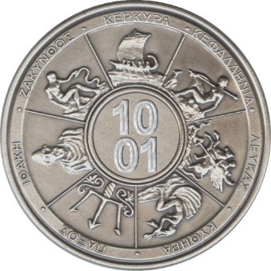{width="1.5465277777777777in"
height="1.5465277777777777in"}{width="4.954166666666667in"
height="1.1381944444444445in"}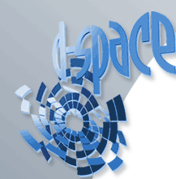{width="1.8333333333333333in"
height="1.9555555555555555in"}

{width="1.9555555555555555in"
height="2.134027777777778in"}

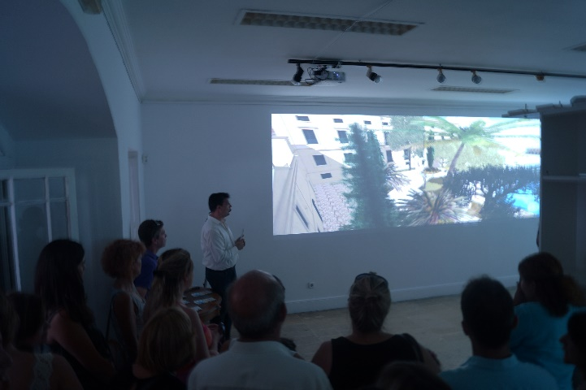{width="3.2743055555555554in"
height="2.1819444444444445in"}

{width="1.4069444444444446in"
height="1.4069444444444446in"}

### 5.2.1 Προγράμματα σε Εξέλιξη {#προγράμματα-σε-εξέλιξη .ListParagraph}

  **ΕΥΡΩΠΑΙΚΑ ΠΡΟΓΡΑΜΜΑΤΑ**                                                                                                                                                                                                                                                                             
  ---------------------------------------------------------------------------------------------------------------------------------------------------------------------------------------------------------------------------- ------------------------------------------------------------------------ ---------------------------------------------------------
  [[[[[[[[]{#_Toc460496661 .anchor}]{#_Toc460414412 .anchor}]{#_Toc457302410 .anchor}]{#_Toc457210809 .anchor}]{#_Toc456101784 .anchor}]{#_Toc456097508 .anchor}]{#_Toc455669160 .anchor}]{#_Toc455573405 .anchor}**ΤΙΤΛΟΣ**   **ΦΟΡΕΑΣ**                                                               **ΙΣΤΟΤΟΠΟΣ**
  [[[[[[]{#_Toc457302411 .anchor}]{#_Toc457210810 .anchor}]{#_Toc456101785 .anchor}]{#_Toc456097509 .anchor}]{#_Toc455669161 .anchor}]{#_Toc455573406 .anchor}**ADRIATinn**                                                    IPA/Adriatic 2007-2013                                                   <http://www.adriatinn.eu/>
  **Adri Health Mob **                                                                                                                                                                                                         IPA/Adriatic 2007-2013                                                   <http://www.adrihealthmob.eu/>
  **E-Olive**                                                                                                                                                                                                                  IPA/Adriatic 2007-2013                                                   [www.e-olive-project.eu](http://www.e-olive-project.eu)
  **Pacinno**                                                                                                                                                                                                                  IPA/Adriatic 2007-2013                                                   [www.pacinno.eu](http://www.pacinno.eu)
  **CLOUD9**                                                                                                                                                                                                                   EΣΠΑ 2007-2013                                                           <http://di.ionio.gr/content/research/cloud9>
  **GEONEXT**                                                                                                                                                                                                                  DAAD program \"Academic Reconstruction of South Eastern Europe           <http://di.ionio.gr/en/uncategorized/geonext-2/>
  **TARD**                                                                                                                                                                                                                                                                                              <http://di.ionio.gr/content/research/tard/>
  **EUDML**                                                                                                                                                                                                                                                                                             [www.eudml.eu](http://www.eudml.eu)
  **TraMOOC**                                                                                                                                                                                                                  Horizon 2020                                                             <http://www.tramooc.eu>
  **ΕΘΝΙΚΑ ΠΡΟΓΡΑΜΜΑΤΑ**                                                                                                                                                                                                                                                                                
  [[[[[[[[]{#_Toc460496662 .anchor}]{#_Toc460414413 .anchor}]{#_Toc457302412 .anchor}]{#_Toc457210811 .anchor}]{#_Toc456101786 .anchor}]{#_Toc456097510 .anchor}]{#_Toc455669162 .anchor}]{#_Toc455573407 .anchor}**ΤΙΤΛΟΣ**   **ΦΟΡΕΑΣ**                                                               **ΙΣΤΟΤΟΠΟΣ**
                                                                                                                                                                                                                                                                                                        
  **PROM(ONT)OTION**                                                                                                                                                                                                           AΡΧΙΜΗΔΗΣ ΙΙΙ -- Ενίσχυση Ερευνητικών Ομάδων Στα ΤΕΙ -- ΕΣΠΑ 2007-2013   <http://di.ionio.gr/hilab/doku.php?id=el:projects>
                                                                                                                                                                                                                                                                                                        

[[[[[[[]{#_Toc460496663 .anchor}]{#_Toc460414414
.anchor}]{#_Toc457210812 .anchor}]{#_Toc456101787
.anchor}]{#_Toc456097511 .anchor}]{#_Toc455669163
.anchor}]{#_Toc455573408 .anchor}

### 5.2.2 Ολοκληρωμένα Προγράμματα {#ολοκληρωμένα-προγράμματα .ListParagraph}

+-----------------------+-----------------------+-----------------------+
| **ΕΥΡΩΠΑΙΚΑ           |
| ΠΡΟΓΡΑΜΜΑΤΑ**         |
+=======================+=======================+=======================+
| [[[[[[[[]{#_Toc460496 | **ΦΟΡΕΑΣ**            | **ΙΣΤΟΤΟΠΟΣ**         |
| 664                   |                       |                       |
| .anchor}]{#_Toc460414 |                       |                       |
| 415                   |                       |                       |
| .anchor}]{#_Toc457302 |                       |                       |
| 414                   |                       |                       |
| .anchor}]{#_Toc457210 |                       |                       |
| 813                   |                       |                       |
| .anchor}]{#_Toc456101 |                       |                       |
| 788                   |                       |                       |
| .anchor}]{#_Toc456097 |                       |                       |
| 512                   |                       |                       |
| .anchor}]{#_Toc455669 |                       |                       |
| 164                   |                       |                       |
| .anchor}]{#_Toc455573 |                       |                       |
| 409                   |                       |                       |
| .anchor}**ΤΙΤΛΟΣ**    |                       |                       |
+-----------------------+-----------------------+-----------------------+
| **BIG**               | Greece-Italy          | <http://www.big-proje |
|                       | 2007-2013             | ct.di.ionio.gr>       |
+-----------------------+-----------------------+-----------------------+
| []{#_Toc457302415     | []{#_Toc457302416     | [www.smartbuild.eu](f |
| .anchor}**SmartBuilt* | .anchor}              | ile:///\\192.168.56.1 |
| *                     |                       | \AppData\Local\AppDat |
|                       | Greece-Italy          | a\Local\Microsoft\Win |
|                       | 2007-2013             | dows\INetCache\Conten |
|                       |                       | t.Outlook\WVR1NTI0\ww |
|                       |                       | w.smartbuild.eu)      |
+-----------------------+-----------------------+-----------------------+
| [[[[[[]{#_Toc45730241 | [[[[[[]{#_Toc45730241 | <http://cult.di.ionio |
| 8                     | 9                     | .gr>                  |
| .anchor}]{#_Toc457210 | .anchor}]{#_Toc457210 |                       |
| 814                   | 815                   |                       |
| .anchor}]{#_Toc456101 | .anchor}]{#_Toc456101 |                       |
| 789                   | 790                   |                       |
| .anchor}]{#_Toc456097 | .anchor}]{#_Toc456097 |                       |
| 513                   | 514                   |                       |
| .anchor}]{#_Toc455669 | .anchor}]{#_Toc455669 |                       |
| 165                   | 166                   |                       |
| .anchor}]{#_Toc455573 | .anchor}]{#_Toc455573 |                       |
| 410                   | 411                   |                       |
| .anchor}**CULTURAL    | .anchor}              |                       |
| UNDERSTANDING THROUGH |                       |                       |
| LEARNING AND          | FP7-PEOPLE-MC-ERG-200 |                       |
| TECHNOLOGY (CULT)**   | 8-230894              |                       |
+-----------------------+-----------------------+-----------------------+
| **D-SPACE**           | FP6, e-Ten -- 2004-1  | <http://www.discovery |
|                       | -- 517339             | space.net>            |
+-----------------------+-----------------------+-----------------------+
| **MAVITRA**           | INTERREG III B MEDOCC | <http://www.mavitra.o |
|                       |                       | rg>                   |
+-----------------------+-----------------------+-----------------------+
| **PELAGOS**           | INTERREG IIIA Ελλάδα- | <http://di.ionio.gr/e |
|                       | Ιταλία 2000-2006,     | n/uncategorized/pelag |
|                       | ΜΕΤΡΟ 2: «Εξέλιξη και | os-2/>                |
|                       | ενίσχυση των          |                       |
|                       | συστημάτων            |                       |
|                       | επιτήρησης, ασφάλειας |                       |
|                       | και ελέγχου».         |                       |
+-----------------------+-----------------------+-----------------------+
| **SWEB**              | FP6 - IST-2006-2.6.5, | [www.sweb-project.org |
|                       | International         | ](http://www.sweb-pro |
|                       | Cooperation for       | ject.org)             |
|                       | eGovernment and       |                       |
|                       | eParticipation        |                       |
+-----------------------+-----------------------+-----------------------+
| **VIDEOPAL**          | Microsoft Research    | <http://di.ionio.gr/c |
|                       |                       | ontent/research/video |
|                       |                       | pal/>                 |
+-----------------------+-----------------------+-----------------------+
| **ΕΘΝΙΚΑ              |
| ΠΡΟΓΡΑΜΜΑΤΑ**         |
+-----------------------+-----------------------+-----------------------+
| [[[[[[[[]{#_Toc460496 | **ΦΟΡΕΑΣ**            | **ΙΣΤΟΤΟΠΟΣ**         |
| 665                   |                       |                       |
| .anchor}]{#_Toc460414 |                       |                       |
| 416                   |                       |                       |
| .anchor}]{#_Toc457302 |                       |                       |
| 421                   |                       |                       |
| .anchor}]{#_Toc457210 |                       |                       |
| 816                   |                       |                       |
| .anchor}]{#_Toc456101 |                       |                       |
| 791                   |                       |                       |
| .anchor}]{#_Toc456097 |                       |                       |
| 515                   |                       |                       |
| .anchor}]{#_Toc455669 |                       |                       |
| 167                   |                       |                       |
| .anchor}]{#_Toc455573 |                       |                       |
| 412                   |                       |                       |
| .anchor}**ΤΙΤΛΟΣ**    |                       |                       |
+-----------------------+-----------------------+-----------------------+
| **E-BUSINESS FORUM    | Ε.Π. "Κοινωνία της    | <http://www.ebusiness |
| ΟΜΑΔΑ ΕΡΓΑΣΙΑΣ ΙΕ2    | Πληροφορίας"          | forum.gr/teams/teamsa |
| «ΕΥΡΥΖΩΝΙΚΟΤΗΤΑ ΚΑΙ   |                       | ll/sign/index.php?lan |
| ΕΞ ΑΠΟΣΤΑΣΕΩΣ         |                       | guage=el>             |
| ΣΥΜΒΟΥΛΕΥΤΙΚΕΣ        |                       |                       |
| ΥΠΗΡΕΣΙΕΣ ΣΕ          |                       |                       |
| ΑΝΘΡΩΠΙΝΟΥΣ ΠΟΡΟΥΣ»** |                       |                       |
+-----------------------+-----------------------+-----------------------+
| **E-GOVERNMENT PORTAL | Γ' Κ.Π.Σ. Μέτρο 2.1:  | \-                    |
| OF KEFALONIA**        | Ηλεκτρονική κυβέρνηση |                       |
|                       | για την εξυπηρέτηση   |                       |
|                       | του πολίτη:           |                       |
|                       | Επιχειρησιακά σχέδια, |                       |
|                       | μελέτες και πιλοτικά  |                       |
|                       | έργα. Κατηγορία       |                       |
|                       | Πράξης 3: Καινοτόμες  |                       |
|                       | και Πιλοτικές         |                       |
|                       | Εφαρμογές.            |                       |
+-----------------------+-----------------------+-----------------------+
| **ΑΝAΠΤΥΞΗ            | Διατμηματικό          | [http://di.ionio.gr/c |
| ΔΙΑΔΙΚΤΥΑΚHΣ ΒAΣΗΣ    | Μεταπτυχιακό          | ontent/research/ανάπτ |
| ΠΡΟΣΩΠΟΓΡΑΦΙΚΩΝ       | Πρόγραμμα Σπουδών     | υξη-διαδικτυακής-βάση |
| ΔΕΔΟΜEΝΩΝ ΓΙΑ ΤΗΝ     | «Ιστορική Έρευνα και  | ς-προσωπο](http://di. |
| ΚΩΔΙΚΟΠΟIΗΣΗ,         | Νέες Τεχνολογίες»     | ionio.gr/content/rese |
| ΑΠΟΔΕΛΤIΩΣΗ ΚΑΙ       |                       | arch/ανάπτυξη-διαδικτ |
| ΑΞΙΟΛOΓΗΣΗ ΤΩΝ        |                       | υακής-βάσης-προσωπο)/ |
| ΑΡΧΕIΩΝ ΤΗΣ ΕΛΛΗΝΙΚHΣ |                       |                       |
| ΠΑΛΙΓΓΕΝΕΣIΑΣ**       |                       |                       |
+-----------------------+-----------------------+-----------------------+
| **ΑΝAΠΤΥΞΗ            | Επιχειρησιακό         | [http://di.ionio.gr/c |
| ΗΛΕΚΤΡΟΝΙΚΟΥ          | Πρόγραμμα             | ontent/research/ανάπτ |
| ΣΥΣΤHΜΑΤΟΣ ΚΡΑΤHΣΕΩΝ  | «Ανταγωνιστικότητα    | υξη-ηλεκτρονικού-συστ |
| ΓΙΑ ΤΟΥΡΙΣΤΙΚA        | και                   | ήματος-κρ/](http://di |
| ΚΑΤΑΛΥΜΑΤΑ**          | Επιχειρηματικότητα»,  | .ionio.gr/content/res |
|                       | ΕΣΠΑ 2007-2013        | earch/ανάπτυξη-ηλεκτρ |
|                       |                       | ονικού-συστήματος-κρ/ |
|                       |                       | )                     |
+-----------------------+-----------------------+-----------------------+
| **ΔΑΚΟΣ**             | Επιχειρησιακό         | <http://di.ionio.gr/e |
|                       | Πρόγραμμα Ιονίων      | n/uncategorized/dakos |
|                       | Νήσων 2000-2006 ΜΕΤΡΟ | -2/>                  |
|                       | 1.5 Πρόγραμμα         |                       |
|                       | «Κοινοπραξίες Έρευνας |                       |
|                       | και Τεχνολογικής      |                       |
|                       | Ανάπτυξης σε τομείς   |                       |
|                       | Εθνικής               |                       |
|                       | Προτεραιότητας»       |                       |
+-----------------------+-----------------------+-----------------------+
| **ΣΥΛΛΟΓΙΚEΣ ΜΝHΜΕΣ   | Κοινωφελές Ίδρυμα     | <http://collectivecit |
| ΜΙΑΣ ΠOΛΗΣ ΣΤΟ ΧΩΡΟ   | Ιωάννη Σ. Λάτση       | ymemory.net>          |
| ΚΑΙ ΣΤΟ ΧΡOΝΟ**       |                       |                       |
+-----------------------+-----------------------+-----------------------+
| **ΕΠΙΧΕΙΡΗΜΑΤΙΚΟΤΗΤΑ* | ΕΠΕΑΕΚ: Ενθάρρυνση    | <http://di.ionio.gr/c |
| *                     | Επιχειρηματικών       | ontent/research/entre |
|                       | Δράσεων, Καινοτομικών | preneurship/>         |
|                       | Εφαρμογών και         |                       |
|                       | Μαθημάτων Επιλογής    |                       |
|                       | Φοιτητών και          |                       |
|                       | Σπουδαστών            |                       |
+-----------------------+-----------------------+-----------------------+
| **ΑΝΑΠΤΥΞΗ            | Ε.Π. "Κοινωνία της    | <http://rc.ionio.gr/p |
| ΜΗΤΡΟΠΟΛΙΤΙΚΩΝ        | Πληροφορίας"          | rojects/broadband/>   |
| ΔΙΚΤΥΩΝ ΟΠΤΙΚΩΝ ΙΝΩΝ  |                       |                       |
| ΤΗΣ Π.Ι.Ν.**          |                       |                       |
+-----------------------+-----------------------+-----------------------+
| **ΑΠΛΟΠΟΙΗΣΗ          | Ε.Π. "Διοικητική      | <http://di.ionio.gr/c |
| ΔΙΟΙΚΗΤΙΚΩΝ           | Μεταρρύθμιση          | ontent/research/aplop |
| ΔΙΑΔΙΚΑΣΙΩΝ Ε.Λ.Ε.    | 2007-2013"            | oiisi-dioikitikon-dia |
| ΤΟΥ ΙΟΝΙΟΥ            |                       | dikasion-ele-tou-ioni |
| ΠΑΝΕΠΙΣΤΗΜΙΟΥ**       |                       | ou-panepistimiou/>    |
+-----------------------+-----------------------+-----------------------+
| **ΥΠΗΡΕΣΙΕΣ           | ΕΣΠΑ 2007-2013        | \-                    |
| ΥΠΟΣΤΗΡΙΞΗΣ ΚΑΙ       |                       |                       |
| ΕΞΥΠΗΡΕΤΗΣΗΣ ΤΗΣ      |                       |                       |
| ΑΚΑΔΗΜΑΪΚΗΣ           |                       |                       |
| ΚΟΙΝΟΤΗΤΑΣ ΤΟΥ ΙΟΝΙΟΥ |                       |                       |
| ΠΑΝΕΠΙΣΤΗΜΙΟΥ ΣΤΟ     |                       |                       |
| ΠΛΑΙΣΙΟ ΤΗΣ ΨΗΦΙΑΚΗΣ  |                       |                       |
| ΣΥΓΚΛΙΣΗΣ**           |                       |                       |
+-----------------------+-----------------------+-----------------------+
| **OpenCourses**       | EΣΠΑ 2007-2013        | <https://opencourses. |
|                       |                       | ionio.gr/>            |
+-----------------------+-----------------------+-----------------------+
| **ΚΤΙΣΜΑΤΑ,           | EΣΠΑ 2007-2013        | <http://iivw.di.ionio |
| ΠΟΛΙΤΙΣΜΟΣ ΚΑΙ        |                       | .gr>                  |
| ΠΕΡΙΒΑΛΛΟΝ ΣΕ         |                       |                       |
| ΕΙΚΟΝΙΚΟ ΚΟΣΜΟ        |                       |                       |
| ΤΟΥΡΙΣΤΙΚΗΣ ΠΡΟΒΟΛΗΣ  |                       |                       |
| ΤΗΣ ΠΕΡΙΦΕΡΕΙΑΣ       |                       |                       |
| ΙΟΝΙΩΝ ΝΗΣΩΝ**        |                       |                       |
+-----------------------+-----------------------+-----------------------+

[ ]{.smallcaps}[6 ΦΟΙΤΗΤΙΚΑ ΘΕΜΑΤΑ]{.smallcaps} {#φοιτητικα-θεματα .ListParagraph}
===============================================

*6.1 Κέντρο Διαχείρισης Δικτύων* {#κέντρο-διαχείρισης-δικτύων .ListParagraph}
--------------------------------

Το Κέντρο Διαχείρισης Δικτύων (ΚΔΔ) του Ιονίου Πανεπιστημίου
δημιουργήθηκε στο πλαίσιο του προγράμματος ΕΠΕΑΕΚ του Β΄ ΚΠΣ. Στο
πλαίσιο του έργου αυτού δημιουργήθηκε ένα προηγμένο δίκτυο μετάδοσης
φωνής και δεδομένων που καλύπτει όλες τις εκπαιδευτικές και διοικητικές
ανάγκες του Ιονίου Πανεπιστημίου. Έχει αναπτύξει κατάλληλες εφαρμογές
και παρέχει συνεχή υποστήριξη για θέματα δικτύου σε όλα τα μέλη της
πανεπιστημιακής κοινότητας. Το ΚΔΔ πέτυχε την αποδοτικότερη χρήση του
δικτύου και την εισαγωγή νέων τεχνολογιών στη διοικητική και
εκπαιδευτική δραστηριότητα του Ιονίου Πανεπιστημίου. Σε όλους τους
φοιτητές παρέχεται λογαριασμός ηλεκτρονικού ταχυδρομείου καθώς και χώρος
στον κεντρικό εξυπηρετητή του πανεπιστημίου για ηλεκτρονική δημοσίευση.
Επίσης λειτουργεί αίθουσα τηλεκπαίδευσης με στόχο να διευκολύνει τη
διδακτική διαδικασία και να ενισχύσει τη συνεργασία του Ιονίου
Πανεπιστημίου με άλλα πανεπιστημιακά ιδρύματα.

Η ηλεκτρονική διεύθυνση του ΚΔΔ είναι: <http://noc.ionio.gr>

{width="5.822222222222222in" height="1.68125in"}*6.2 Φοιτητική Μέριμνα* {#φοιτητική-μέριμνα .ListParagraph}
----------------------------------------------------------------------------------------------

Η φοιτητική μέριμνα έχει ως στόχο την υποστήριξη και διεκπεραίωση των
δραστηριοτήτων της στέγασης και της φοίτησης των φοιτητών, καθώς και
κάθε είδους προβλήματος που μπορεί να προκύψει σε έναν φοιτητή κατά την
περίοδο των σπουδών του. Για οποιαδήποτε σχετική πληροφορία ο φοιτητής
μπορεί να απευθύνεται στα τηλέφωνα 26610 -- 87637 και 26610 -- 82119,
και στην ιστοσελίδα:
<http://sites.ionio.gr/e-care>[[[[[[[]{#_Toc460496669
.anchor}]{#_Toc460414420 .anchor}]{#_Toc457210820
.anchor}]{#_Toc456101795 .anchor}]{#_Toc456097519
.anchor}]{#_Toc455669171 .anchor}]{#_Toc455573416 .anchor}

*6.3 Συνήγορος του Φοιτητή* {#συνήγορος-του-φοιτητή .ListParagraph}
---------------------------

Μέσω του Συνηγόρου του Φοιτητή, ο κάθε φοιτητής μπορεί να αναζητήσει
υποστήριξη σε οποιαδήποτε περίπτωση αισθάνεται ότι θίγονται δικαιώματά
του που άπτονται των φοιτητικών του θεμάτων. Για σχετικά ζητήματα μπορεί
ο φοιτητής να απευθυνθεί στην διεύθυνση <synigoros.foititi@ionio.gr>, ή
στην ιστοσελίδα: <http://www.ionio.gr/central/gr/ombudsman>

*6.4 Ηλεκτρονική Καρτέλα Φοιτητή* {#ηλεκτρονική-καρτέλα-φοιτητή .ListParagraph}
---------------------------------

H Ηλεκτρονική Καρτέλα Φοιτητή παρέχεται από το Τμήμα Πληροφοριακών
Συστημάτων του Ιονίου Πανεπιστημίου και δίνει την δυνατότητα στους
φοιτητές να δηλώσουν ηλεκτρονικά τα μαθήματα που επιθυμούν να
παρακολουθήσουν. Ο ιστοχώρος της υπηρεσίας βρίσκεται στην ιστοσελίδα:
<http://gram-web.ionio.gr/unistudent>

[ ]{.smallcaps}[7 ΑΚΑΔΗΜΑΙΚΟ ΗΜΕΡΟΛΟΓΙΟ]{.smallcaps} {#ακαδημαικο-ημερολογιο .ListParagraph}
====================================================

Σύμφωνα με το άρθρο 25, Ν. 2083/92 και απόφαση της Συγκλήτου, το
ακαδημαϊκό έτος 2016-2017 αρχίζει την 1η Σεπτεμβρίου 2016 και λήγει την
31η Αυγούστου 2017.

> **Χειμερινό Εξάμηνο**
>
> Διδασκαλία: 03/10/2016 έως και 20/01/2017
>
> Εξετάσεις: 23/01/2017 έως και 10/02/2017
>
> Διακοπές Χριστουγέννων: 24/12/2016 έως και 06/01/2017
>
> **Εαρινό Εξάμηνο**
>
> Διδασκαλία: 13/02/2017 έως και 02/06/2017
>
> Εξετάσεις: 06/06/2017 έως και 23/06/2017
>
> Διακοπές Πάσχα: 10/04/2017 έως και 21/04/2017
>
> Επαναληπτική εξεταστική: 04/09/2017 έως και 29/09/2017
>
> **Αργίες**
>
> 28 Οκτωβρίου 2016 (Εθνική Επέτειος)
>
> 17 Νοεμβρίου 2016 (Επέτειος Πολυτεχνείου)
>
> 12 Δεκεμβρίου 2016 (Αγ. Σπυρίδωνα, Πολιούχου Κέρκυρας)
>
> 30 Ιανουαρίου 2017 (Τριών Ιεραρχών)
>
> 27 Φεβρουαρίου 2017 (Καθαρά Δευτέρα)
>
> 25 Μαρτίου 2017 (Εθνική Επέτειος)
>
> 1 Μαΐου 2017 (Εργατική Πρωτομαγιά)
>
> 21 Μαΐου 2017 (Ένωση των Επτανήσων με την Ελλάδα)
>
> 5 Ιουνίου 2017 (Αγίου Πνεύματος)

{width="1.0131944444444445in"
height="1.0131944444444445in"}{width="5.821527777777778in"
height="8.617346894138233in"}
